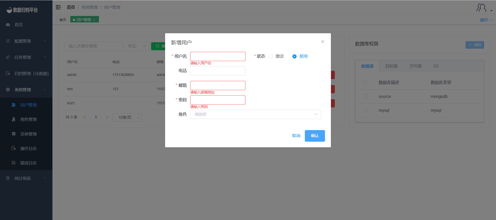
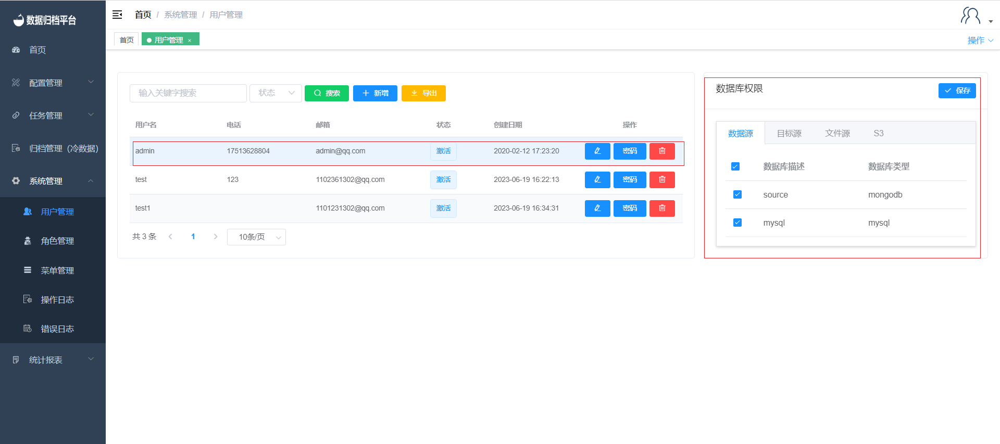

#### 		用户管理

​	点击系统管理菜单下的用户管理，此页面只有管理员用户可见，页面展示出平台所有的用户信息及数据库权限绑定等。

##### 				搜索

​	绿色按钮为搜索按钮，左侧两个条件框，填写完条件后点击搜索可过滤出所需的用户信息。

##### 				新增用户

​	第二个蓝色按钮为新增按钮，点击“新增”按钮弹出如图界面，填写用户名、邮箱、电话、密码即可新增用户，角色中可选择用户的系统权限及新增的用户状态是否可用。

##### 				导出用户

​	第三个黄色按钮为导出用户按钮，点击后将生成一份所有用户的xlsx文件，文件名称可自定义。

##### 				修改内容

​	点击用户右侧的铅笔按钮即修改用户信息，弹出以下编辑页面。除密码不可修改外其余信息可根据需求按要求修改，修改完成后点击确认即可。

##### 				修改密码

​	点击用户右侧第二个密码按钮，弹出以下图中表格。按需按要求修改完成后点击确认即可保存新密码。

##### 				删除用户

​	点击用户右侧第三个红色按钮弹出确认框，是否删除此用户。若确认删除点击确认即可，若不想删除点击取消即可。

##### 				数据库权限（数据源、目标源、文件源、S3）

​	点击用户后右侧数据库权限所勾选的源为被点击用户所绑定的源，其中包括数据源、目标源、文件源、S3，勾选用户所需的源后点击保存即可。

