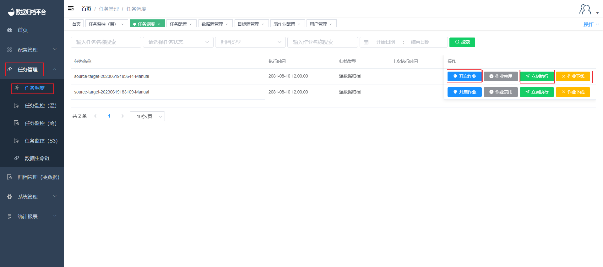

#### 		任务调度

​	点击任务管理下的任务调度，该页面展示了已通过审核的任务，搜索按钮前的条件框可根据所需填写条件点击搜索过滤出任务。针对单条任务可对其进行状态的修改，例如作业进行开启、禁用、下线、立即执行。

##### 				开启作业

​	作业被禁用后不可再执行任务，可点击任务右侧的作业开启将禁用的任务开启，之后可点击立即执行进行任务的执行，或到达定时时间后自动执行。

##### 				作业禁用

​	可点击任务右侧的灰色按钮将其禁用，禁用后此任务将无法执行，点击开启作业后任务才可恢复正常。

##### 				立即执行

​	任务右侧的第三个按钮立即执行，若全量任务点击后会将此任务立即开始执行同步任务，若为增量任务点击立即执行将执行未到时间的下次执行任务。

##### 				作业下线

​	最右侧按钮作业下线点击后将弹出提示框确认是否下线，因下线后不可恢复同时次任务将不可再用。若确认下线点击下线即可，若不下线点击取消。
