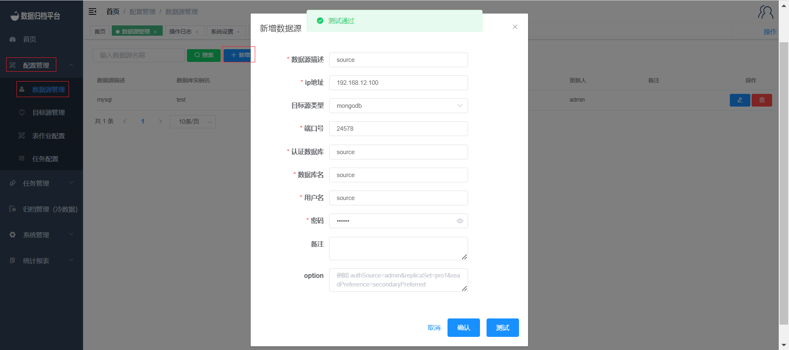
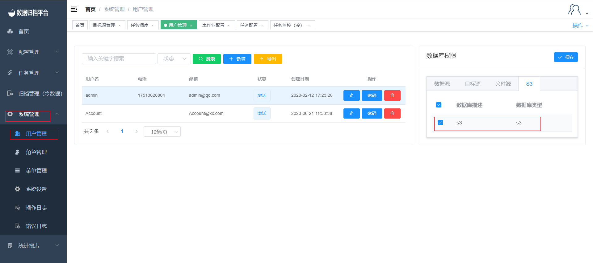
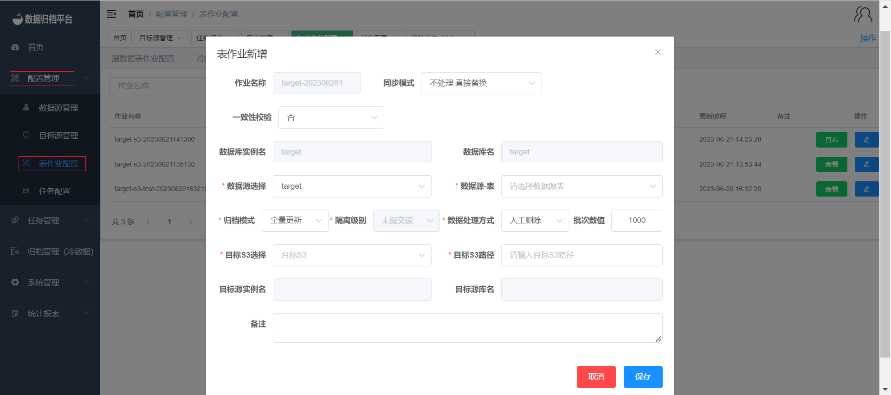
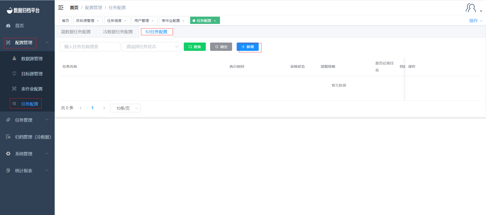
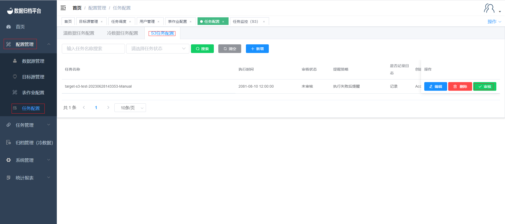
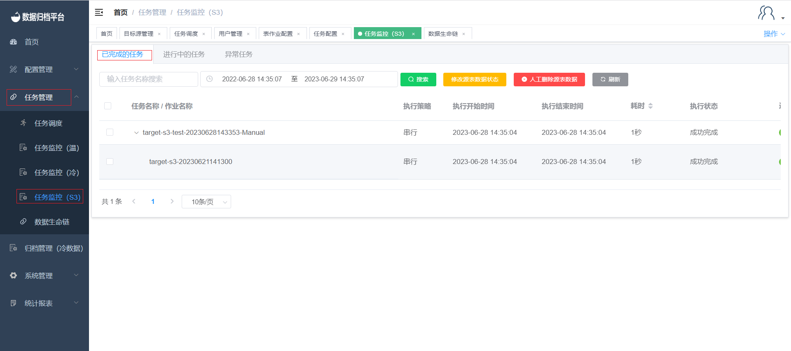

##  S3作业Demo

### 1. 新增数据源及目标S3

#### 新增数据源
点击配置管理菜单下的数据源管理页面，在此页面点击蓝色新增按钮并填写数据源相关信息，测试通过后点击确认保存此数据源。
   

#### 新增目标S3

点击配置管理菜单下的目标源管理页面，点击S3页面后点击蓝色新增按钮并填写目标S3相关信息，测试通过后点击确认保存此目标S3。

### 2. 权限分配

新增数据源与目标S3后管理员用户在系统管理菜单下的用户管理页面进行数据库权限的分配。
  

### 3. 新建S3作业

点击配置管理菜单下的表作业配置，在S3表作业页面点击蓝色新增按钮弹出以下表单，选择需同步的数据源与目标S3。表作业具有一致性校验功能，选择是后可填写所需校验的百分比，同步后平台将对同步的数据进行一致性校验。数据处理方式可选人工删除或系统删除，此功能在同步完成后将源表进行按后方批次进行删除。

### 4. 创建任务

#### 新增任务配置
点击任务配置菜单下的任务配置，此页面展示了所有任务点击蓝色新增按钮弹出第二张图片所示表单，根据需求填写任务配置。若此任务表作业很多时可根据自身需求设置执行模式、任务超时时间、失败重试次数。提醒策略选择后添加报警邮箱地址，任务完成后将根据提醒策略发送邮件。

#### 在任务中添加表作业
点击添加作业弹出以下图片所示数据配置，勾选作业后点击确定即可将此作业绑定至新建任务中，一个任务可绑定多个表作业。

#### 管理员审核

任务配置完成后管理员用户在任务配置处可进行审核，审核通过后此任务即可进行执行。

### 5. 任务调度

点击任务管理菜单下的任务调度，在此页面进行此任务的状态。点击立即执行即可立即执行此任务。

### 6. 任务监控

在任务调度页面点击立即执行或到达任务执行时间后，在任务管理菜单下的任务监控(S3)处查看此任务的执行状态。

