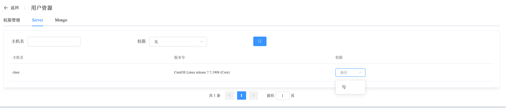

## Users

```
Users 提供以下操作：
 - Operation
 - Management
 - Server
 - MongoDB
```


### Operation

Whaleal 可以为用户配置管理员权限，管理员可以执行删除用户的操作。


### Management

Whaleal 可以配置是否有权限创建Server、创建MongoDB。


### Server

Whaleal 提供了对服务器资源的访问限制。




### MongoDB

Whaleal 提供了对MongoDB资源的访问限制。

