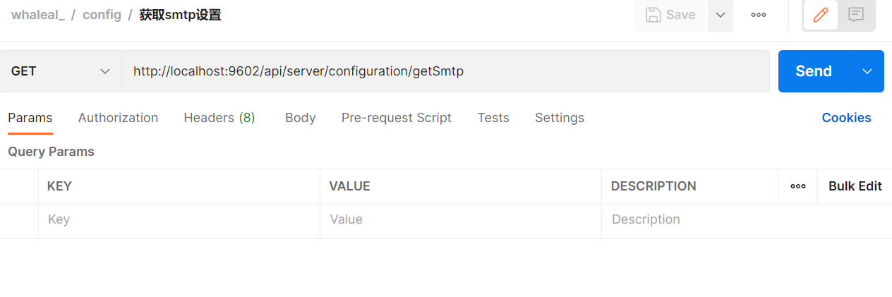
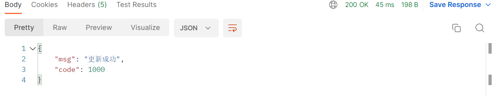

# Configuration 接口
接口调用时须在请求头中设置whaleal-Token ，填写参数发起请求，返回内容为 JSON 格式的信息，返回特殊实体类将在最后提供实体类表格。
其参数为时间的都以时间戳形式传递。

 

### 请求头默认格式，特殊情况特殊声明

    whaleal-Token在调用登录接口时返回，在之后调用接口时将token放置请求头中。
[登录接口调用获取whaleal-Token](Member.md)

| KEY                |     VALUE      |     
| -------------------|----------------------|
| Accept-Encoding        |         gzip,deflate,br |     
| Connection          |         keep-alive           |          
| Content-Type          |         application/json |    
| whaleal-token          |         "token"           |     
---

 

###  1 获取smtp设置

1.1 请求路径

GET: http://{Server-Host}:{端口}/api/server/configuration/getSmtp

---

1.2 请求

 

----

1.3 返回结果

|               |     Description    |           Schema              |  
| --------------|----------------------|---------------------------
| code        |   状态符:1000成功,其余异常 |            int           |    
| data       |         返回数据         |           SmtpEntity             |        

 

---

 

### 2 更新 smtp设置.

2.1 请求路径

POST: http://{Server-Host}:{端口}/api/server/configuration/updateSmtp

---

2.2 请求参数：

| Name                |     Located in     |           Description         |     Required    |        Schema   |
| -------------------|----------------------|-------------------------------|-----------------|-----------   |
| smtpEntity          |         Body           |            smtp实体类            |        Yes       | SmtpEntity |

 

~~~
Ex. 更新 smtp设置.;SmtpEntity 如下所示：
{
    "id": "630864e29c477153b441b426",
    "createTime": 0,
    "updateTime": 0,
    "port": "465",
    "host": "smtp.qiye.163.com",
    "from": "notifications@jinmuinfo.com",
    "title": "whaleal",
    "userName": "notifications@jinmuinfo.com",
    "password": "89k235Xwma9caArk",
    "default_encoding": "utf-8",
    "propertiesMailSmtpSSLEnable": true,
    "propertiesMailSmtpSSLRequired": true,
    "propertiesMailSmtpPort": null
}
~~~

----

2.3 返回结果

|               |     Description    |           Schema              |  
| --------------|----------------------|---------------------------
| code        |   状态符:1000成功,其余异常 |            int           |    
| msg       |         返回消息       |           String             |        

 

---

 

### 3 获取设置颗粒度

3.1 请求路径

GET: http://{Server-Host}:{端口}/api/server/configuration/getConfig

---

3.2 请求

 

----

3.3 返回结果

|               |     Description    |           Schema              |  
| --------------|----------------------|---------------------------
| code        |   状态符:1000成功,其余异常 |            int           |    
| data       |         返回数据      |           ConfigEntity             |        

 

~~~
{
    "code": 1000,
    "data": {
        "id": "whaleal",
        "createTime": 0,
        "updateTime": 0,
        "hostAcquisitionFrequency": 2,
        "mongoAcquisitionFrequency": 2,
        "logSaveTime": 3600
    }
}

~~~

---

 

### 4 更新配置颗粒度.

4.1 请求路径

POST: http://{Server-Host}:{端口}/api/server/configuration/updateConfig

---

4.2 请求参数：

| Name                |     Located in     |           Description         |     Required    |        Schema   |
| -------------------|----------------------|-------------------------------|-----------------|-----------   |
| configEntity          |         Body           |            设置实体类            |        Yes       | ConfigEntity        |

 

~~~
Ex. 更新 smtp设置.;ConfigEntity 如下所示：
{
    "hostAcquisitionFrequency": 2,
    "mongoAcquisitionFrequency": 2,
    "logSaveTime": 3600
}
~~~

----

4.3 返回结果

|               |     Description    |           Schema              |  
| --------------|----------------------|---------------------------
| code        |   状态符:1000成功,其余异常 |            int           |    
| msg       |         返回消息       |           String             |        

 

---

 

