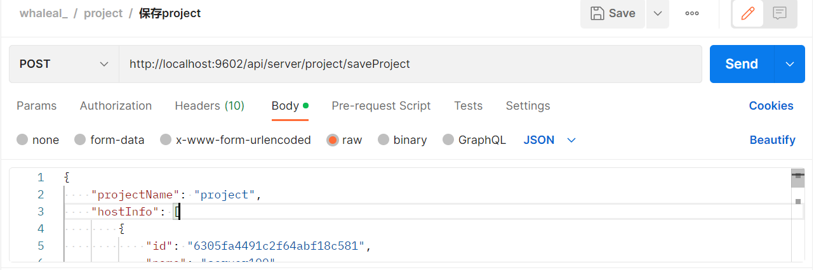
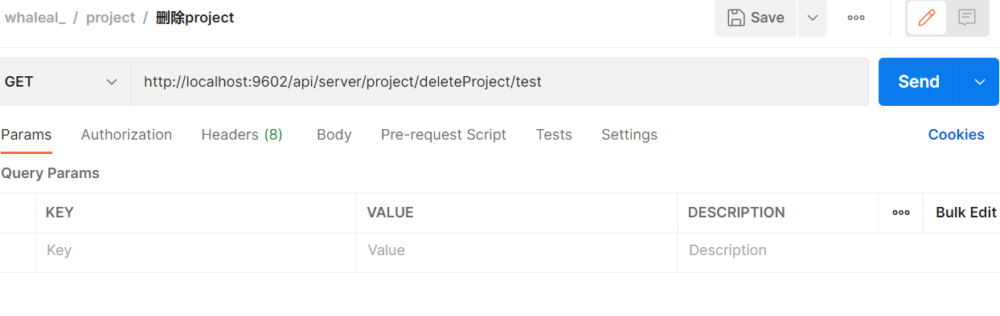
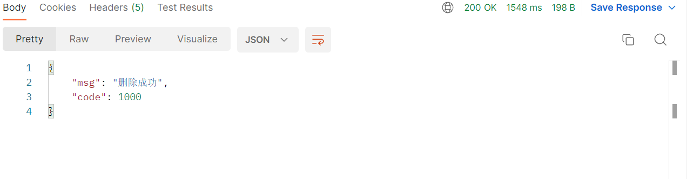
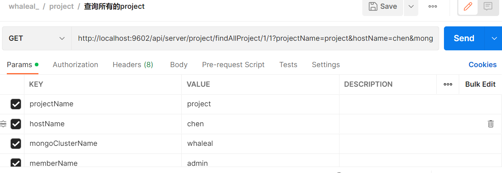
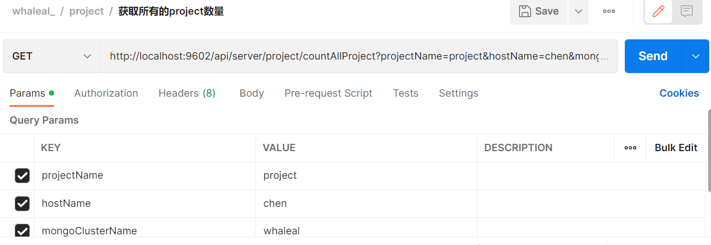
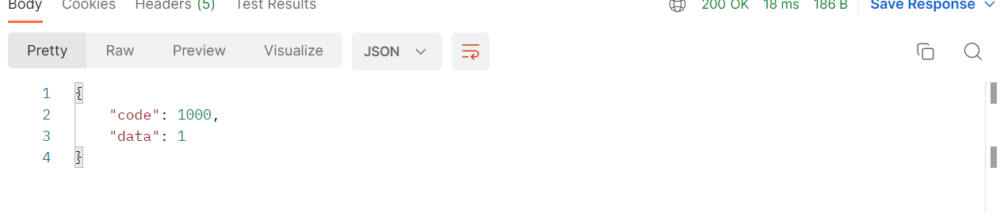
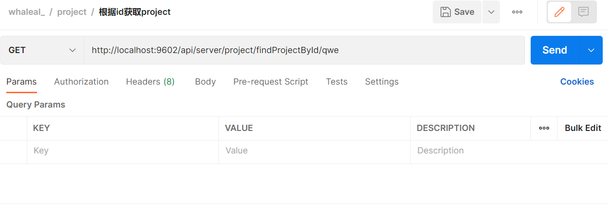
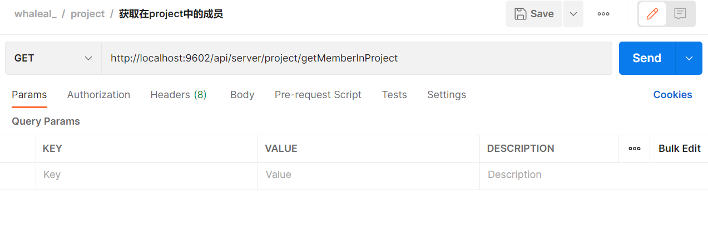
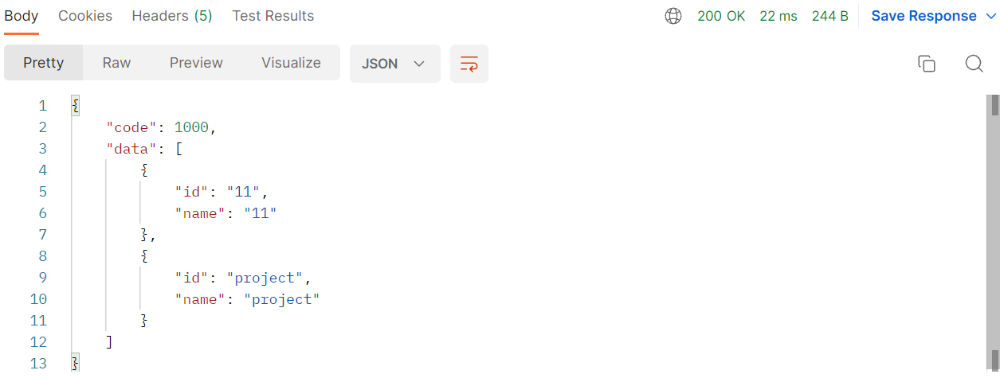

# Project 接口
接口调用时须在请求头中设置whaleal-Token ，填写参数发起请求，返回内容为 JSON 格式的信息，返回特殊实体类将在最后提供实体类表格。
其参数为时间的都以时间戳形式传递。

 

### 请求头默认格式，特殊情况特殊声明

    whaleal-Token在调用登录接口时返回，在之后调用接口时将token放置请求头中。
[登录接口调用获取whaleal-Token](Member.md)

| KEY                |     VALUE      |     
| -------------------|----------------------|
| Accept-Encoding        |         gzip,deflate,br |     
| Connection          |         keep-alive           |          
| Content-Type          |         application/json |    
| whaleal-token          |         "token"           |     
---

 

###  1 保存project

1.1 请求路径

POST: http://{Server-Host}:{端口}/api/server/project/saveProject

---

1.2 请求参数：

| Name                |     Located in     |           Description         |     Required    |        Schema   |
| -------------------|----------------------|-------------------------------|-----------------|-----------   |
| projectMongoEntity          |         Body           |            project实体类            |        Yes       | ProjectMongoEntity        |

 

~~~
Ex. 保存project.;projectMongoEntity 如下所示：
{
    "projectName": "test",
    "hostInfo": [
        {
            "id": "6305fa4491c2f64abf18c581",
            "name": "server100"
        }
    ],
    "memberInfo": [
        {
            "id": "630321262ef5221f75e9f0c6",
            "name": "chen"
        }
    ],
    "mongoInfo": [
        {
            "id": "632ae4e496b892559b6a7aab",
            "name": "whaleal"
        }
    ],
    "dingDingList": [
        "qwe123"
    ]
}
~~~

----

1.3 返回结果

|               |     Description    |           Schema              |  
| --------------|----------------------|---------------------------
| code        |   状态符:1000成功,其余异常 |            int           |    
| data       |         返回数据         |           ProjectMongoEntity             |        

 

~~~
{
    "msg": "保存成功",
    "code": 1000,
    "data": {
        "id": "test",
        "createTime": 1664245657405,
        "updateTime": 1664245657405,
        "projectName": "test",
        "hostInfo": [
            {
                "id": "630eddeff3d9e72e3695ea48",
                "name": "chen"
            }
        ],
        "mongoInfo": [
            {
                "id": "632ae4e496b892559b6a7aab",
                "name": "whaleal"
            }
        ],
        "memberInfo": [
            {
                "id": "63031cb149d5ad2d50af5d15",
                "name": "admin"
            }
        ],
        "dingDingList": [
            "qwe123"
        ]
    }
}

~~~

---

 

 

###  2 删除project

2.1 请求路径

POST: http://{Server-Host}:{端口}/api/server/project/deleteProject/{{projectId}}

---

2.2 请求参数：

| Name                |     Located in     |           Description         |     Required    |        Schema   |
| -------------------|----------------------|-------------------------------|-----------------|-----------   |
| projectId          |         Path           |            项目id            |        Yes       | String        

 

----

2.3 返回结果

|               |     Description    |           Schema              |  
| --------------|----------------------|---------------------------
| code        |   状态符:1000成功,其余异常 |            int           |    
| msg       |         返回消息         |           String             |        

 

 

###  3 查询所有的project

3.1 请求路径

GET: http://{Server-Host}:{端口}/api/server/project/findAllProject/{{pageSize}}/{{pageIndex}}

---

3.2 请求参数：

| Name                |     Located in     |           Description         |     Required    |        Schema   |
| -------------------|----------------------|-------------------------------|-----------------|-----------   |
| pageSize          |         Path           |            每页大小            |        Yes       | int
| pageIndex          |         Path           |            第几页            |        Yes       | int
| projectName          |         Params           |        项目名称            |        No       | String
| hostName          |         Params           |        主机名称            |        No       | String
| mongoClusterName          |         Params           |        mongo集群名称            |        No       | String
| memberName          |         Params           |        用户名称            |        No       | String

 

----

3.3 返回结果

|               |     Description    |           Schema              |  
| --------------|----------------------|---------------------------
| code        |   状态符:1000成功,其余异常 |            int           |    
| data       |         返回数据         |           ProjectMongoEntity             |        

 

~~~
{
    "code": 1000,
    "data": [
        {
            "id": "project",
            "createTime": 1664245537831,
            "updateTime": 1664245537831,
            "projectName": "project",
            "hostInfo": [
                {
                    "id": "630eddeff3d9e72e3695ea48",
                    "name": "chen"
                }
            ],
            "mongoInfo": [
                {
                    "id": "632ae4e496b892559b6a7aab",
                    "name": "whaleal"
                }
            ],
            "memberInfo": [
                {
                    "id": "63031cb149d5ad2d50af5d15",
                    "name": "admin"
                }
            ],
            "dingDingList": [
                "qwe123"
            ]
        }
    ]
}

~~~

 

###  4 获取所有的project数量

4.1 请求路径

GET: http://{Server-Host}:{端口}/api/server/project/countAllProject

---

4.2 请求参数：

| Name                |     Located in     |           Description         |     Required    |        Schema   |
| -------------------|----------------------|-------------------------------|-----------------|-----------   |
| projectName          |         Params           |        项目名称            |        No       | String
| hostName          |         Params           |        主机名称            |        No       | String
| mongoClusterName          |         Params           |        mongo集群名称            |        No       | String
| memberName          |         Params           |        用户名称            |        No       | String

 

----

4.3 返回结果

|               |     Description    |           Schema              |  
| --------------|----------------------|---------------------------
| code        |   状态符:1000成功,其余异常 |            int           |    
| data       |         返回数量         |           int             |        

 

 

###  5 根据id获取project

5.1 请求路径

GET: http://{Server-Host}:{端口}/api/server/project/findProjectById/{{projectId}}

---

5.2 请求参数：

| Name                |     Located in     |           Description         |     Required    |        Schema   |
| -------------------|----------------------|-------------------------------|-----------------|-----------   |
| projectId          |         Path           |            项目id            |        Yes       | String

 

----

5.3 返回结果

|               |     Description    |           Schema              |  
| --------------|----------------------|---------------------------
| code        |   状态符:1000成功,其余异常 |            int           |    
| data       |         返回数据        |           ProjectMongoEntity             |        

 

~~~

{
    "code": 1000,
    "data": {
        "id": "qwe",
        "createTime": 1663899341009,
        "updateTime": 1663899341009,
        "projectName": "qwe",
        "hostInfo": [
            {
                "id": "630eddeff3d9e72e3695ea48",
                "name": "chen"
            },
            {
                "id": "6305fa4491c2f64abf18c581",
                "name": "server100"
            }
        ],
        "mongoInfo": [
            {
                "id": "632ae4e496b892559b6a7aab",
                "name": "whaleal"
            }
        ],
        "memberInfo": [
            {
                "id": "632138e2eef4de695d5116db",
                "name": "chen123"
            },
            {
                "id": "630321262ef5221f75e9f0c6",
                "name": "chen"
            }
        ],
        "dingDingList": []
    }
}
~~~

 

###  6 更新project

6.1 请求路径

POST: http://{Server-Host}:{端口}/api/server/project/updateProject

---

6.2 请求参数：

| Name                |     Located in     |           Description         |     Required    |        Schema   |
| -------------------|----------------------|-------------------------------|-----------------|-----------   |
| projectMongoEntity          |         Body           |            project实体类            |        Yes       | ProjectMongoEntity        |

 

~~~
Ex. 更新project.;projectMongoEntity 如下所示：
{
    "id": "qwe",
    "projectName": "qwe",
    "hostInfo": [
        {
            "id": "630eddeff3d9e72e3695ea48",
            "name": "chen"
        },
        {
            "id": "6305fa4491c2f64abf18c581",
            "name": "server100"
        }
    ],
    "mongoInfo": [
        {
            "id": "632ae4e496b892559b6a7aab",
            "name": "whaleal"
        }
    ],
    "memberInfo": [
        {
            "id": "632138e2eef4de695d5116db",
            "name": "chen123"
        },
        {
            "id": "630321262ef5221f75e9f0c6",
            "name": "chen"
        }
    ],
    "dingDingList": []
}

~~~

----

6.3 返回结果

|               |     Description    |           Schema              |  
| --------------|----------------------|---------------------------
| code        |   状态符:1000成功,其余异常 |            int           |    
| data       |         返回数据        |           ProjectMongoEntity             |        

 

~~~

{
    "msg": "更新成功",
    "code": 1000,
    "data": {
        "id": "qwe",
        "createTime": 1664248185424,
        "updateTime": 1664248185424,
        "projectName": "qwe",
        "hostInfo": [
            {
                "id": "630eddeff3d9e72e3695ea48",
                "name": "chen"
            },
            {
                "id": "6305fa4491c2f64abf18c581",
                "name": "server100"
            }
        ],
        "mongoInfo": [
            {
                "id": "632ae4e496b892559b6a7aab",
                "name": "whaleal"
            }
        ],
        "memberInfo": [
            {
                "id": "632138e2eef4de695d5116db",
                "name": "chen123"
            },
            {
                "id": "630321262ef5221f75e9f0c6",
                "name": "chen"
            }
        ],
        "dingDingList": []
    }
}

~~~

 

###  7 获取在project中的成员

7.1 请求路径

GET: http://{Server-Host}:{端口}/api/server/project/getMemberInProject

---

7.2 请求

 

----

7.3 返回结果

|               |     Description    |           Schema              |  
| --------------|----------------------|---------------------------
| code        |   状态符:1000成功,其余异常 |            int           |    
| data       |         返回数据        |           List             |        

 

