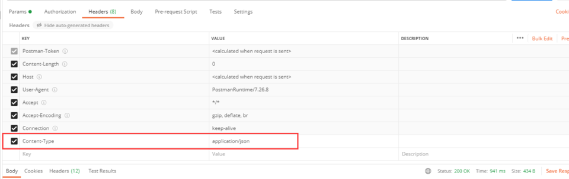
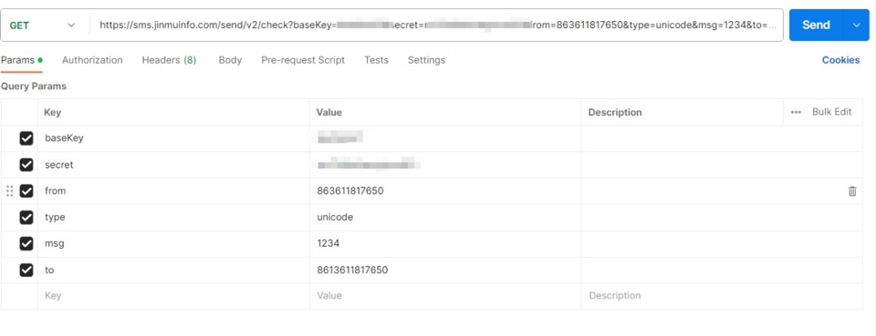
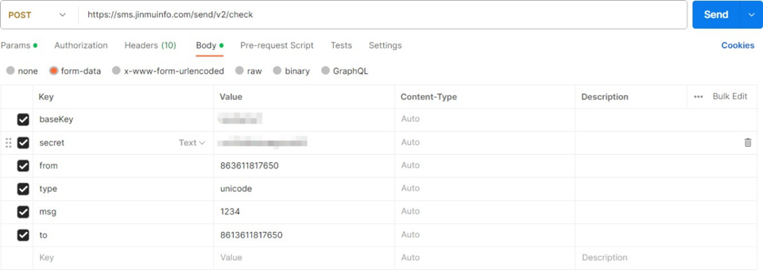
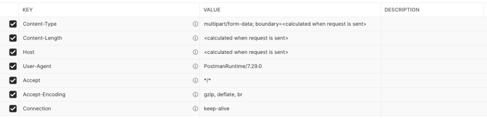
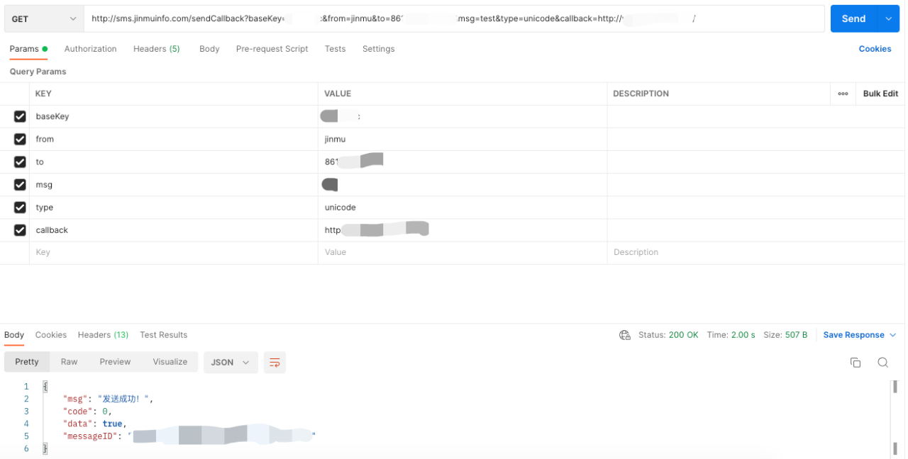
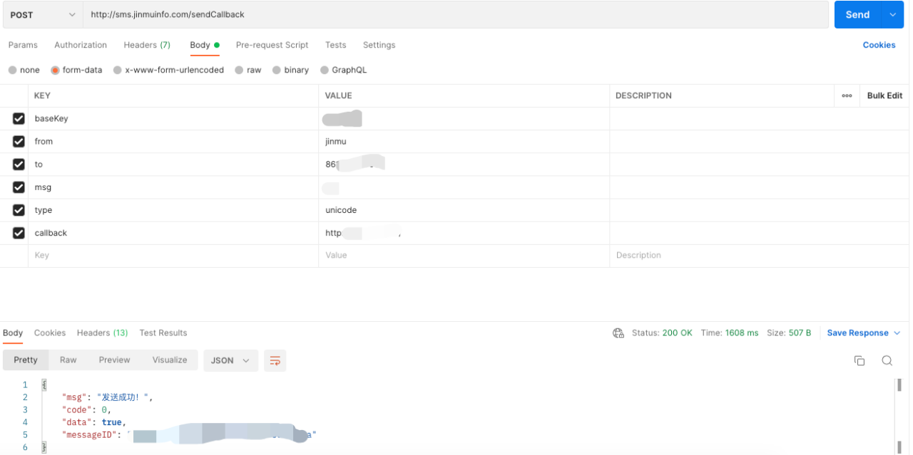
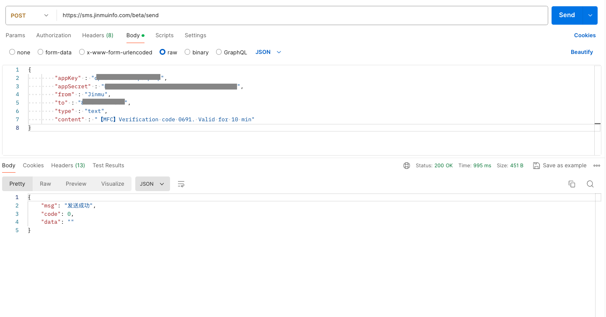

#### API 接入方式（API发信）

##### 接口说明

接口同时支持GET和POST，推荐使用POST请求。此接口会校验号码黑名单。

接口地址: [https://sms.jinmuinfo.com/send/v2/check](https://sms.jinmuinfo.com/send/v2/check)  
请求方式: GET/POST  
接口描述: 短信API接口


## 请求参数

| 参数名称       | 参数说明                                       | 请求类型 | 是否必须 | 数据类型 | 说明                      |
|----------------|------------------------------------------------|----------|----------|----------|---------------------------|
| baseKey        | 加密后的 KEY，用于校验请求是否合法              | query    | true     | string   | 由锦木服务团队提供        |
| secret         | 与 baseKey 唯一对应的密钥                        | query    | true     | string   | 由锦木服务团队提供        |
| from           | 发送方内容                                      | query    | true     | string   | XX 数字中心               |
| msg            | 发送的消息内容                                  | query    | true     | string   | 您的 XX 服务到期          |
| to             | 接收用户的手机号码                              | query    | true     | string   | 86136XXXXXXXX            |
| type           | 发信类型，默认参数为 text，非英文内容时设为 unicode | query    | false    | string   | unicode/text              |

##### 响应状态

| Status Code    | Description  | Schema   |
|----------------|--------------|----------|
| 200            | OK           | Result   |
| 401            | Unauthorized |          |
| 403            | Forbidden    |          |
| 404            | Not Found    |          |  

##### 响应参数
| Parameter Name | Description      | Type       | Schema      |
|----------------|------------------|------------|-------------|
| code           | Status code      | int32      | integer     |
| data           | Response data    | object     |             |
| msg            | Response message | string     |             |  

##### 响应示例

成功示例:
```json
{
   "msg": "发送成功!",
   "code": 0,
   "data": true
}
```

失败示例:
```json
{
    "msg": "baseKey不存在或已禁用",
    "code": 35,
    "data": false
}
```

失败示例:
```json
{
    "msg": "此手机号在黑名单中，无法发送",
    "code": 3333,
    "data": null
}
```

失败示例:
```json
{
    "msg": "此手机号在国家黑名单中，无法发送",
    "code": 3333,
    "data": {
        "country_code": "86",
        "country_prefix": "CN",
        "country_name": "China (PRC)"
    }
}
```

##### Postman 示例

Header设置:
```
Content-Type: application/json
```

**图例4-3** Header 设置

GET请求设置:
```
GET https://sms.jinmuinfo.com/send/v2/check?baseKey={baseKey}&secret={secret}&from={from}&msg={msg}&to={to}&type={type}
```

**图例4-4** GET 请求设置


POST请求设置:
```
POST https://sms.jinmuinfo.com/send/v2/check
Body (raw JSON):
{
    "baseKey": "{baseKey}",
    "secret": "{secret}",
    "from": "{from}",
    "msg": "{msg}",
    "to": "{to}",
    "type": "{type}"
}
```


**图例4-5** POST 请求设置


##### Java 示例

```

public static void main(String[] args) throws Exception {
    String baseKey = "XXXXXX";
    String secret = "XXXX";
    String type = "unicode";
    String from = "jinmu";
    String msg = "发送演示";
    String to = "861XXXXXXXXXX";
    JSONObject object = send(baseKey, secret, type, from, msg, to);
    System.out.println(object.toJSONString());
}

private static JSONObject send(String baseKey, String secret, String type, String from, String msg, String to) throws Exception {
    String url = "https://sms.jinmuinfo.com/send/v2/check";
    Connection connection = Jsoup.connect(url).ignoreContentType(true);
    Map<String, String> data = new HashMap<>();
    data.put("baseKey", baseKey);
    data.put("secret", secret);
    data.put("type", type);
    data.put("from", from);
    data.put("msg", msg);
    data.put("to", to);
    connection.data(data);
    Document doc = connection.post();
    String bodyStr = doc.body().ownText();
    return JSON.parseObject(bodyStr);
}
```


## API发信（指定webhook回调地址）

### 接口说明
接口同时支持 GET 和 POST，推荐使用 POST 请求。

- **接口地址**: `https://sms.jinmuinfo.com/sendCallback`
- **请求方式**: GET/POST
- **接口描述**: 短信 API 接口（附带callback）

### 请求参数

| 参数名称 | 参数说明 | 请求类型 | 是否必须 | 数据类型 | 说明 |
|----------|----------|----------|----------|----------|------|
| baseKey  | 加密后的 KEY，该参数用于校验是否避免非法请求 | query | true  | string | 锦木服务团队提供 |
| from     | 发送的 from 内容 | query | true  | string | XX数字中心 |
| msg      | 发送的消息内容 | query | true  | string | 您的XX服务到期 |
| to       | 接收用户的手机号码 | query | true  | string | 86136XXXXXXXX |
| type     | JMC 发信，默认参数为 text，当内容为非英文时，参数设置为 unicode | query | false | string | unicode/text |
| callback | 指定本次发信的Webhook回调地址，只支持http和https协议 | query | true  | string | http://ip+port/xxx https://ip+port/xxx |

### 响应状态

| 状态码 | 说明 | schema |
|--------|------|--------|
| 200    | OK   | Result |
| 401    | Unauthorized | |
| 403    | Forbidden | |
| 404    | Not Found | |
| 23     | callback地址无效 | null |
| 35     | baseKey不存在或已禁用 | null |

### 响应参数

| 参数名称 | 参数说明 | 类型 | schema |
|----------|----------|------|--------|
| code     | 状态码 | integer(int32) | integer(int32) |
| data     | 数据 | object | |
| msg      | 消息 | string | |
| messageID | 消息ID | string | |

### 响应示例

**成功示例**
```json
{  
   "msg": "发送成功!",
   "code": 0,
   "data": true,
   "messageID": "xxx-xxx-xxx-xxx"
}
```

**失败示例**
```json
{  
    "msg": "baseKey不存在或已禁用",
    "code": 35,
    "data": false,
    "messageID": null
}
```

## Postman示例

### Header


**图例4-6** POST Header 设置


### GET


**图例4-7** GET 请求设置

### POST


**图例4-8** POST 请求设置

## Java示例

```
java
public static void main(String[] args) throws Exception {
    String baseKey = "XXXXXX";
    String type = "unicode";
    String from = "jinmu";
    String msg = "发送演示";
    String to = "861XXXXXXXXXX";
    String callback = "http://ip+port";
    JSONObject object = send(baseKey, type, from, msg, to, callback);
    System.out.println(object.toJSONString());
}

/**
 * API短信接口
 *
 * @param from 来源
 * @param msg 内容
 * @param to 接受用户
 * @param baseKey KEY
 * @param type 非英文的内容传入参数为unicode英文默认text
 * @param callback 指定webhook回调地址
 * @return com.alibaba.fastjson.JSONObject 发送结果 json
 * @date 2022/6/13
 */
private static JSONObject send(String baseKey, String type, String from, String msg, String to, String callback) throws Exception {
    String url = "https://sms.jinmuinfo.com/sendCallback";
    Connection connection = Jsoup.connect(url).ignoreContentType(true);
    Map<String, String> data = new HashMap<>();
    data.put("baseKey", baseKey);
    data.put("type", type);
    data.put("from", from);
    data.put("msg", msg);
    data.put("to", to);
    data.put("callback", callback);
    connection.data(data);
    Document doc = connection.post();
    String bodyStr = doc.body().ownText();
    return JSON.parseObject(bodyStr);
}
```


## 应用发信API

##### 接口说明

推荐使用POST请求。

接口地址: https://sms.jinmuinfo.com/beta/send
请求方式: POST

接口描述: 应用发信接口

## 请求参数

| 参数名称  | 参数说明                                            | 请求类型 | 是否必须 | 数据类型 | 说明                    |
| --------- | --------------------------------------------------- | -------- | -------- | -------- | ----------------------- |
| appKey    | 加密后的 KEY，用于校验请求是否合法                  | data     | true     | string   | 在jmc平台应用管理中查看 |
| appSecret | 与 appKey 唯一对应的密钥                            | data     | true     | string   | 在jmc平台应用管理中查看 |
| from      | 发送的 from 内容                                    | data     | true     | string   | XX 数字中心             |
| to        | 接收用户的手机号码                                  | data     | true     | string   | 86136XXXXXXXX           |
| type      | 发信类型，默认参数为 text，非英文内容时设为 unicode | data     | false    | string   | unicode/text            |
| content   | 发信内容                                            | data     | true    | string   | 发信内容                |


应用发信请求设置:

```
curl --location 'https://sms.jinmuinfo.com/beta/send' \
--header 'Content-Type: application/json' \
--data '{
        "appKey" : "{appKey}",
        "appSecret" : "{appSecret}",
        "from" : "{from}",
        "to" : "{to}",
        "type" : "{type}",
        "content" : "{content}"
}'
```



**图例4-9** 应用发信


## 注意事项

- callback地址的协议要是http或https协议，暂时不支持其他协议。
- 响应码为23，说明callback参数格式有误，请检查url是否有误。
- 如果响应码正常，但是未接收到webhook，可能是callback参数地址无法访问，请检查：ip是否可以访问，端口是否开放；接收Webhook的应用是否启动。
