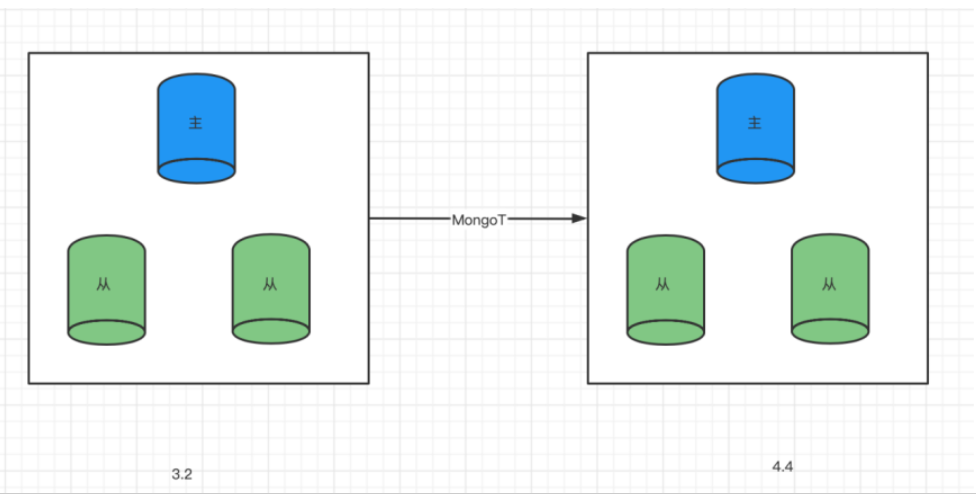

### DDT应用案例：MongoDB同步到MongoDB

#### 案例一：某证券公司

**业务场景**:
在某证券公司的生产环境中，需要保证数据的双活架构备份，以提升业务的韧性和可靠性。利用DDT工具，实现生产中心MongoDB数据库数据的实时同步到灾备中心的MongoDB数据库，确保数据的即时备份和业务的持续性。

**性能对比**:
通过DDT工具的应用，实现了MongoDB数据的高效实时同步，支持双中心互备架构。相较于传统的备份方法，DDT显著提升了数据同步的速度和效率。

---

#### 案例二：某航空公司

**业务场景**:
某航空公司需要将其旧版本MongoDB复制集集群从3.2升级到4.4版本，以满足业务需求的快速变更和提升数据库性能。

**解决方案**:
为航空公司搭建了新的MongoDB 4.4版本集群，并利用DDT工具实时将旧版本MongoDB中的数据迁移至新集群。通过在迁移过程中保持数据的一致性和实时性，成功实现了数据库版本的平滑升级和业务的连续性。

**性能对比**:
在此案例中，通过DDT工具完成了对700GB数据量的全量迁移，实时数据处理速度高达每秒1万条，包括DDL操作。总体迁移时间为6小时，其中全量数据迁移用时5小时，实时同步用时1小时。

---

#### 案例三：某电商企业

**业务场景**:
某电商企业需要将其现有的多个MongoDB分片集群整合为单一集群，以简化管理并提升系统性能和可扩展性。

**解决方案**:
利用DDT工具支持的多数据源迁移功能，将电商企业的多个分片集群数据有序地迁移至新的MongoDB单一集群。通过自动化作业和灵活的任务管理，确保了数据迁移过程的顺利进行和数据的完整性。

**性能对比**:
在整合过程中，DDT工具有效地管理了大量数据的迁移和同步，提高了数据处理的效率和迁移的成功率，为电商企业的系统优化和扩展提供了坚实支持。

---

#### 案例四：某游戏开发公司

**业务场景**:
某游戏开发公司需要将其多个游戏数据库从不同的MongoDB实例迁移至新的全局游戏数据库，以支持全球性游戏用户的统一管理和更高的游戏性能要求。

**解决方案**:
通过DDT工具的高效数据同步和迁移功能，帮助游戏开发公司成功将分布在多个MongoDB实例中的游戏数据迁移至新的全局MongoDB数据库。确保了游戏数据的一致性和实时性，支持了公司全球化运营的顺利进行。

**性能对比**:
在迁移过程中，DDT工具处理了大量游戏数据的同步和迁移任务，有效地提升了数据迁移的速度和效率，为游戏开发公司的业务扩展和用户体验提供了可靠保障。

---

这些案例展示了DDT工具在MongoDB同步到MongoDB的场景下的成功应用，通过高效的数据迁移和同步策略，帮助企业实现了数据库版本升级、系统整合以及全球化数据管理等多种业务需求。
