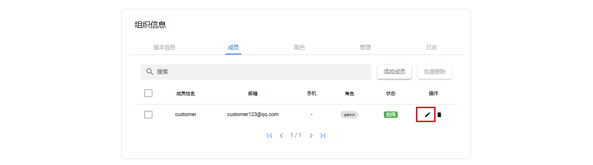
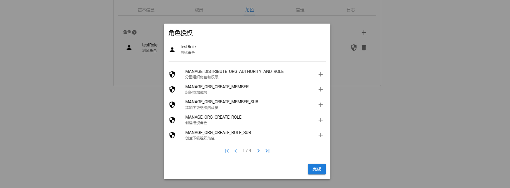
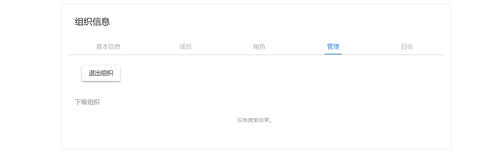
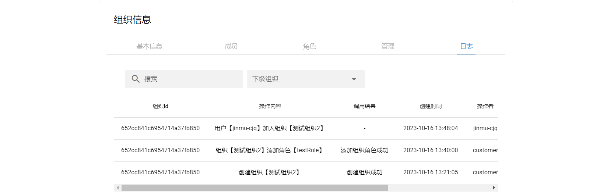

### 组织

__组织页__

用户可通过左侧菜单中组织进入组织页,并对拥有的组织进行管理

__创建组织__

点击组织页右侧创建组织,填写组织信息点击确定即可创建成功

__组织详情页__

点击创建完成的组织进入组织详情

__基本信息__

基本信息页面可修改组织的组织名、描述、首页地址、组织logo

__成员__

成员页可对成员删除及启用操作或邀请其他用户加入组织

__邀请成员__

点击添加成员

根据需求生成邀请链接,将连接发送给受邀用户

__删除成员__

左侧勾选成员点击批量删除或者点击右侧删除按钮都可删除成员

__启用/禁用__

点击编辑按钮

选择状态点击更新

__修改成员角色__

点击编辑按钮

选择对应角色点击更新

__角色__

点击右侧加号可添加组织角色,成员的角色池（除了admin角色）也是由这里决定的

__分配角色权限/删除角色__

创建角色成功后可以看到右侧的两个按钮,点击左边按钮可为角色分配权限,点击右侧可删除该角色

为角色分配权限,此处权限池由预制角色和应用权限组合而成

删除角色

__管理页__

在管理页用户可执行退出组织删除组织及创建下级组织的操作,刚加入的普通成员只拥有退出组织的权限

普通成员看到的页面

__日志__

组织内部的日志记录

