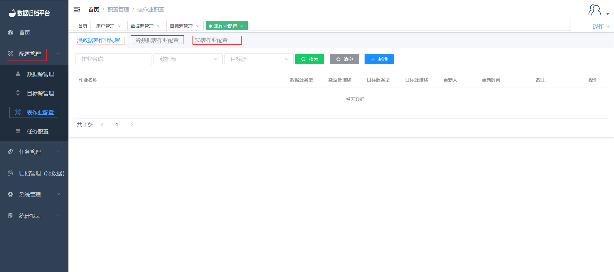
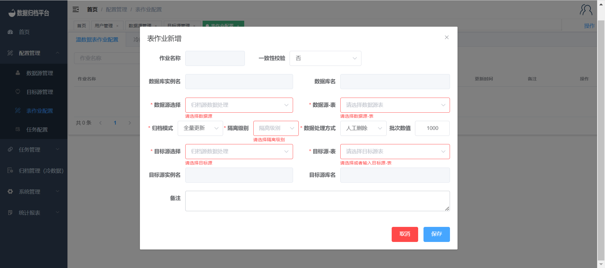
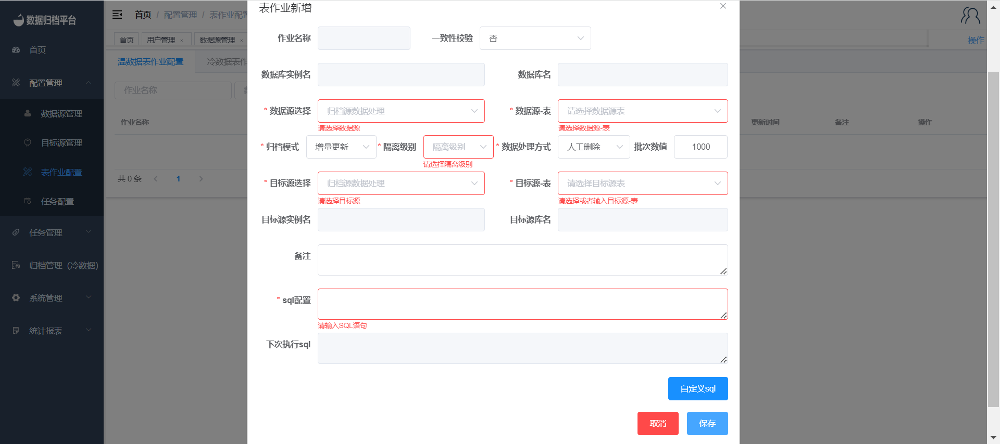
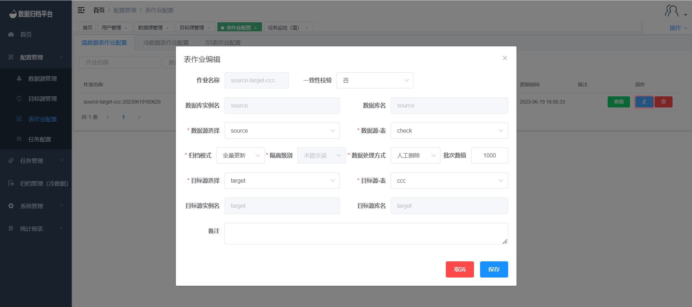
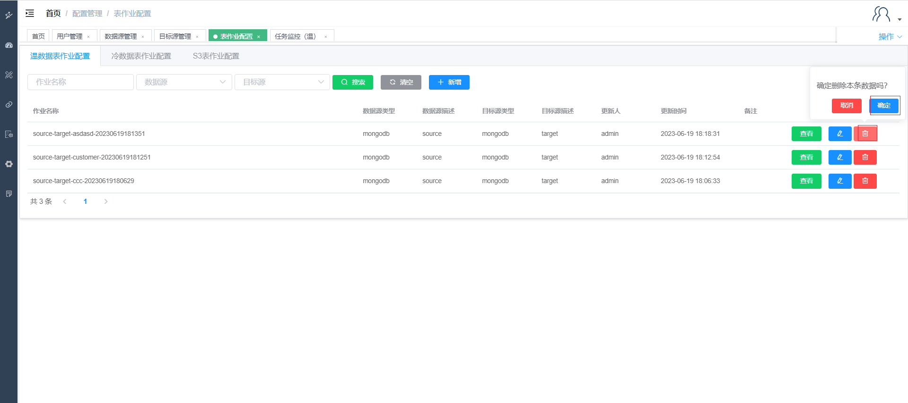

#### 		表作业配置
##### 			新增温/冷/S3作业

​	点击配置管理下的表作业配置,点击温数据表作业可查看平台内所有温数据表作业信息，点击冷数据表作业配置可查看平台内所有冷数据表作业信息，点击S3表作业配置可查看平台内所有S3表作业信息。同理新增哪种类型的表作业配置需在哪点击新增。之后跳出第二张图片表格，选择完数据源与目标源后可选择一致性校验、归档方式、同步完数据处理方式等。一致性校验选择是后可填写校验百分比。归档模式为“全量更新”的情况下，无须录入sql条件平台直接归档整表数据，归档模式为“增量更新”的情况下，窗口会多出录入sql条件的输入框及自定义sql配置按钮见第三张图；如想自定义配置sql可点击按钮进入第四张图表格进行数据表字段的可视化条件配置。当数据源与目标源同时为MongoDB时可选择Gridfs，若Gridfs为是则同步MongoDB的Gridfs数据类型。

##### 			编辑温/冷/S3作业

​	点击右侧蓝色按钮弹出编辑表格，修改表作业后点击保存即可。

##### 			删除温/冷/S3作业

​	点击右侧红色按钮弹出提示框，若确定删除点击确认即可，若不想删除可点击取消。

##### 			搜索温/冷/S3作业

​	点击上方搜索按钮并填写前面三个条件框，可过滤出当前平台所有符合条件的表作业配置。

##### 			查看温/冷/S3作业

​	点击右侧查看按钮，弹出白作业配置详情但不可操作。

