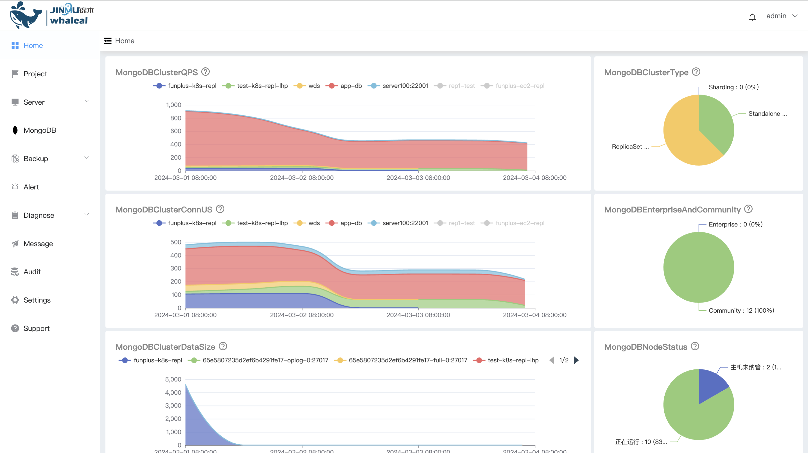
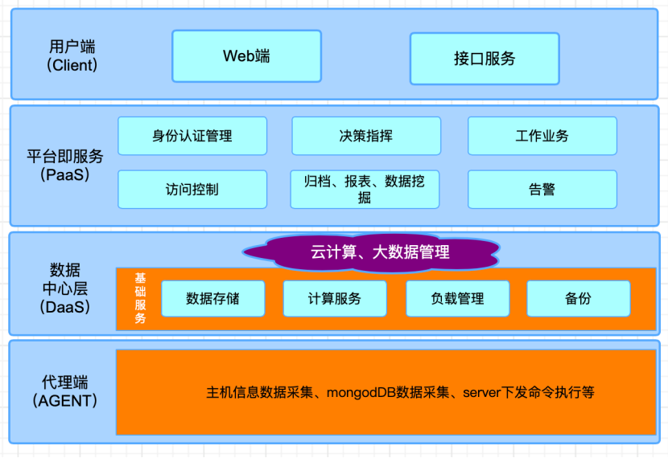

## Whaleal Platform Introduction
````python
Whaleal Platform（WAP）是一款智能运维托管平台，7*24实时监控和管理您的 MongoDB 服务。作为一项开源的 MongoDB 数据库监控解决方案，WAP 提供即时的故障排除和诊断功能，以确保您的 MongoDB 数据库持续稳定运行，并提高工作效率。同时，WAP 还支持自动备份和恢复，为您提供全面的数据保护，确保数据安全可靠。选择 WAP，您将体验到智能化运维的便捷与高效。
````


## Whaleal Platform




## Architecture Introduction



```
系统的架构图描绘了系统的整体结构，它反映了系统各个模块之间的关系。
功能模块划分就是经过层层分解，把一个复杂的系统划分成为多个功能单一的功能模块。
根据对系统的功能进行分析整理，总结出数据共享交换系统的具体功能模块.
```


## WAP Feature

* **灵活部署**

  WAP支持根据业务需求高度定制MongoDB节点，实现快速灵活部署。

* **全局监控**

  平台全面监控每个MongoDB节点，智能关联Host监控，并提供直观的故障排除方法。

* **审计操作日志**

  记录详尽的审计操作日志，有力支持历史回溯，有助于快速排查和解决问题，缩短故障排障时长。

* **自动备份与恢复**

  WAP支持自动备份和恢复功能，为用户提供全面的数据保护，确保数据的安全可靠。

* **通信加密保障**

   WAP采用通信加密技术，保证MongoDB服务之间的数据传输安全，有效防止敏感信息泄露。

* **MongoDB实时诊断**

  WAP支持实时诊断、LogVis、Performance、ExplainPlan等功能，提供全面而精准的数据库性能监控。

* **实时告警：** 

  WAP具备实时告警系统，能迅速捕捉MongoDB节点的异常，如性能下降、存储不足等，及时通知管理员，确保对潜在问题的敏感感知和快速响应。