## Backup

**1、开启备份**

WAP 可以将 MongoDB 数据备份存储到 Linode S3、Amazon S3 中，以便安全可靠地存储和管理你的数据。

a. 进入页面左侧导航栏

b. 点击 Backup 选项按钮,显示当前所以的备份策略

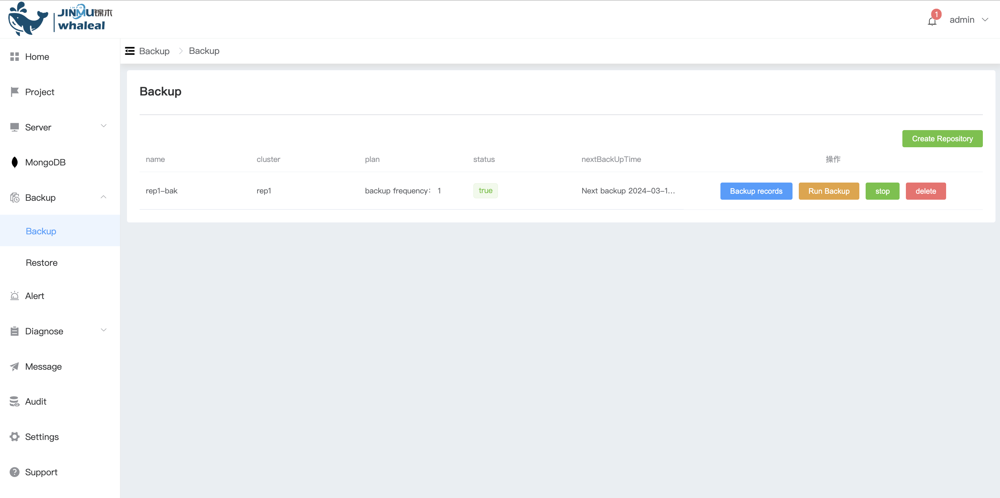

c. 点击 Create Repository 创建备份

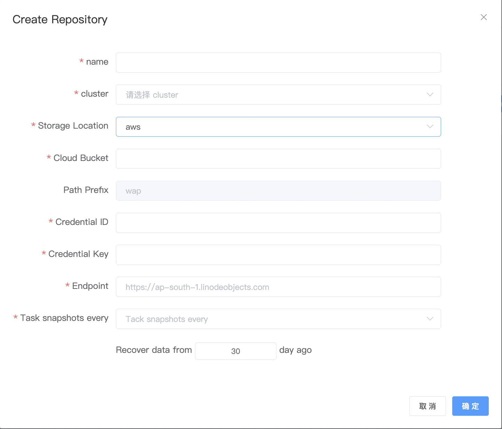

| 配置项               | 值                        |
| -------------------- | ------------------------- |
| Name                 | 当前备份的名称            |
| cluster              | 选择你要备份的mongodb集群 |
| Storage Location     | 选择你要存储备份的位置    |
| Cloud Bucket         | 你存储的s3桶名            |
| Path Prefix          | 路径                      |
| Access Key           | 访问密钥                  |
| Secret Key           | 密钥                      |
| Endpoint             | 存储桶的区域名称          |
| Task snapshots every | 任务快照间隔              |
| Recover data from    | 备份数据保存天数          |

d. 配置完成后,点击 确认 创建备份任务

**2、功能介绍**

a. 备份记录

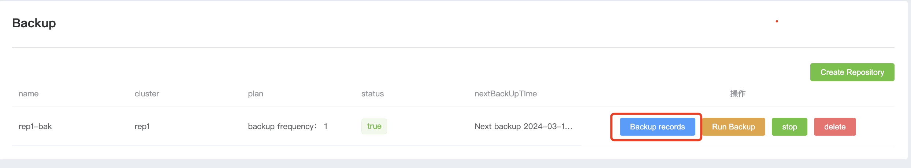

* 点击后 可以看到每次备份的记录

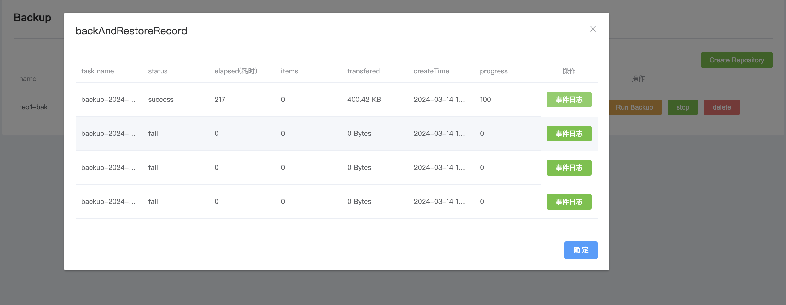

* 点击 事件日志 可以看到备份的详细日志记录

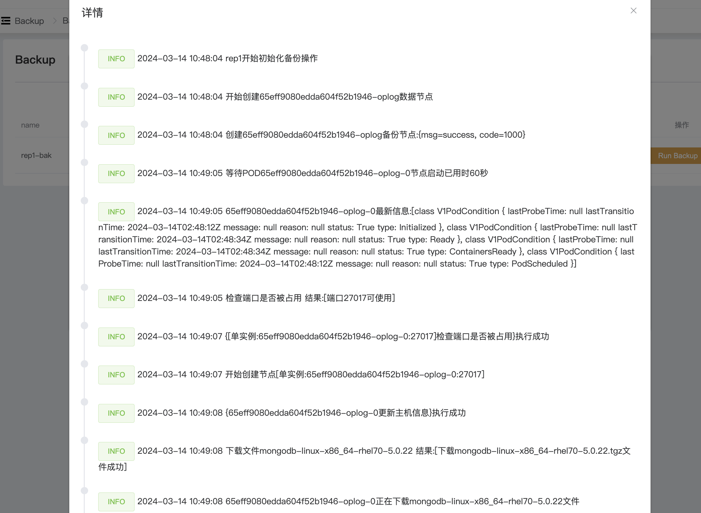

b. 开启备份 

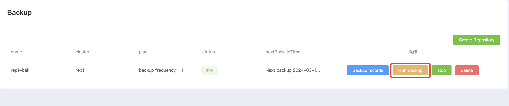

* 点击 运行备份 后会立即运行一次备份任务

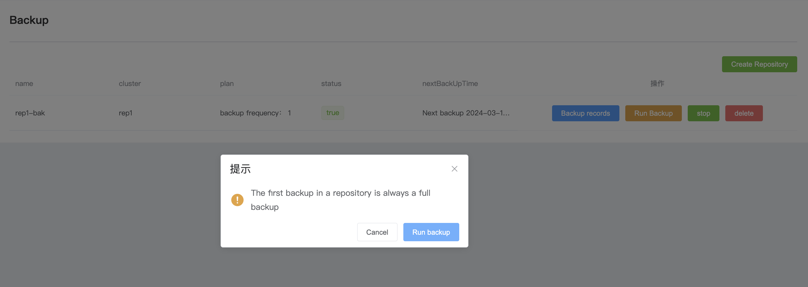

c. 停止备份

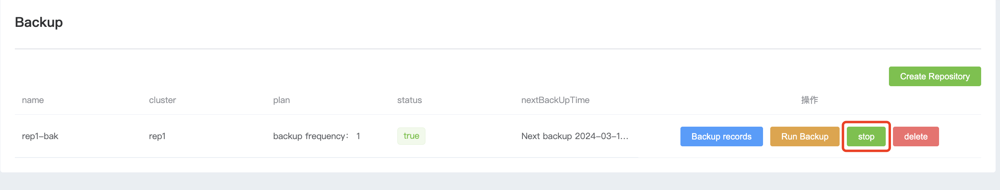

* 点击 stop 后,不再执行此备份任务,如果需要开启点击 start 后会再次开启备份

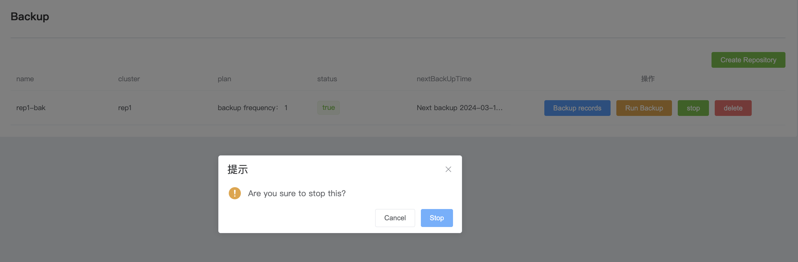

d. 删除备份

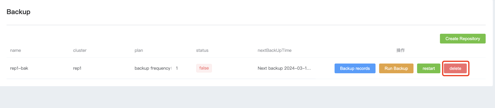

* 点击 删除备份 后此备份策略会被彻底删除,不会在backup中存在

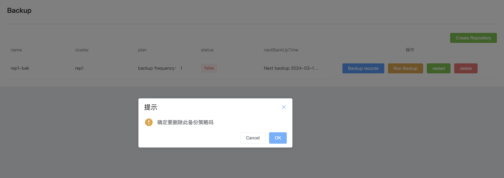

