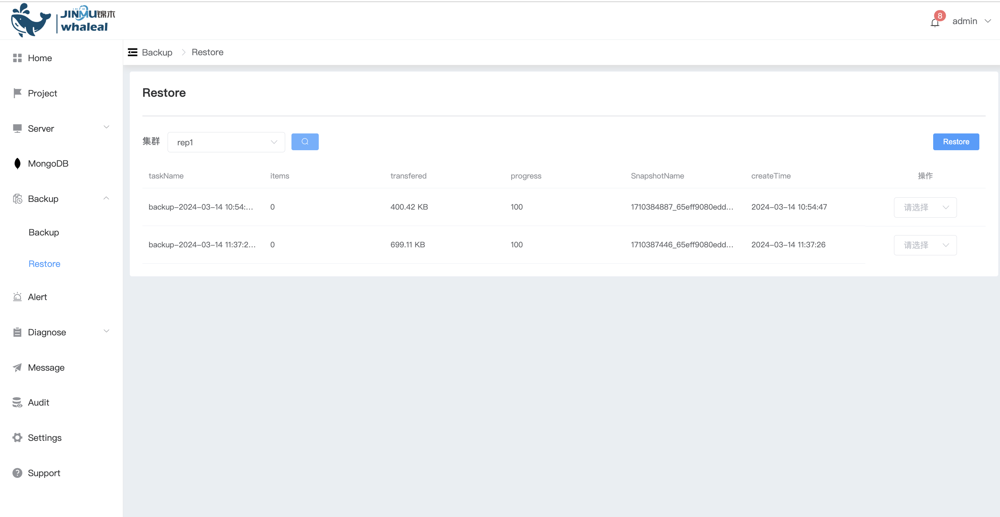
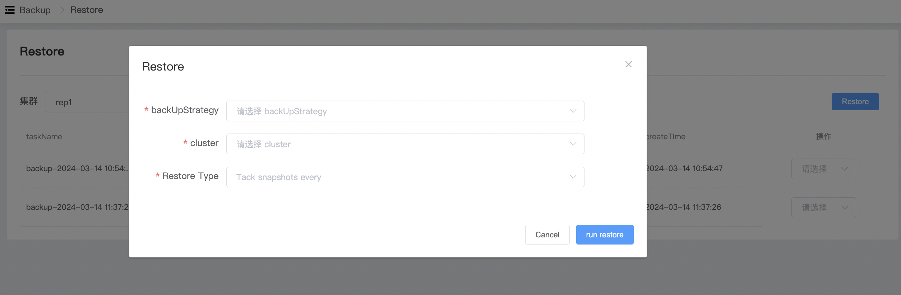
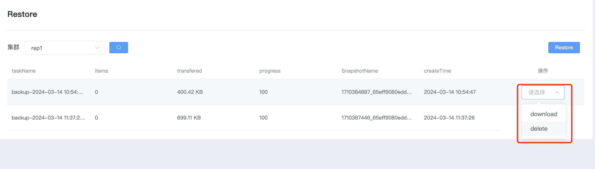

## Restore

**备份恢复**

恢复数据,使用已经备份的数据就行恢复mongodb数据

a. 进入页面左侧导航栏

b. 点击 Backup — Restore 选项按钮,显示当前所有的备份数据

c. 点击右侧 Restore 选择恢复配置

配置信息

| 配置项         | 描述                                                         |
| -------------- | ------------------------------------------------------------ |
| backUpStrategy | 选择备份策略                                                 |
| cluster        | 选择需要恢复到的群集名称                                     |
| Restore Type   | **选择恢复类型** snapshot: 选择要恢复的快照进行恢复  point in time: 选择要恢复的时间点进行恢复 |

e. 配置完成后点击 run Restore 开始恢复

f. 快照操作

- download 下载快照到本地
- delete  删除备份快照文件