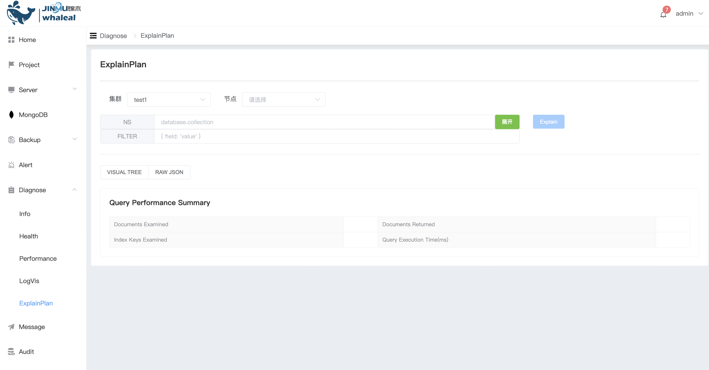
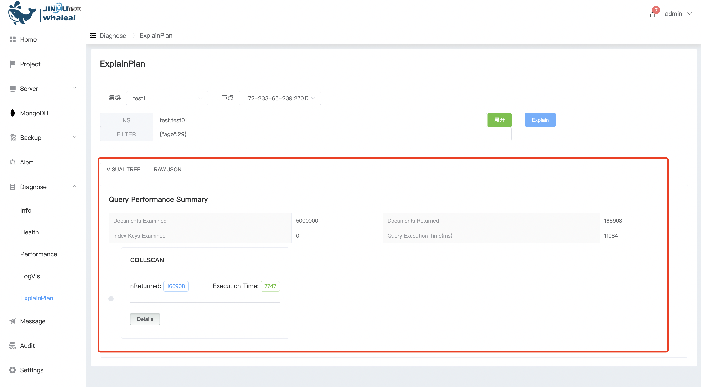

## ExplainPlan

Explain Plan（执行计划）是数据库系统中的一个重要概念，用于解释查询语句的执行方式和优化策略。在 MongoDB 中，执行计划可以通过 `explain()` 方法来获取，该方法接受查询语句作为参数，并返回一个文档，其中包含了查询的执行计划信息。

通过分析执行计划，管理员可以了解查询的执行情况，发现潜在的性能瓶颈，并进行优化。例如，可以根据执行计划优化查询语句、创建合适的索引或调整集合的存储结构，以提高查询效率和整体性能。

执行explain

a. 选择群集和节点 输入数据库表,查询条件后点击Explain

b. 可以查看到当前explain的结果

