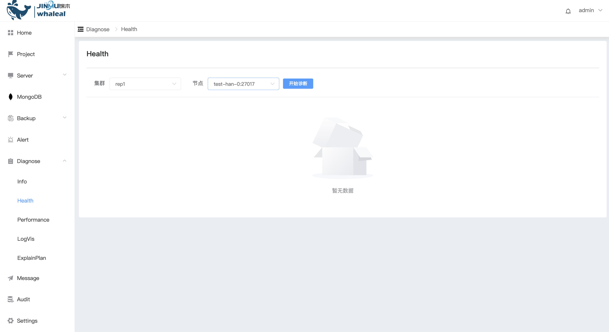
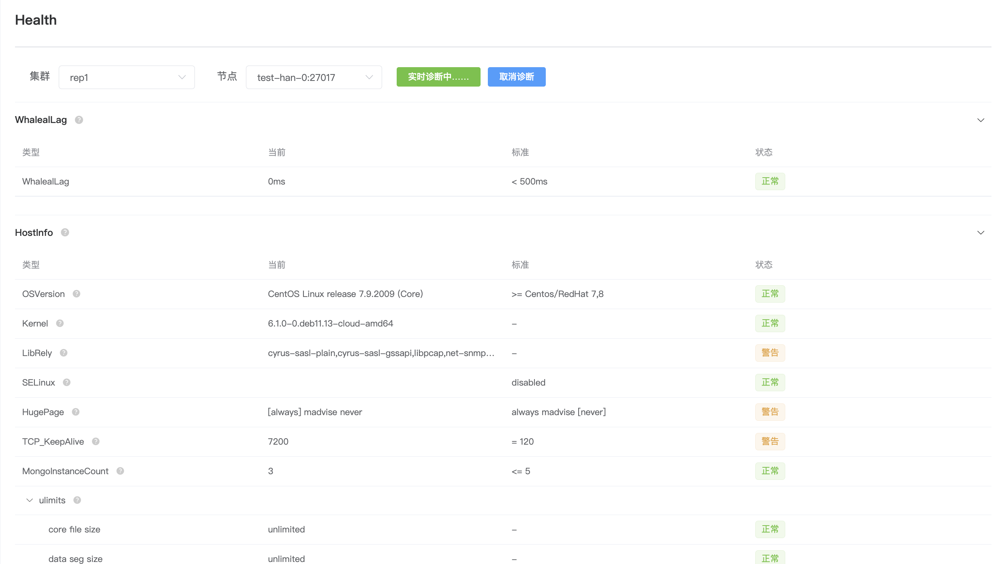
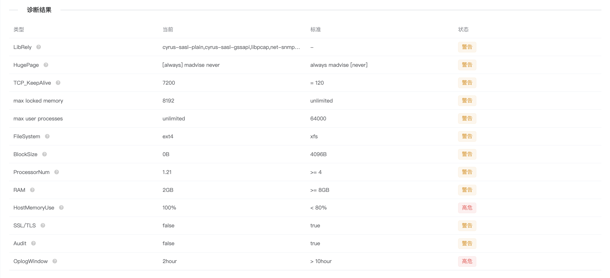

## Health

**快速诊断**

快速诊断 包括WAP平台和agent主机的延迟（WhalealLag）、主机的基本信息（HostInfo）、更详细的实时主机资源利用情况（RealHostInfo）、MongoDB 实例的基本信息（MongoInfo）以及更详细的实时 MongoDB 实例信息（RealMongoInfo）。这些信息可以帮助评估 MongoDB 的性能、可用性和健康状况，从而采取相应的优化和调整措施。

**开始诊断**

a. 点击 开始诊断 , 就开始进行诊断了,等待诊断完成

b. 诊断完成后,下面可以查看诊断结果

