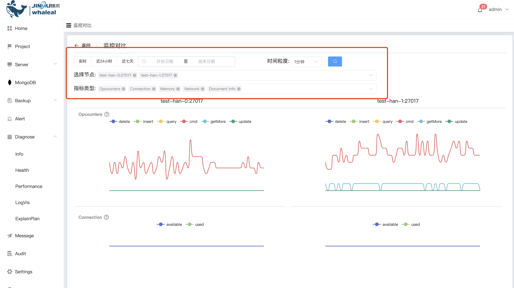

## Performance

实时监控

Performance 实时监控可以实时跟踪和记录 MongoDB 数据库系统的性能指标,通过实时监控，管理员可以及时发现潜在的性能问题，并采取相应的措施进行优化，确保数据库系统能够持续高效地运行。

a. 选择你的集群,集群节点

b. 点击 实时诊断 

**监控对比**

可以查看一个集群中不同的节点监控指标差异对比

a. 点击 监控对比

b.可以选择监控的时间范围,节点以及指标类型

 

