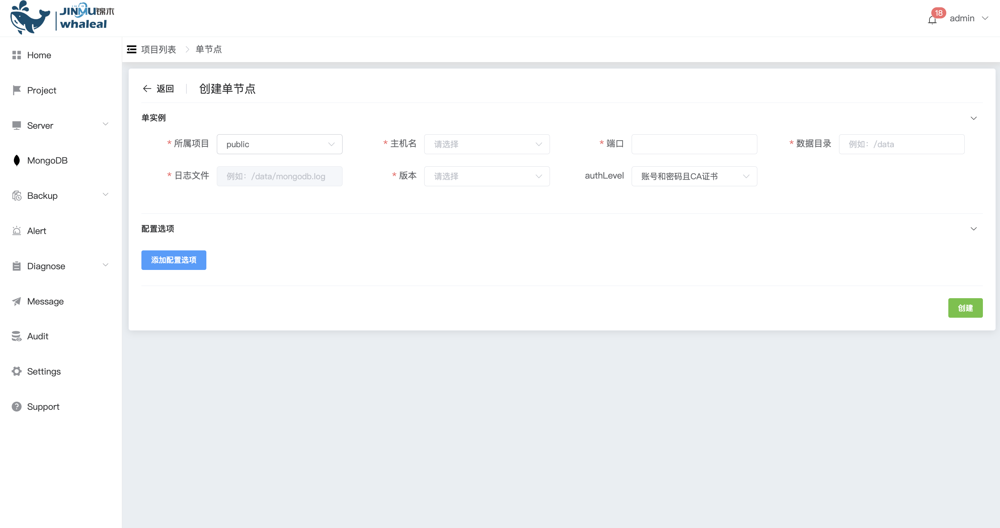

## Create Standalone

```
Create Standalone 分为以下两部分操作内容：
 - Prerequisites
 - Procedure
```

使用 WAP 可以创建 Standalone 。Standalone 所有的数据都存储在该单节点上，没有数据分布或数据冗余。可用于测试与开发，不推荐在生产环境中使用 Standalone 部署方式，Standalone 部署方式没有高可用机制。对于生产环境中推荐使用 [ReplicaSet](CreateReplicaSet.md) 部署方式。

### Prerequisites

在部署 Standalone 前必须确保 Host 已被 WAP 管理。若没有，请先[添加EC2](../../Server/EC2.md)或[添加K8S](../../Server/K8S.md)。

在部署 Standalone 前必须确保 WAP 中有可使用的 MongoTar。若没有，请先[上传 MongoTar](../../Settings/UploadMongoDBTARfile.md)。

### Procedure

**1、进入导航目录**

a. 点击 MongoDB 选项按钮

b. 页面展示所有用户可操作 MongoDB Cluster


**2、创建 Standalone**

a. 点击右侧 创建项目 按钮

b. 选择 单节点 选项

**3、配置 Standalone**



在页面配置以下配置项

| 配置项       | 值                                                           |
| ------------ | ------------------------------------------------------------ |
| 所属项目     | 选择所属的Project                                            |
| 主机名       | 选择主机                                                     |
| 端口         | Standalone mongodb 使用端口                                  |
| 数据目录     | Standalone 数据文件存储目录（绝对路径）                      |
| 日志文件     | Standalone 日志输出文件（绝对路径）                          |
| 版本         | 选择创建 Standalone 版本所对应 MongoTar                      |
| 认证         | 未开启任何认证: 不设置用户密码 <br>账号和密码: 开启认证并设置用户密码 <br/>账号和密码且CA证书: 开启认证设置用户密码并使用CA证书 |
| 添加配置选项 | 可以添加mongodb 的参数配置                                   |

**4、配置选项**


a. 点击 添加配置选项 按钮

b. 选择添加启动配置项，点击 确定 按钮添加

c. 设置 配置选项 值

**5、创建**

点击 创建 按钮，创建 Standalone。

