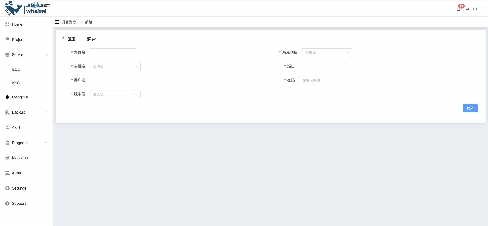

## Existing MongoDB Deployment

```
Existing MongoDB Deployment 可以执行以下操作：
 - Existing MongoDB Deployment
```

### Existing MongoDB Deployment

**进入导航目录**

a. 点击 MongoDB 选项按钮

b. 选择 MongoList 选项，页面展示所有用户可操作 MongoDB Cluster


c. 点击 创建项目 选项按钮，选择 纳管

通过配置集群中任意一个节点信息，Whaleal Platform 会发现集群中所有节点，实现对所有节点进行的监控、管理。



配置以下配置项

| 配置项   | 值                           |
| -------- | ---------------------------- |
| 群集名   | mongodb群集名称              |
| 所属项目 | 选择所属项目的名称           |
| 主机名   | 选择部署mongodb节点 所在主机 |
| 端口     | mongodb 使用端口             |
| 用户名   | mongodb用户                  |
| 密码     | mongodb用户密码              |
| 版本号   | mongodb的版本号              |


配置完成点击 提交 按钮