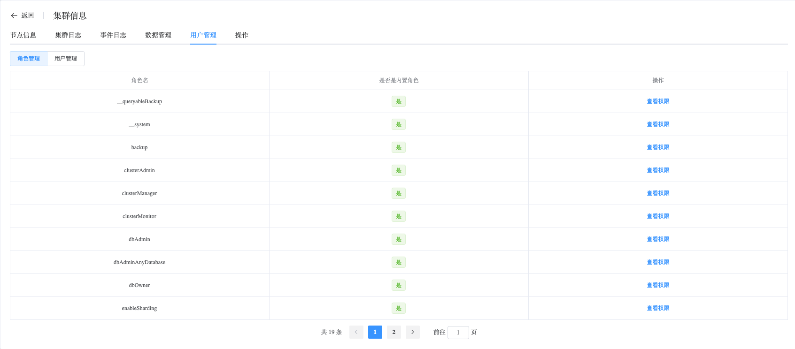
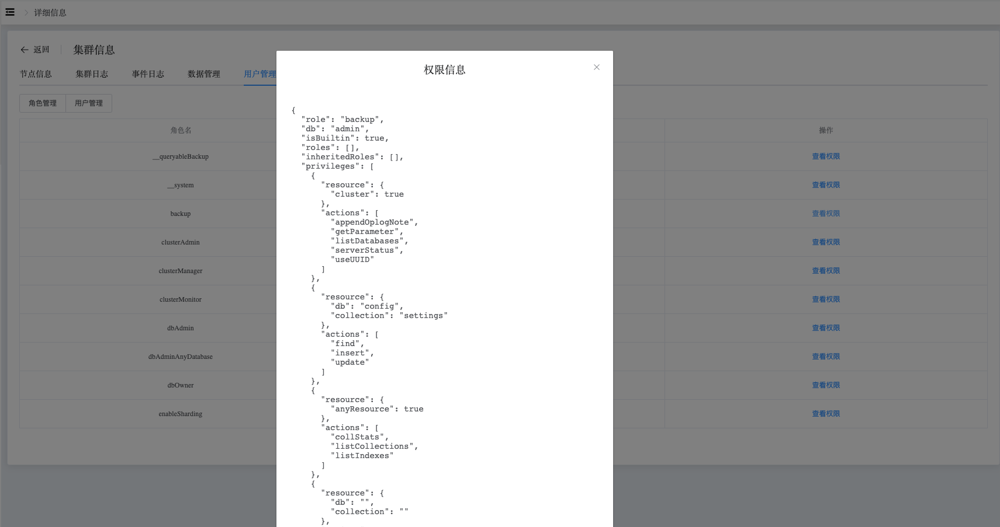
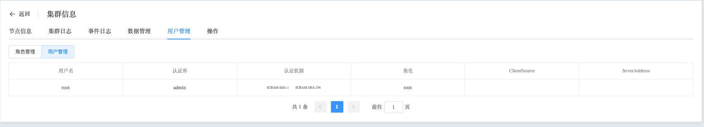

## Role And User

```
Role And User 可以执行以下操作：
 - Role
 - User
```

查看 Role 和 User 数据

a. 进入页面左侧导航栏

b. 点击 MongoDB 选项按钮，选择 MongoList 选项

c. 在 MongoDB 静态信息页面，点击类型为 “单实例” 的集群名

d. 在集群信息页面，选择用户管理

### Role

选择 角色管理 按钮，展示集群中所有角色信息




点击角色后 “查看权限” 按钮，查看角色具体权限




### User

选择 用户管理 按钮，展示集群内所有用户

