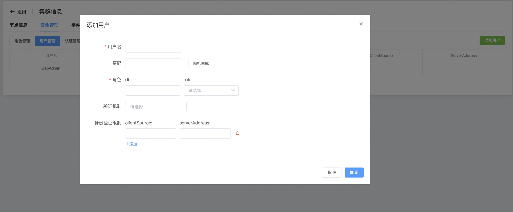

## User Management

**创建MongoDB群集用户**

a. 点击 MongoDB 选项按钮

b. 点击你要创建用户的群集名称

c. 点击安全管理

d. 点击用户管理,创建用户

配置以下配置

| 配置项       | 值                                              |
| ------------ | ----------------------------------------------- |
| 用户名       | 添加的用户名                                    |
| 密码         | 配置密码,可以选择随机生成                       |
| 角色         | db; 认证库 role; 选择权限角色                |
| 认证机制     | 选择认证机制,可以选择SCRAM-SHA-1和SCRAM-SHA-256 |
| 身份验证限制 | 客户端来源限制 服务器地址限制               |

e. 配置完成后单击 确认 创建用户

