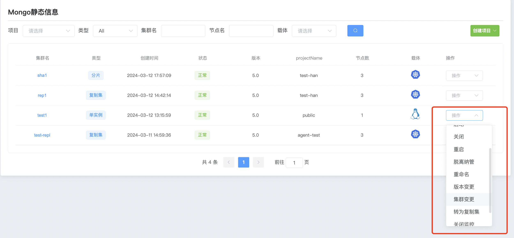
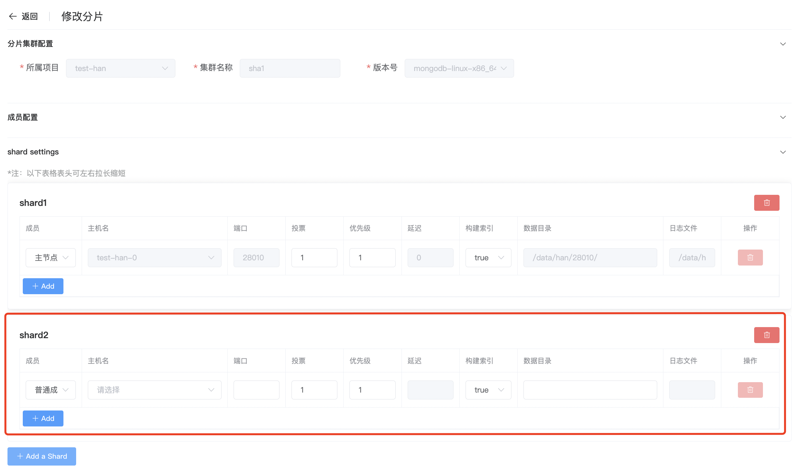

## Cluster changes

**群集变更**

在群集变更中,单节点、复制集、分片集群的变更会有所不同

a. 点击 MongoDB 选项按钮

b. 选择群集点击 操作 群集变更

c. 修改配置选项内的参数

d. 添加配置选项

e. 配置完成后点击 修改

**复制集添加成员**

 a. 点击 MongoDB 选项按钮

b. 选择群集点击 操作 群集变更

c. 点击成员配置 +add 添加新的成员

d. 配置完成后点击 修改

**分片集群添加shard**

 a. 点击 MongoDB 选项按钮

b. 选择群集点击 操作 群集变更

c. 点击成员配置 +add shard 添加新shard群集

d. 配置完成后点击 修改

