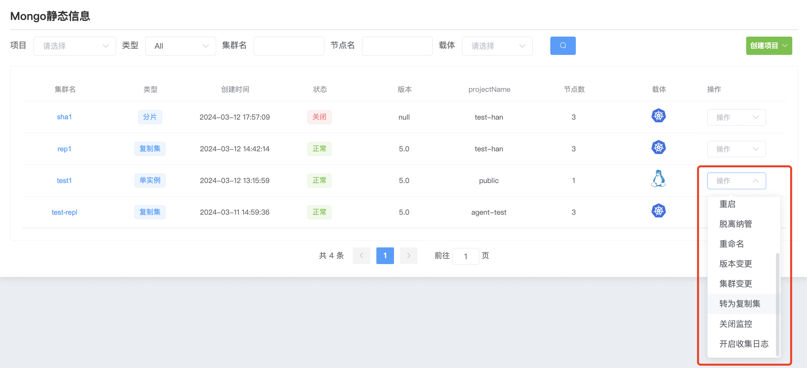
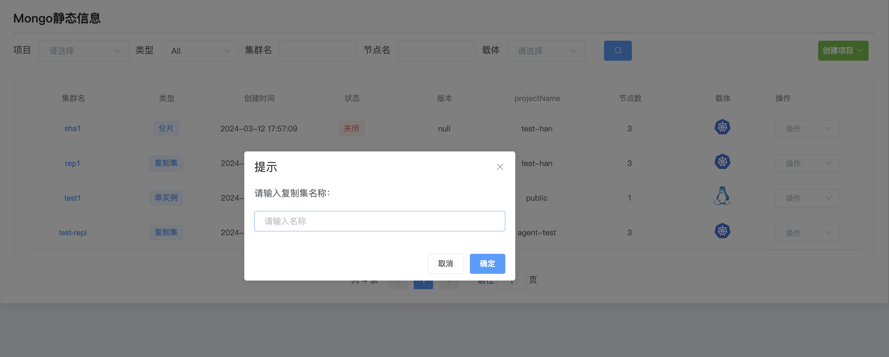
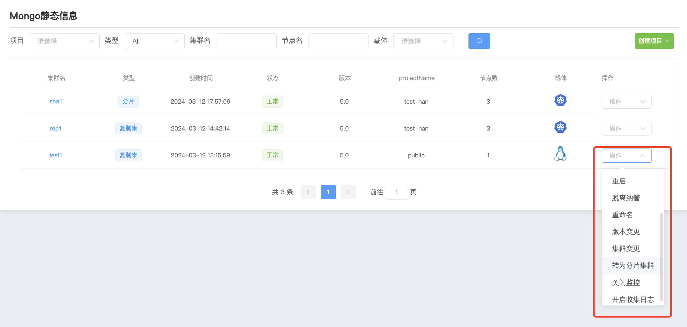
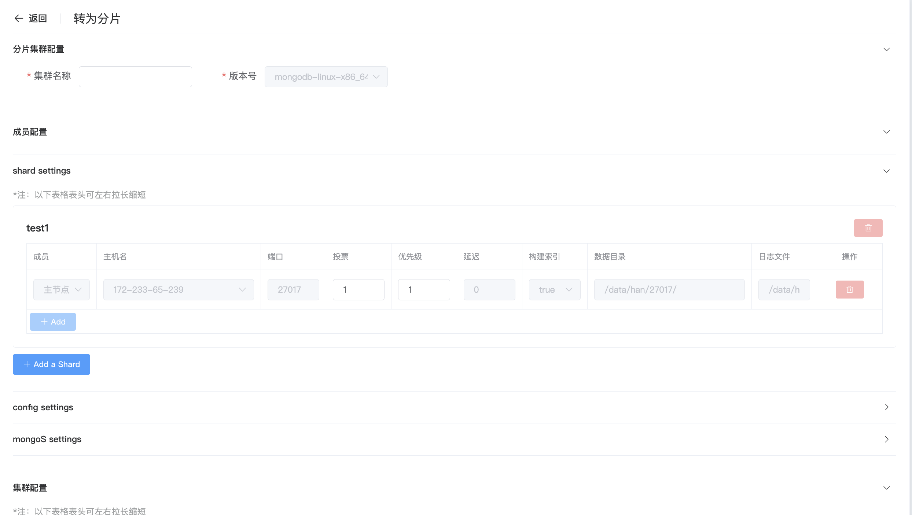

## cluster conversion

**群集转换**

wap平台支持把MongoDB单实例转换为MongoDB复制集,MongoDB复制集转换为分片集群.

**单实例转换为复制集**

a. 点击 MongoDB 选项按钮

b. 选择群集点击 操作 转为复制集

c. 输入复制集名称

d. 输入完成后点击 确认 开始转换

**复制集转换为分片**

a. 点击 MongoDB 选项按钮

b. 选择群集点击 操作 转为分片集群

c. 填写配置

复制集转换为分片,必须配置一个config和mongos集群

d. 配置完成后点击 保存 开始复制集转换为分片