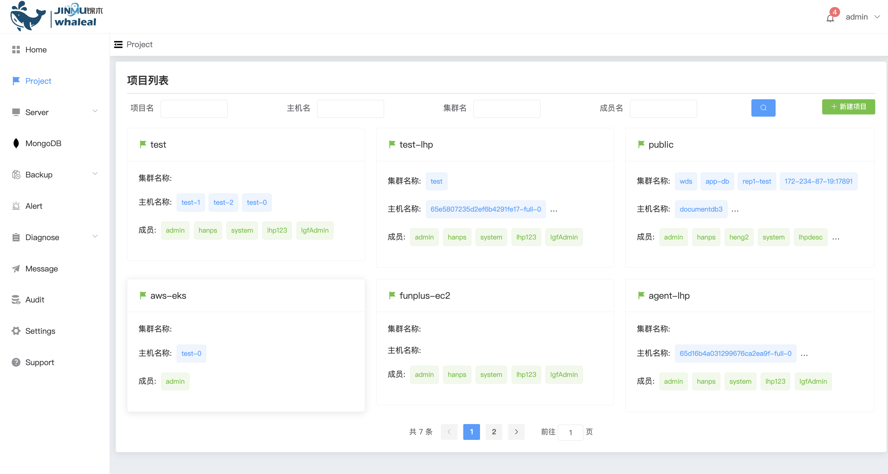
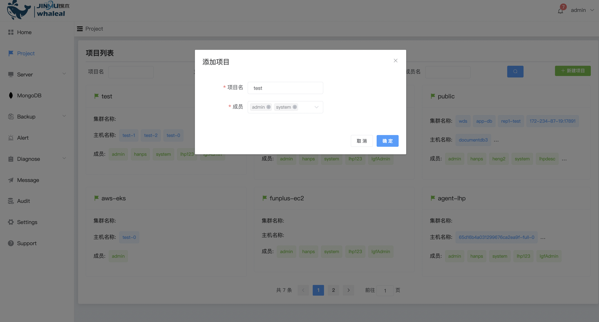
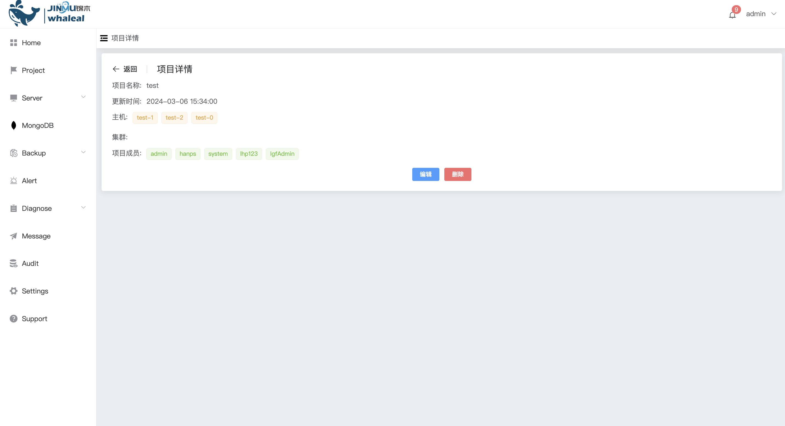

### Project

**项目**

MongoDB 的创建必须存在于一个项目中，你可以为每个项目添加用户和群集。一个项目可以包含多个用户和群集。

通过项目，你可以定义权限和访问控制，确保只有授权的用户能够访问和管理项目中的资源。此外，项目还支持多环境管理，使你能够在不同的项目中管理不同的 MongoDB 环境。

**新建项目**

创建Project,填写项目名称 成员

**修改Project配置**

可以修改添加相应的群集信息

**删除Project**

删除Project后,Project中的mongodb群集也会被删除掉

