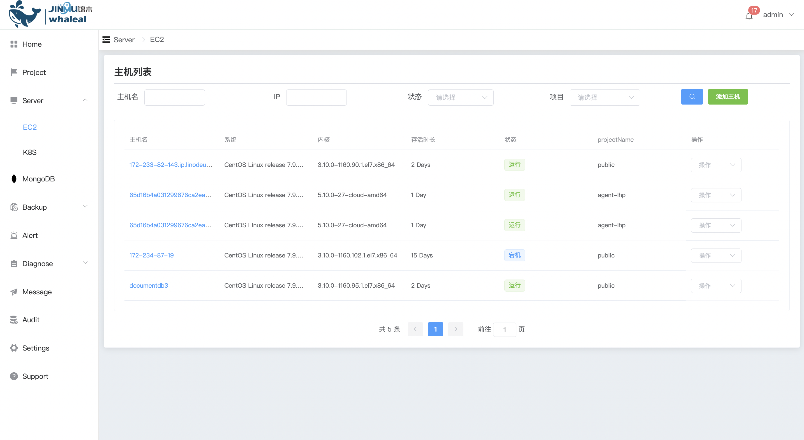
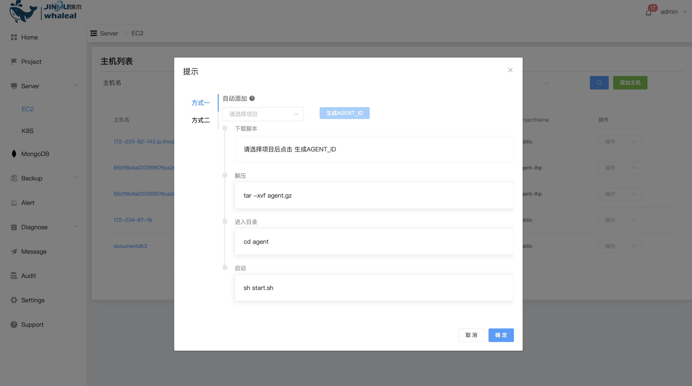
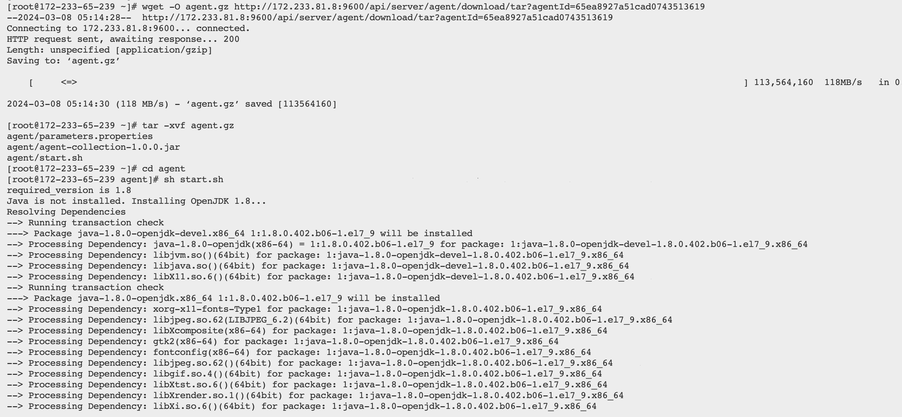
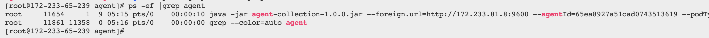
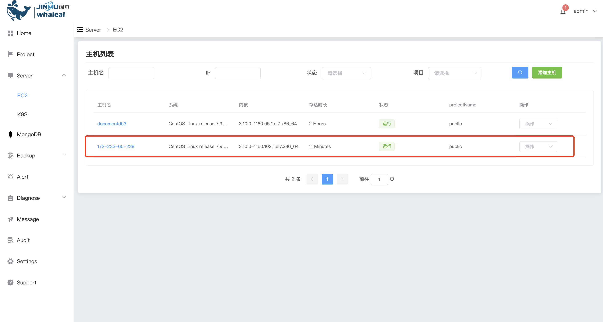
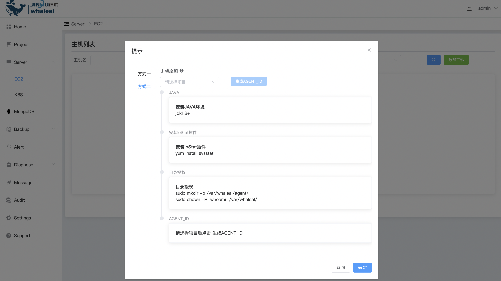
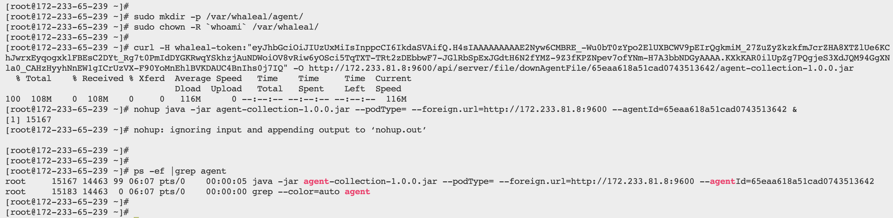
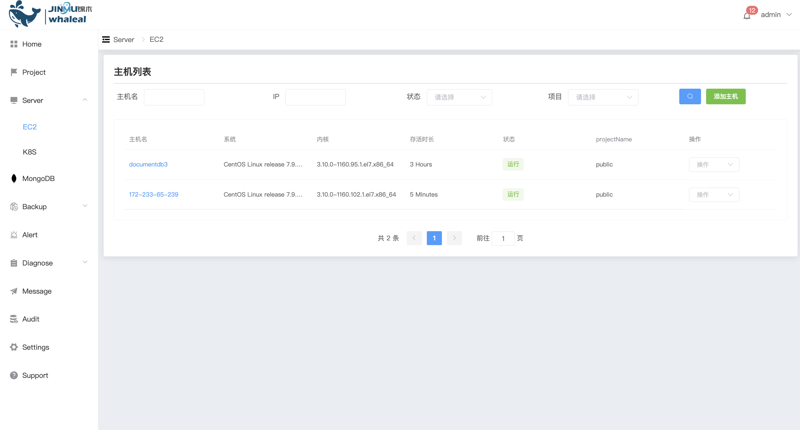

### EC2

 添加主机可以把mongodb部署到自己的资源环境中



**添加主机**

添加主机提供有两种方式可以选择,选择项目生成agentid后,按照提示的信息执行后点击确定,

1、方式一:



* 登陆服务器下载agent

  

* 执行脚本后再看agent程序是否启动

  

* 登陆WAP平台后查看

  

2、方式二:

需要手动安装java环境和插件



* 下载安装java环境

  ```
  
  tar -zxvf jdk-11.0.9_linux-x64_bin.tar.gz -C /usr/local/
  
  vi /etc/profile
  # 最后一行添加以下配置
  export JAVA_HOME=/usr/local/jdk-11.0.9
  export CLASSPATH=.:$JAVA_HOME/lib/dt.jar:$JAVA_HOME/lib/tools.jar
  export PATH=$PATH:$JAVA_HOME/bin
  
  source /etc/profile
  
  # 查看当前版本
  java --version
  ```

* 安装ioStat插件

  ```
  yum install sysstat
  ```

* 下载agent包

  

* 启动后平台查看

  