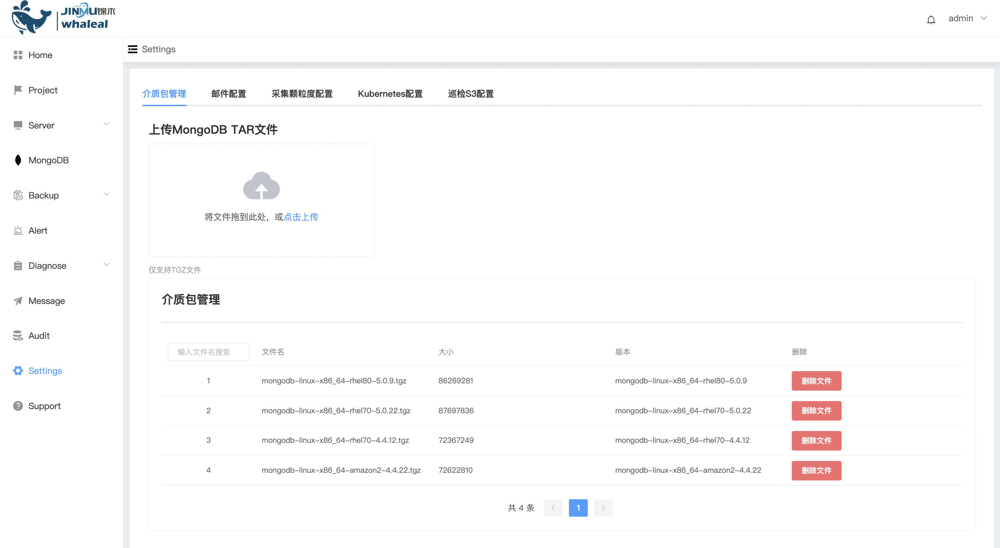

## UploadMongoTar

```
上传 MongoDB Tar 前，需阅读以下材料：
 - Procedure
```

Whaleal Platform 创建集群，需使用 TGZ 文件。其他文件类型暂不支持。

### Procedure

Step-1. 进入导航目录

a. 进入页面左侧导航栏

b. 点击 Settings 选项按钮

c. 选择 介质包管理 选项，页面展示所有可用于创建集群 TGZ 文件





Step-2. 上传文件

a. 点击 点击上传

b. 选择待上传的 TGZ 文件

c. 点击 确定

d. 等待上传进度条完成，上传成功

