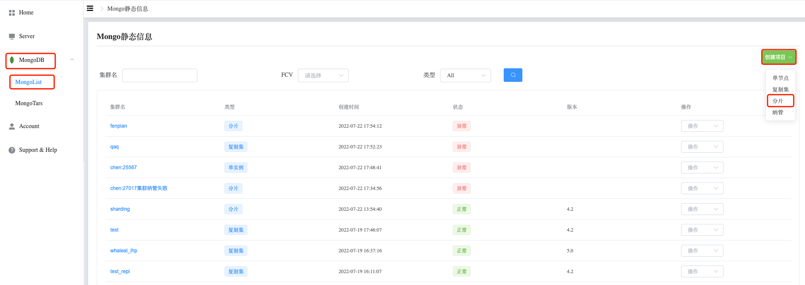
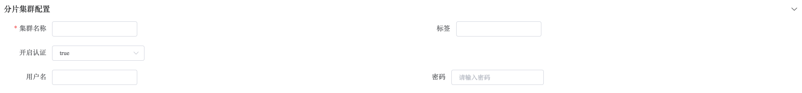
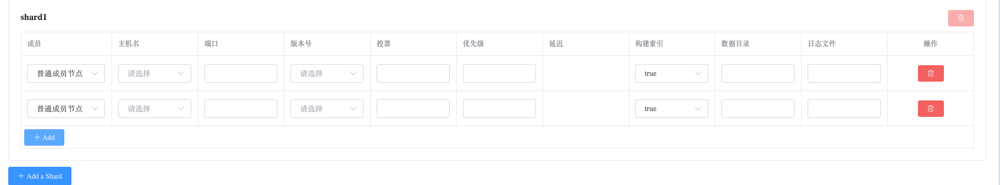
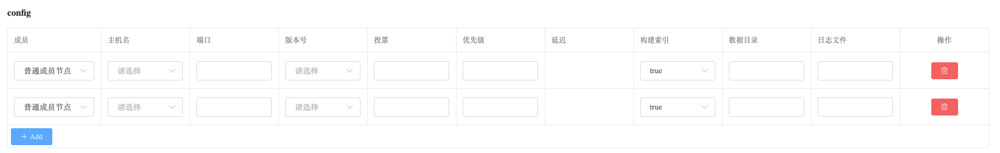
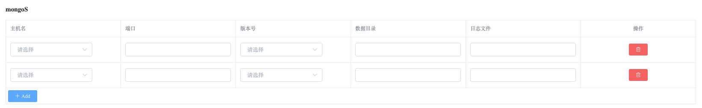

## How To Create Sharded Cluster

### Create Sharded Cluster

Step-1. 进入导航目录

a. 进入页面左侧导航栏

b. 点击 MongoDB 选项按钮

c. 选择 MongoList 选项，页面展示所有用户可操作 MongoDB Cluster

Step-2. 创建 ReplicaSet

a. 点击右侧 创建项目 按钮

b. 选择 分片 选项

Step-3. 配置 Sharded Cluster

分片集群配置

成员配置

a. 点击 Add Option 按钮

b. 选择添加启动配置项，点击 确定 按钮添加

c. 设置 配置选项 值

Shard Settings

config Settings

Mongos Settings

集群配置

高级配置

Step-4. 创建

点击 创建 按钮，创建 Sharded Cluster。

