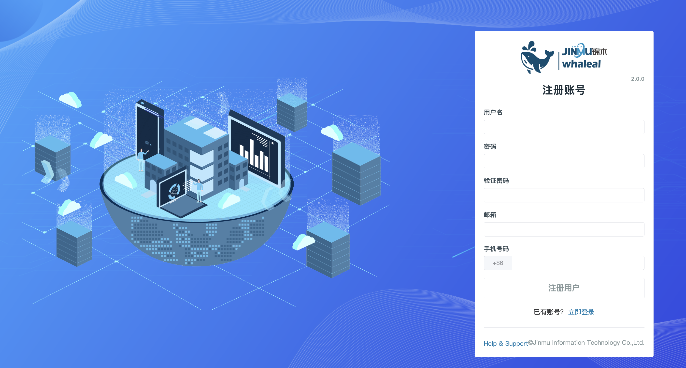

## Whaleal Platform ChangeLog

### Whaleal Platform V2.0.0

    Whaleal Platform V2.0.0。

其平台包含功能模块大致如下：
    
#### 1.登录注册

- 注册


注册账号：账号注册时，无需验证手机号和邮箱正确性只验证基本格式与是否已存在，一般建议填写手机号（仅支持中国大陆手机号）和邮箱。




- 登录

  登录方式：手机+密码，邮箱+密码，账号+密码。


<br>

#### 2.首页 (Home)


- Host

   - 显示主机、CPU、内存、磁盘的存活状态以扇形图形式展示。


- Host Summary

  - 显示CPU、Memory、Disk、NetIn、NetOut 前五的存详情数据，以图表的形式展示。
- Mongo

  - 显示Mongo节点、Mongo集群、Mongo集群类型的实时情况，以扇形图形式展示。
- MongoDB Summary

  - 显示Cluster 、Collection 、Crashed 、Qps 、Connection、Slowest 前五的存详情数据，以图表的形式展示。

<br>

#### 3. 项目 (Project)

* [项目](../02-Usage/Project.md)
  * 你可以定义权限和访问控制，确保只有授权的用户能够访问和管理项目中的资源

#### 4. 主机列表 (Server)

* 主机统计

  - 页面将已被平台纳管的主机大致信息进行展示，同时可以对主机进行脱离纳管更新数据等操作。

* 添加主机

  * [EC2](../02-Usage/Server/EC2.md)

    添加 EC2 主机

  * [K8S](../02-Usage/Server/K8S.md)

    创建 k8s 主机,修改添加主机资源配置

* 主机信息
  * 点击主机名称进入主机的详情页面页面内有主机的基本信息、监控、日志、命令、告警等。详情在[HostInfos](../02-Usage/Host/HostInfos.md)处有介绍
* [脱离纳管](../02-Usage/Server/RemoveHost.md)
  
  * 对主机在平台进行移除

<br>

#### 5.Mongo列表 (MongoDB)

- Mongo静态信息

  - 页面展示已被纳管进平台的集群信息，也可对想要集群进行搜索定位，同时可以对集群进行不同操作。例如更新节点信息、启动、关闭、重启、脱离纳管、重命名等操作。


- 创建项目

  - 点击创建项目按钮可以选择不同的集群类型在平台上进行创建。创建类型有单节点、复制集、分片等。也可将未被平台纳管的集群纳管到平台中来。
    - 创建单节点详细步骤-->[CreateStandalone](../02-Usage/MongoDB/CreateDeployment/CreateStandalone.md)
    - 创建复制集详细步骤-->[CreateReplicaSet](../02-Usage/MongoDB/CreateDeployment/CreateReplicaSet.md)
    - 创建分片详细步骤-->[CreateShardedCluster](../02-Usage/MongoDB/CreateDeployment/CreateShardedCluster.md)
    - 纳管MongoDB步骤-->[ExistingMongoDBDeployment](../02-Usage/MongoDB/CreateDeployment/ExistingMongoDBDeployment.md)

- Mongo集群操作

  * [连接集群](../02-Usage/MongoDB/ManageCluster/clusteroperations/Connecttothecluster.md)
  * [更新集群信息](../02-Usage/MongoDB/ManageCluster/clusteroperations/Updateclusterinformation.md)
  * [启动/关闭/重启集群](../02-Usage/MongoDB/ManageCluster/clusteroperations/Clusterstartupshutdown.md)
  * [脱离纳管](../02-Usage/MongoDB/ManageCluster/clusteroperations/outofmanagement.md)
  * [重命名](../02-Usage/MongoDB/ManageCluster/clusteroperations/Clusterrename.md)
  * [版本变更](../02-Usage/MongoDB/ManageCluster/clusteroperations/Versionchanges.md)
  * [群集变更](../02-Usage/MongoDB/ManageCluster/clusteroperations/Clusterchanges.md)
  * [群集转换](../02-Usage/MongoDB/ManageCluster/clusteroperations/clusterconversion.md)
    * 单节点转为复制集
    * 复制集转为分片集群
  * [开启监控](../02-Usage/MongoDB/ManageCluster/clusteroperations/Turnonmonitoring.md)
  * [开启收集日志](../02-Usage/MongoDB/ManageCluster/clusteroperations/Enablelogcollection.md)

- [Mongodb监控](../02-Usage/MongoDB/ManageCluster/MonitorMongoDB.md)

  * 点击群集名--> 点击查看监控,可以看到mongodb监控信息

- 安全管理

  *  [用户创建](../02-Usage/MongoDB/ManageCluster/UserManagement.md)

    创建mongodb用户

  *  [认证管理](../02-Usage/MongoDB/ManageCluster/Certification.md)

    修改mongodb用户的认证方式比如用户名密码,或者ca证书
  
- [节点操作](../02-Usage/MongoDB/ManageCluster/Nodeoperations.md)

  * 针对集群中的单个节点进行开启/关闭等操作

<br>

#### 6.备份 (Backup)

* [Backup](../02-Usage/Backuprestore/Backub.md)
  * 对mongodb进行备份,备份文件存储到S3中
* [Restore](../02-Usage/Backuprestore/Restore.md)
  * 通过备份文件进行恢复数据

<br>

#### 7.告警 (Alert)

* [告警配置](../02-Usage/Alert.md)
  * 添加告警配置,可以配置host告警、mongo告警、project告警

<br>

#### 8.诊断 (Diagnose)

* [群集信息](../02-Usage/Diagnose/Info.md) (Info)

  info页面，提供集群信息、复制集配置和节点状态。管理员可以在此查看集群概要信息、复制集配置（如主从节点设置）以及每个节点的详细信息

* [快速诊断](../02-Usage/Diagnose/Health.md) (Health)

  快速诊断出当前主机和MongoDB的资源以及配置信息,这些信息可以帮助评估 MongoDB 的性能、可用性和健康状况

* [实时监控](../02-Usage/Diagnose/Performance.md) (Performance)

  实时监控可以实时跟踪和记录 MongoDB 数据库系统的性能指

* [日志分析](../02-Usage/Diagnose/LogVis.md) (LogVis)

  查看当前MongoDB群集的慢日志,以及MongoDB审计日志

* [执行计划](../02-Usage/Diagnose/ExplainPlan.md) (ExplainPlan)

  通过分析执行计划，管理员可以了解查询的执行情况，发现潜在的性能瓶颈，并进行优化。

<br>

#### 9.通知 (Message)

* [平台操作通知](../02-Usage/Message.md)
  * 平台中所有的操作信息通知包括告警等

<br>

#### 10.审计 (Audit)

* [审计列表](../02-Usage/Audit.md)
  * 审计通知,包含用户操作、请求方式、群集操作、用户登陆等信息

<br>

#### 11.设置 (Settings)

* 介质包管理
  * Mongo介质包管理

    - 在创建集群时选择不同mongo版本进行创建，此版本mongo可通过MongoTars页面进行上传.
      - 上传介质包详情步骤-->[UploadMongoTar](../02-Usage/Settings/UploadMongoDBTARfile.md)
* [邮件配置](../02-Usage/Settings/Emailconfiguration.md)
  * 配置告警邮件,告警信息会通过这个邮箱发送给用户
* [采集颗粒度配置](../02-Usage/Settings/Collectiongranularityconfiguration.md)
  * 采集颗粒度配置可以在监控中设定数据采集的频率
* [Kubernetes配置](../02-Usage/Settings/Kubernetesconfiguration.md)
  * k8s配置,要添加k8s主机必须把Kubernetes配置文件添加到WAP平台.
* [巡检S3配置](../02-Usage/Settings/InspectingS3configuration.md)
  * 巡检需要配置,巡检文件存储到的S3,

<br>

#### 12.支持 (Support)

* 巡检
* [工单](https://support.whaleal.com/)
  * Whaleal Support工单

<br>


####  13.用户中心

- [个人中心](../02-Usage/Account/AccountCenter.md)
  - 个人中心页面显示注册时所填写的个人信息，可以在此页面进行更改与添加信息。
  
- [用户管理](../02-Usage/Account/Users.md)
  - 用管理页面只有admin账号可以进行显示与操作，在页面中可以删除用户与对用户赋权。
    - 点击用户名进入用户资源页面，可以对此用户进行权限管理如添加主机与创建集群功能。在Server与Mongo页面可以对某个主机或集群对此用户显示与隐藏。
  
- [账户配置](../02-Usage/Account/Config.md)
- 账户配置页面可以设置时区，同时可以设置是否接受告警通知。

<br>

####  14. Help


- [文档专栏](https://docs.whaleal.com/)
  - Whaleal社区文档专栏


- [社区地址](https://www.whaleal.com/)
  - Whaleal社区

<br>


---
---


##### Whaleal Platform Agent V1.0.0

```


```