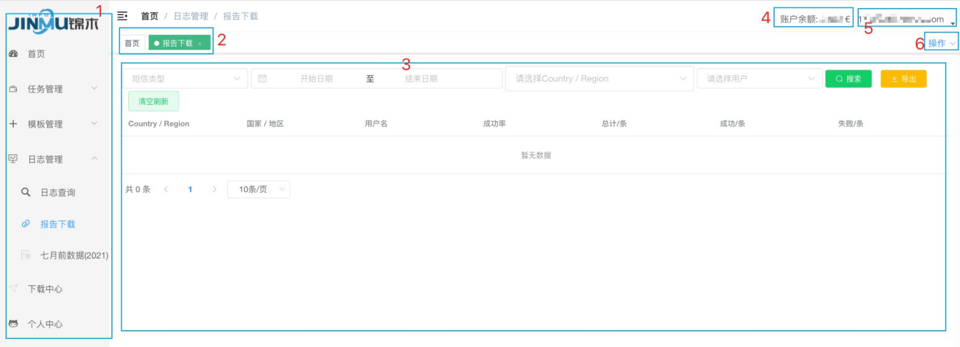

*图例2-1 页面布局图*

### 平台布局介绍

| 区域 | 描述 |
|------|------|
| 1    | 导航栏，默认点击某一级目录时会自动收缩其他目录，可通过“区域5-布局设置-菜单 UniqueOpened”调节；该导航栏可往左侧收缩，仅展示小图标。 |
| 2    | Tags-Views 区域，默认开启，可通过“区域5-布局设置-开启 Tags-Views”调节。 |
| 3    | 操作区。 |
| 4    | 账户余额展示区，随发信任务/API调用更新。 |
| 5    | 登录账号、系统布局配置、个人中心。 |
| 6    | 跟随 Tags-Views调节，对 Tags执行操作：刷新、关闭、关闭其他、关闭所有。 |
