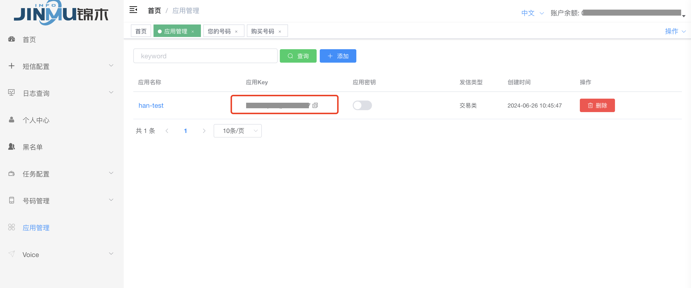
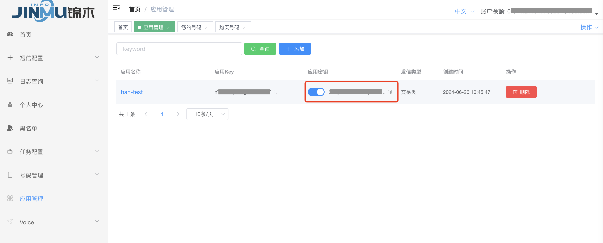

### step0 首次接入流程

JMC对用户端接入流程进行了精简，用户仅需提供相关信息，后续审核、申请、维护等均由锦木通信服务团队负责。


### step1 登录

**登录地址**: [https://client.jinmuinfo.com](https://client.jinmuinfo.com)

**登录账号**: 须由锦木服务团队注册，手机号暂仅支持中国大陆及港澳台、新加坡

**登录密码**: 账号注册时，自动发送至注册邮箱

**验证码**: 邮箱登录则发送至邮箱，手机号登录则发送短信，有效期 5 分钟


### step2 发信

#### step2.1 应用发信（推荐使用）
##### 获取应用API KEY配置信息

**创建应用**:

*点击添加 填写应用名称*


*点击确认创建成功*


*创建应用完成后,可以直接看到应用key*



*点击 应用密钥 查看密钥信息*



**appKey**: 应用Key

**appSecret**: 点击应用密钥开关，即可查看密钥信息

**Tip**: 如果无此页面访问权限，请联系锦木进行配置


##### 接口说明

使用POST请求。

接口地址: https://sms.jinmuinfo.com/beta/send
请求方式: POST

接口描述: 应用发信接口

##### 请求参数

| 参数名称  | 参数说明                                            | 是否必须 | 数据类型 | 说明                    |
| --------- | --------------------------------------------------- | -------- | -------- | ----------------------- |
| appKey    | 加密后的 KEY，用于校验请求是否合法                  | true     | string   | 在 jmc 平台应用管理中查看 |
| appSecret | 与 appKey 唯一对应的密钥                            | true     | string   | 在 jmc 平台应用管理中查看 |
| from      | 发送的 from 内容                                    | true     | string   | XX 数字中心（一般为senderID）             |
| to        | 接收用户的手机号码                                  | true     | string   | 86136XXXXXXXX           |
| type      | 发信类型，默认参数为 text，非英文内容时设为 unicode | false    | string   | unicode/text            |
| content   | 发信内容                                            | true    | string   | 发信内容                |

成功示例:
```json
{
  "msg": "发送成功",
  "code": 0,
  "data": ""
}
```

失败示例:
```json
{
    "msg": "appKey不存在或已禁用",
    "code": 35,
    "data": false
}
```

应用发信请求设置:


```
curl --location 'https://sms.jinmuinfo.com/beta/send' \
--header 'Content-Type: application/json' \
--data '{
        "appKey" : "{appKey}",
        "appSecret" : "{appSecret}",
        "from" : "{from}",
        "to" : "{to}",
        "type" : "{type}",
        "content" : "{content}"
}'
```


##### 查看应用发信日志


#### step2.2 普通API发信
##### 获取API KEY配置信息


**baseKey**: 第一列的key参数

**secret**: 点击查看poc secret获取密钥信息。密钥信息可以配置多个

**Tip**: 如果此页面查询不到任何key信息，请联系锦木进行配置

##### 使用API接口说明

使用POST请求。此接口会校验号码黑名单。

接口地址: [https://sms.jinmuinfo.com/send/v2/check](https://sms.jinmuinfo.com/send/v2/check)  
请求方式: POST  
接口描述: 短信API接口


##### 请求参数

| 参数名称   | 参数说明                             | 是否必须 | 数据类型 | 说明                   |
|------------|--------------------------------------|----------|----------|------------------------|
| baseKey    | 加密后的 KEY，用于校验请求是否合法    | true     | string   | 由锦木服务团队提供     |
| secret     | 与 baseKey 唯一对应的密钥            | true     | string   | 由锦木服务团队提供     |
| from       | 发送方内容                            | true     | string   | XX 数字中心(一般为senderID)            |
| msg        | 发送的消息内容                        | true     | string   | 您的 XX 服务到期       |
| to         | 接收用户的手机号码                    | true     | string   | 86136XXXXXXXX         |
| type       | 发信类型，默认参数为 text，非英文内容时设为 unicode    | false    | string   | unicode/text              |


成功示例:
```json
{
   "msg": "发送成功!",
   "code": 0,
   "data": true
}
```

失败示例:
```json
{
    "msg": "baseKey不存在或已禁用",
    "code": 35,
    "data": false
}
```


##### Postman 示例

Header设置:
```
Content-Type: application/json
```

POST请求设置:


##### 查看发信日志


### step3 senderID申请

**senderID申请**: 请联系锦木人员进行申请，不同国家不同申请资料。

美国和加拿大地区需购买加拿大号码发信，号码为senderID

巴西无需申请senderID

南非无需申请senderID

菲律宾，越南等国家需要申请senderID。

JMC支持全球国家发信，具体国家发信要求，请联系锦木人员进行确定申请资料。

[查看更多信息](module/4.3.JMCInfomation.md)

### step4 金额充值

**账户充值流程** 

JMC暂不支持平台自助充值，需用户通过汇款/转账形式进行，具体方式可咨询所对接的锦木销售。


