### 登录模块

**登录地址**: [https://client.jinmuinfo.com](https://client.jinmuinfo.com)

**登录账号**: 须由锦木服务团队注册，手机号暂仅支持中国大陆及港澳台、新加坡

**登录密码**: 账号注册时，自动发送至注册邮箱

**验证码**: 邮箱登录则发送至邮箱，手机号登录则发送短信，有效期 5 分钟

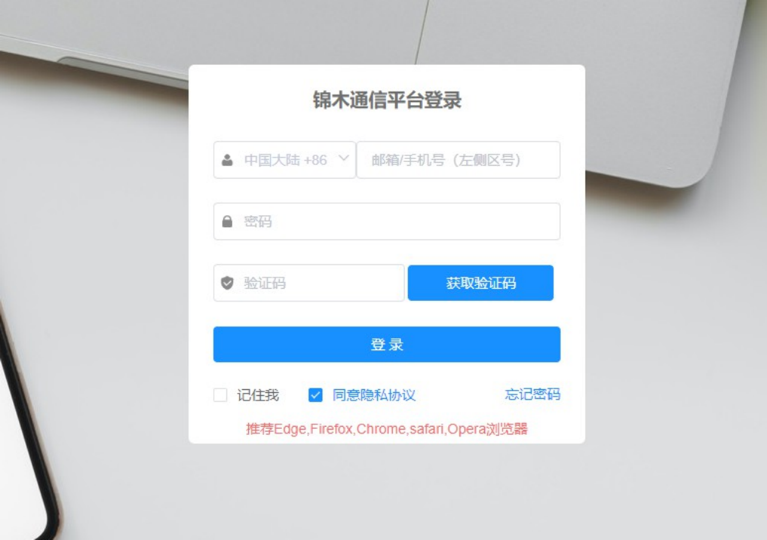
**图例3-1** 平台登录页

**图例3-2** 重置密码页

### 任务管理

用户可通过任务管理进行短信发送及任务统计查询。

#### 国际|港澳台发信

**任务名称**: 用户自定义。

**From**: 部分地区需提前申请，详情请查询“接入信息表-表2”。

**短信模板（可选）**: 单选项，需先在模板管理中添加。选择短信模板时，系统自动填入模板内容。

**模板内容**: 可直接输入发信内容，根据不同的计费标准，长短信会拆分发送。

**开启手机号校验**: 针对上传的号码进行黑名单校验。用户可预先在平台页面菜单栏最下方的黑名单菜单页中针对发信KEY配置发信黑名单，若目标号码在黑名单中，将不会产生发信行为。注意，开启此功能可能会导致发信速度降低。如找不到黑名单菜单页请联系锦木通信服务团队协助处理。

**号码上传**: 需先下载标准模板填写收信手机号（须加区号）；若上传的数据异常则会提示检测到异常数据X条，并可下载《异常数据.xlsx》用于排错。JMC不检测收信号码真实及有效性。

**发送时间**: 立即发送将会立即创建任务并发送；定时发送将会在用户所定时间进行发送，定时任务未实际发送前，均可进行暂停再修改，但开始发送后无法停止。

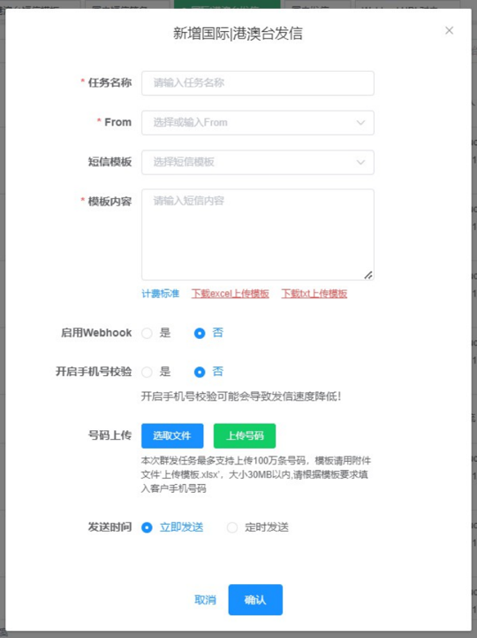
**图例3-3** 国际|港澳台发信任务创建

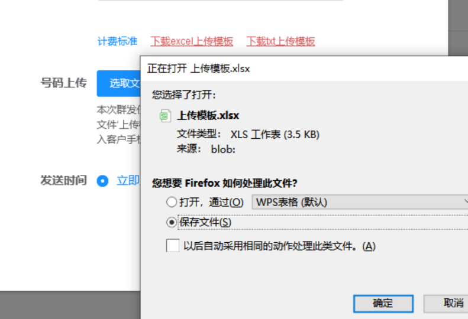

**图例3-4** 上传模板下载

**图例3-5** 定时任务时间选择

#### 国内发信

**任务名称**: 用户自定义。

**From**: 单选项，国内发信须提前申请From，由锦木通信服务团队后台绑定至用户账号。

**短信签名**: 单选项，国内发信须提前申请短信签名，由锦木通信服务团队后台绑定至用户账号。

**短信模板**: 单选项，国内发信须提前申请短信模板，由锦木通信服务团队后台绑定至用户账号。

**模板内容**: 选择短信模板后，系统会自动填入，此时用户可对模板内容进行微调。但若内容差别过大，则可能造成短信发送成功，却被当地方运营商拦截（即未实际到达收信方），此时仍旧计费。建议使用申请通过后的模板，若需调整内容，请联系锦木通信服务团队进行确认。

**开启手机号校验**: 针对上传的号码进行黑名单校验。用户可预先在平台页面菜单栏最下方的黑名单菜单页中针对发信KEY配置发信黑名单，在配置列表中的号码将不会产生发信行为。注意，开启此功能可能会导致发信速度降低。如找不到黑名单菜单页请联系锦木通信服务团队协助处理。

**号码上传**: 需先下载标准模板填写收信手机号（须加区号86）；此处，系统会自动比对所上传号码区号是否为“86”，若不一致则会提示检测异常数据X条，并可下载《异常数据.xlsx》用于排错。JMC不检测收信号码真实及有效性。

**发送时间**: 立即发送将会立即创建任务并发送；定时发送将会在用户所定时间进行发送，定时任务未实际发送前，均可进行暂停再修改，但开始发送后无法停止。

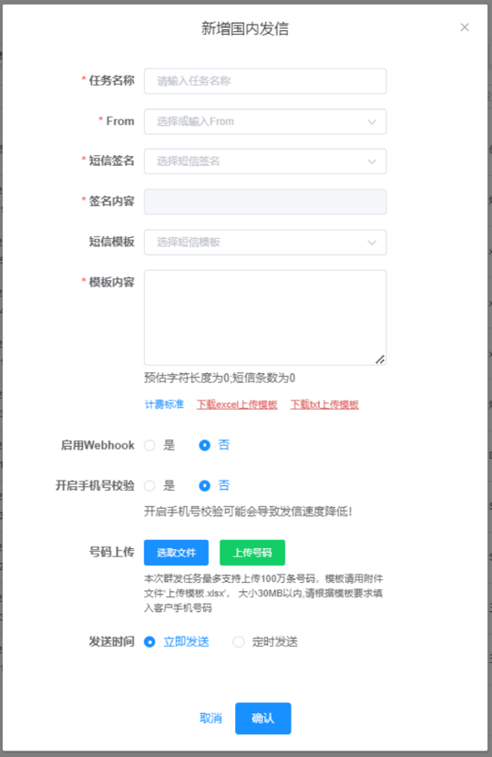
**图例3-6** 国内发信任务创建

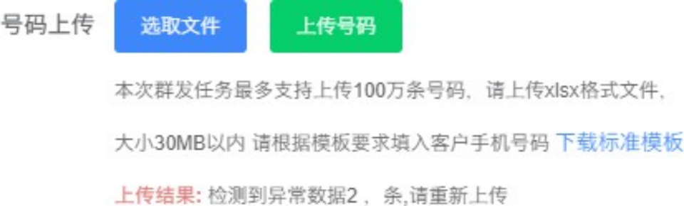
**图例3-7** 号码检测异常提示

### 任务统计

以任务ID为维度进行相关任务的统计、查询。任务ID随机且唯一。

任务统计仅能查询通过JMC创建的发信任务，Api发信无任务统计，若需查询Api发信需至日志管理模块。

默认展示该账号下所有数据，可通过任务状态、任务ID、任务名称、国家名称和指定用户进行数据筛选和下载。下载的文件格式为.xlsx，表格内字段如下：

- 任务ID
- 发送用户
- 任务名称
- 创建时间
- 发送时间
- 任务状态
- 短信统计
- 已发送条数
- 成功条数
- 失败条数
- 费用统计

针对每条任务，均可在当前页面单独下载“费用统计”和“失败详情”。费用统计表格内字段如下：

- TaskID
- 手机号码
- 结果
- 发送时间
- 国家地区名称
- 国家地区代码
- FROM
- 发送内容
- 费用

### 模板管理

用户可在模板管理模块对国际|港澳台短信模板进行增、删、改、查操作。该模板设置目的为减少用户重复工作，提高效率。已设置的国际|港澳台短信模板与国际|港澳台发信任务处自动关联。

暂不支持国内短信发信模板自定义，国内短信模板须由用户先发送至锦木短信服务团队，由技术支持人员提交审核通过后再添加。添加完成后将会与任务管理-国内发信任务自动关联。

用户如有需要接收发信的 Webhook，可联系锦木通信团队协助创建 Webhook URL。创建完毕后即可在模板管理中的 Webhook URL 菜单页进行编辑配置。

### 日志管理

#### 日志查询

日志查询处可查询每一条短信的发信详情，并支持 xlsx、csv 文件格式的数据导出。

日志查询支持营销类和交易类查询。可根据接收方手机号码、任务名称、国家名称、Message Id、任务ID和具体时间周期进行筛选查询。

#### 报告下载

选定短信类型和时间周期后，可以进行报告的下载。另可根据用户账户和国家进行数据搜索，国家支持多选。

导出任务创建后，可在下载中心下载格式为 xlsx 的报告，报告内容为统计型数据，表内字段如下：

Country / Region, 国家/地区, 用户名, 成功率, 总计/条, 成功/条, 失败/条

#### 七月前数据（2021）

在该模块内支持 2021 年七月（不含）前的数据进行日志查询、任务统计和报告下载。数据可在该页面直接导出。

### 下载中心

任务管理 - 任务统计中导出总览表，日志查询和报告下载中创建的下载任务，可在该模块内下载。根据导出类型和时间周期进行筛选查询下载。

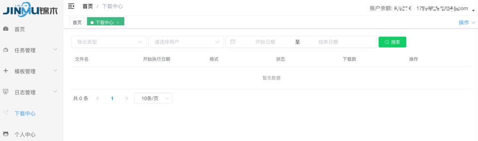
**图例3-8** 下载中心

### 个人中心

用户可在个人中心处查看账号信息，并可对账号密码进行修改。

**图例3-9** 用户账号基础信息

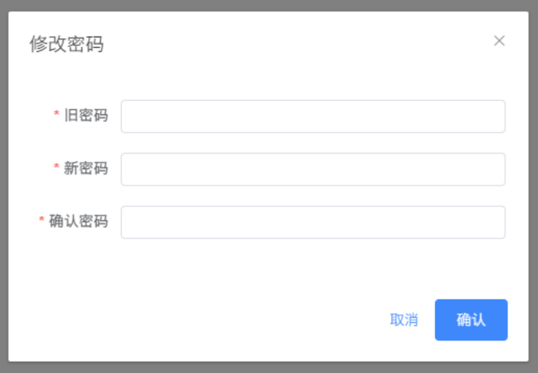

**图例3-10** 修改密码

### 黑名单

用户可针对指定的锦木Key配置号码的黑名单，配置黑名单号码后，目标号码存在于黑名单列表中或黑名单国家中将被过滤，不产生发信操作。

#### 根据手机号配置

选择页面上方的手机号标签，点击页面中的新增按钮，弹出配置框，根据提示配置。
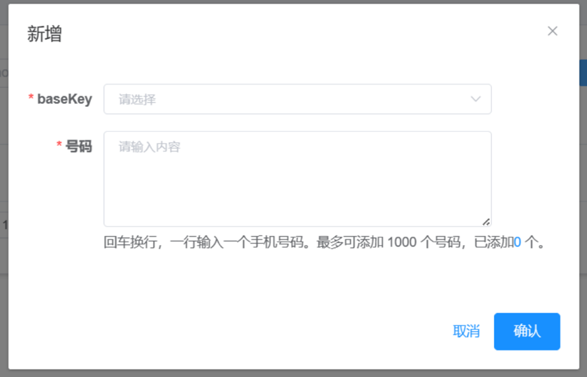
**图例3-11** 根据号码配置

#### 根据国家配置

选择页面上的国家配置标签，点击页面中的新增按钮进行配置。选择具体的锦木Key，选择指定的国家，点击确定即可。
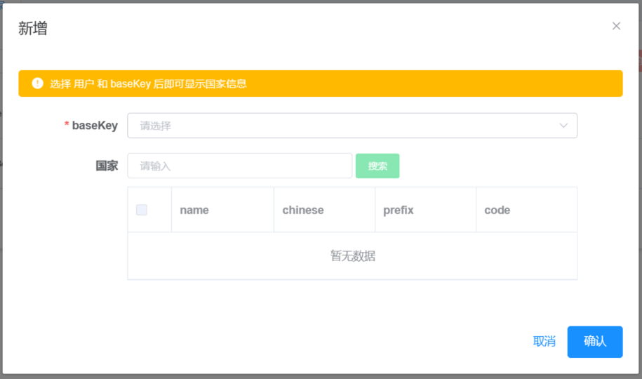
**图例3-12** 根据国家配置

### 号码管理

*号码管理可以管理已有的号码,以及能够购买号码等操作*

#### 您的号码
*可以看到已管理的号码,可以针对号码进行删除退订*

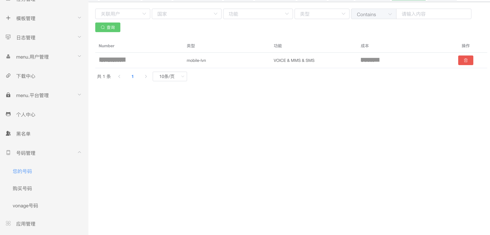

**图例3-13** 号码管理

#### 购买号码

*选择要购买号码国家,号码功能,号码类型*

**Tip 1**:部分国家无法直接号码购买，需填写申请单到锦木

**Tip 2**:部分国家号码购买后，需要进行报备才可使用。具体国家请联系锦木技术进行确认

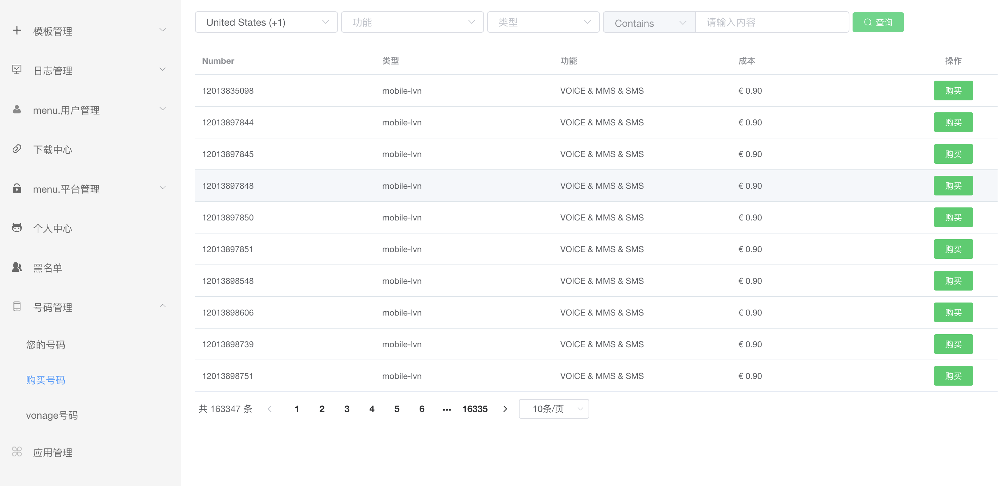
**图例3-14** 购买号码

### 应用管理

*创建应用,选择应用发信可以通过应用管理添加应用*

**图例3-15** 应用管理

#### 创建应用

*点击添加 填写应用名称*

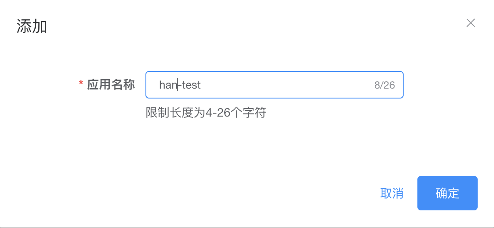
**图例3-16** 创建应用

*点击确认创建成功*

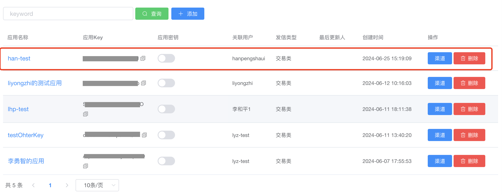
**图例3-17** 应用管理

#### 查看应用key和密钥

*创建应用完成后,可以直接看到应用key*

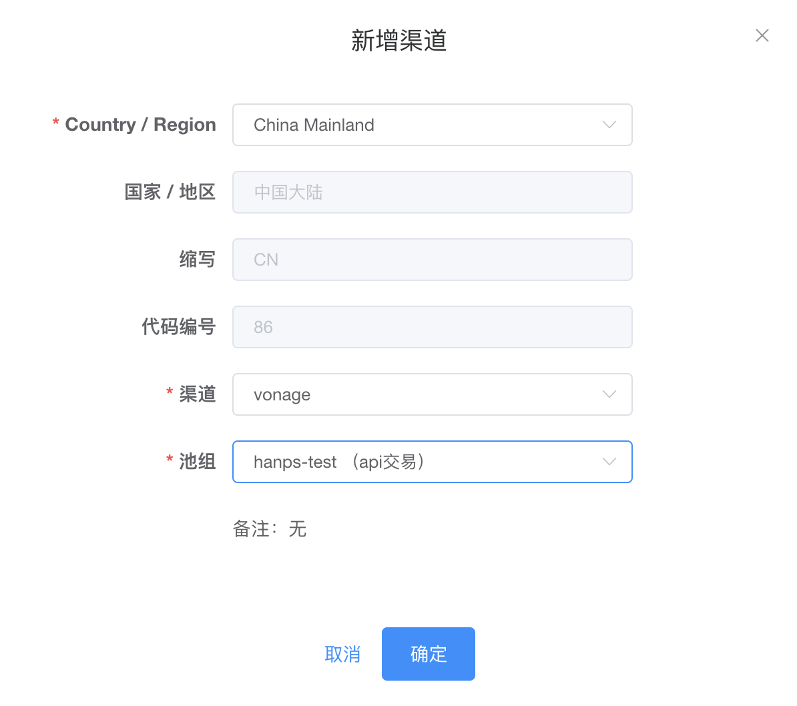
**图例3-18** 查看应用key

*点击 应用密钥 查看密钥信息*

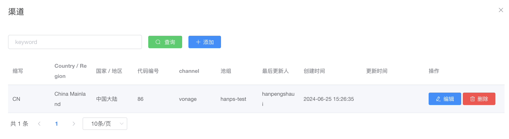
**图例3-19** 查看应用密钥

### Voice

*此页面查看语音的信息日志*

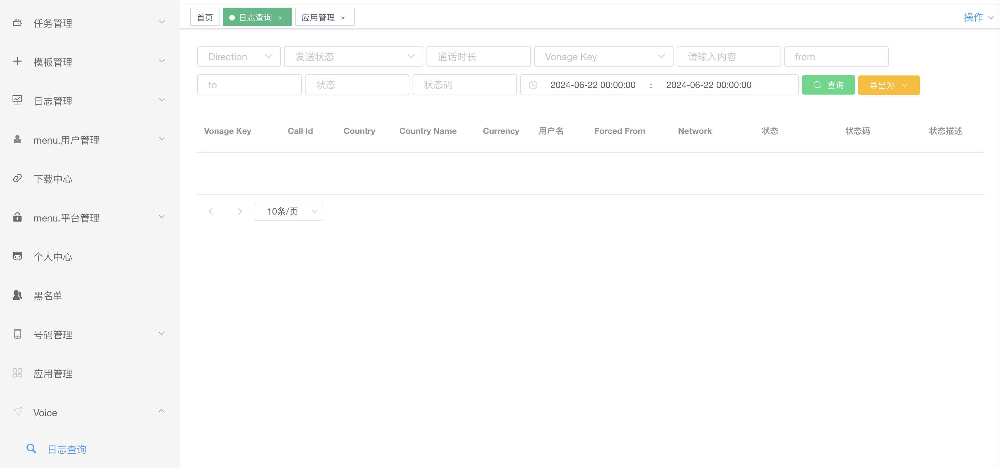

**图例3-20** Voice日志查询

### 业务流程/场景

#### 首次接入流程

JMC对用户端接入流程进行了精简，用户仅需提供相关信息，后续审核、申请、维护等均由锦木通信服务团队负责。

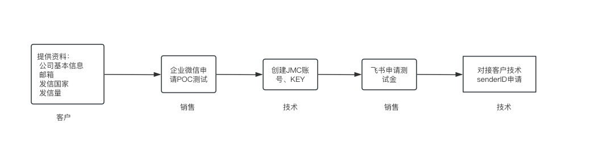
**图例4-1** 接入流程

#### 新增发信国家/地区流程

因政策不同，部分国家/地区发信须提前进行申请。相关国家已记录在“接入信息表-表2”中。为保证发信任务正常，建议用户有新增发信国家/地区情况时，提前联系锦木通信服务团队进行确认。

#### 账户充值流程

JMC暂不支持平台自助充值，需用户通过汇款/转账形式进行，具体方式可咨询所对接的锦木销售。

**图例4-2** 充值流程

### 名词解释

- **短信服务**: 锦木通信平台提供的覆盖全球200+国家/地区的通信业务服务，支持从中国境内向港澳台及其他境外手机号码发送短信、以及在境外地区向境外手机号发送短信。

- **From**: 发信方号码。不同国家/地区要求不同（国内发信必须提前申请），锦木通信服务团队会协助From号码开通。

- **Sender ID**: 部分国家可将From数字号码替换为字母型Sender ID，需提前申请。（国内及美国发信必须申请，但发送时仍为数字From）。锦木通信服务团队会协助进行申请、设置。

- **短信签名**: 短信签名是位于短信正文前【】中的署名，用于标识公司或业务，例如【Jinmu】。不同国家/地区要求不同（国内发信必须提前申请），锦木通信服务团队会协助进行申请、设置。

- **短信模板**: 短信模板即具体发送的短信正文内容。

- **长短信**: 短信长度大于一定字符时，会对短信进行拆分，分多条计费。部分国家在最终用户手机号上，短信会合并成一条展示；部分国家展示为多条。

- **营销类短信**: 营销类短信一般指在经营公司促销、会员活动时，向网站、公司注册会员下发的，内容带有明显营销推广类意图的短信。营销短信常用于发送会员关怀、新品上线提醒、活动通知等营销推广类信息。

- **交易类短信**: 交易类短信包含验证码短信（如注册登录验证、支付确认、身份核实等）、通知类短信（如付款回执、物流通知、状态提醒等）。

