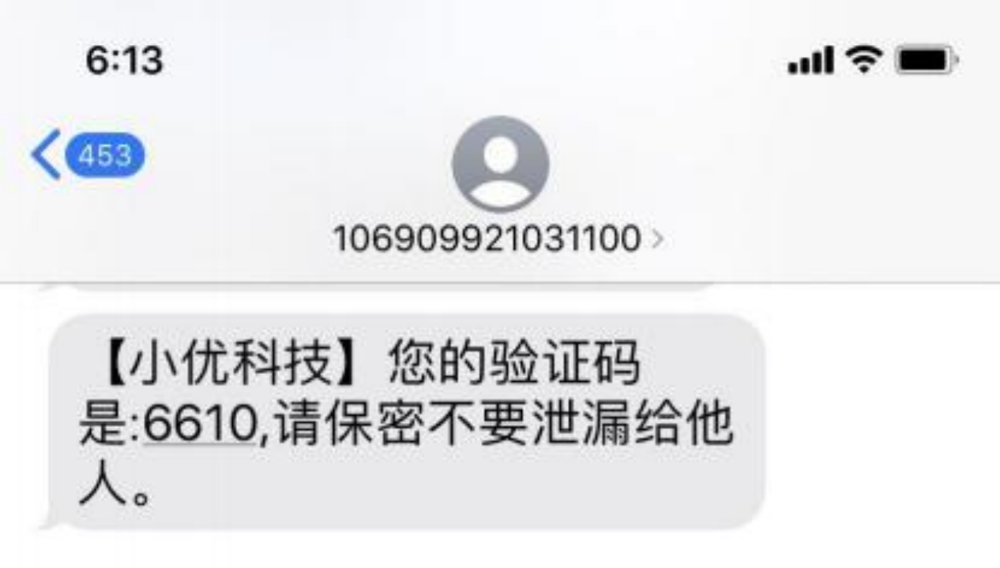

# JMC 基础概念介绍

## 1. 名词说明

### 1.1 签名（中国大陆特有）

**图例6-1** 短信实例

展示在短信内容里。如：图例 6-1 中的小优科技。

### 1.2 模板

短信正文，部分国家需要提前申请，才能发送。

### 1.3 Sender ID

用户短信界面显示的主叫标识叫做 Sender ID，如图例 6-1 中的 106909921031100

#### 1.3.1 Sender ID 要求

Sender ID 在不同的国家有具体要求（跟使用的发信通道也有关系）：
- 有些国家支持字母型，有些国家支持数字型
- 有些国家/地区支持透传（如中国香港）
- 有些国家/地区需要预注册
- 中国大陆的短信规定 A2P (Application-to-Person) 的短信一定会以1065/1069开头。

#### 1.3.2 Sender ID 的种类

- Sender ID 的命名字符：最长15位数字(0-9)或者11个字符(A-Za-z)
    - 全动态 Sender ID： 支持自定义数字字符混合（不支持空格）
    - 动态字符型： 4-11 位字符透传型，如“Jinmu”（注：此种情况支持单向发送短信不支持接收）
    - 动态数字型： 最长15位数字透传型，如“12345678”
    - 随机数字型： 多数情况下，是国际线路商为符合当地法规设置的数字 Sender ID 号码池之一。
    - 固定 Sender ID： 部分国家要求只有国际线路商唯一的固定 ID（此类情况下送达率可以得到保证）

### 1.4 Inbound

Inbound 指用户的回复短信。

### 1.5 锦木 baseKey

应用场景：使用锦木 API 发信。此 Key 为 API 方式发信的验证凭证，注意保密，不要泄露。

### 1.6 长短信

短信长度大于一定字符时，会对短信进行拆分，分多条计费。部分国家在最终用户手机号上，短信会合并成一条展示；部分国家展示为多条。

计费标准：
- 纯英文短信长度不超过 160 字时，按照 1 条短信计费；超过 160 字即为长短信时，按 153 字/条分隔成多条计费。
- 非纯英文（如中文，阿拉伯文，泰文）短信长度不超过 70 字时，按照 1 条短信计费；超过 70 字即为长短信时，按 67 字/条分隔成多条计费。

某些运营商有特殊的计费方式，具体计费标准以实际运营商扣费为准。

预估短信字符及条数：
- 方式一（需登录）：JMC - 任务管理 - 国内发信 or 国际|港澳台发信 - 新增 - 模板内容。

### 1.7 调用率

客户服务器调用 JMC API 的成功率。使用 JMC API 发信，JMC 无法记录数据提交情况，此数据需由客户运维人员自行记录。仅针对使用 JMC API 发信的场景。

### 1.8 发送率

成功下发给 SMS 通道的数据（公式：通道接收数 / JMC 接收数）。

### 1.9 送达率

通过 SMS 通道成功发送到当地运营商后，由运营商下发给最终用户的数据（公式：成功收信用户数 / 下发到 SMS 通道个数）。

### 1.10 Webhook

当运营商将短信发信给用户后，用户会给运营商返回一个接收短信的状态。

## 2. 流程

### 2.1 JMC API 发信数据流

单个 baseKey 可支持的调用 API 的频率默认为 30 次/秒，向 Vonage 申请调高频率，一般可调到≤50 次/秒。

### 2.2 JMC 平台发信数据流

默认 JMC 平台发信频率是 130 次/秒，可联系技术支持调整。

## 3. 各国/地区发信规则

### 3.1 全部

[查看详细规则](../5.SenderID.md)

### 3.2 中国大陆

必须提前注册 SenderID，签名，模板，否则基本会发信失败。Sender ID 会被改成 1065/1069 开头的随机数字号码。

为防止骚扰信息，24 小时内最多约可以发 3 条内容相同的短信或 15 条不同内容的短信往同一个号码。超过以上限制的短信有可能会被网络运营商（针对签名）拦截。

注：从2023年6月下旬开始，中国运营商将加强内容控制。因此，某些品牌/公司的英文内容或英文签名的短讯可能会在没有营办商事先通知的情况下被屏蔽。这将影响已注册和未注册的流量。

### 3.3 中国香港

运营商 45407（ChinaUnicomHK）和 45412（ChinaMobileHK）：
默认不支持字母型 Sender ID 透传，需要申请。不申请的话，所有 Sender ID 会被替换成香港本地手机号去确保送达。

运营商 CSL（45400）、Hutchison（45404）、SmarTone（45406）和 PCCW（45416）：
默认支持 3-11 字符长度的字母型 Sender ID 透传，非字母型 Sender ID 会被替换成香港本地号码或“SMS”。

### 3.4 中国台湾

Sender ID 会被换成随机的台湾号码。也可以申请字母型 Sender ID，走直连线路，收费会高一些。GSM 7 位（英文内容

的短信）默认表中的扩展字符集 | ^€{}[~]\ 将更改为三角形符号 △ 。支持符号 <>。

注：在实际中发现，台湾用户习惯在手机号前加 0，注意发信时，国家/地区代码和手机号中间不能有 0。

如果内容不进行注册：
- 如果营销内容中带有 URL，需要提前注册，否则可能会被限制。
- 如果不带 URL，在规定限制之内可以正常发送。

### 3.5 中国澳门

运营商 SmarTone（45500）、CTM（45501）和 Hutchison（45503）支持动态字母型 Sender ID，不需要申请；运营商 China Telecom 会被换成随机的香港号码。

### 3.6 美国

比较复杂，发不同类型的短信会有区别。普遍需要购买美国号码做 Sender ID，可能还需要付费注册 10DLC（Brand 和 Campaign）。

如发营销短信：需要在前一个月注册 10DLC（包含 Brand、Campaign 和外部审查）。

如发交易类短信：需要购买 Toll-free 号码，这个号码购买后需要申请验证。

### 3.7 菲律宾

需要注册 Sender ID。如果不注册 Sender ID 的话，会被转换成随机的通用 Sender ID（nxsms）或者号码，且低于注册了 Sender ID 的送达率。注册 Sender ID 需要客户签署授权书（在授权书上填写信息签字盖章，并扫描发给我们。涉及 2 个运营商：Smart 和 Globe）。

### 3.8 韩国

仅允许数字型 Sender ID（可能会在前边加前缀，比如 007，008，009），不支持字母型 SenderID，可能会被替换成全球的数字 Sender ID。可能会自动在内容上加前缀："[Web  발신]" -表示短信来自 web；"[국제발 신]" -表示短信来自国外。前缀会算在短信内容字符数中，GSM-7 编码超出 140 个字符后开始分隔短信。

对于长短信合并，KTF 和 LGU+ 运营商不支持短信合并，收信人会收到 2 条短信；SK 电信运营商支持短信合并，收信人会收到 1 条完整的短信。

根据 KISA，促销信息必须包含标题广告（例如，“(광고)”，韩语广告）和带有 STOP 信息的页脚（例如，韩语“수신거부”和选择退出号码）。

