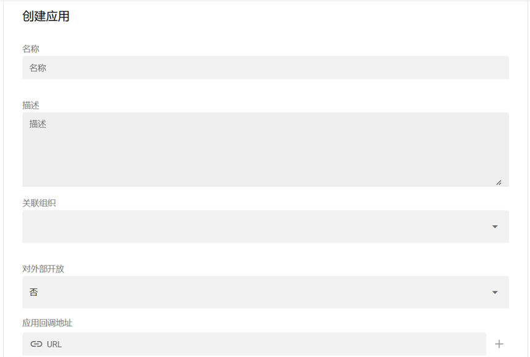
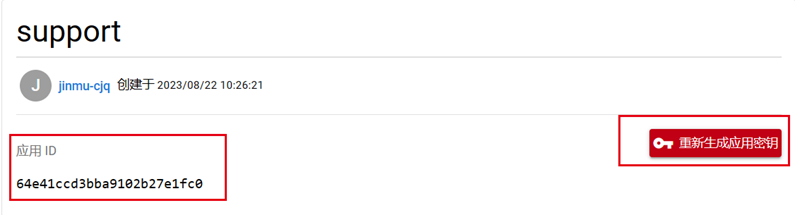
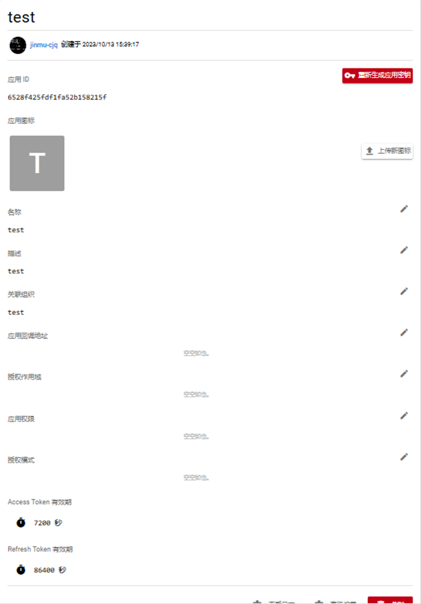
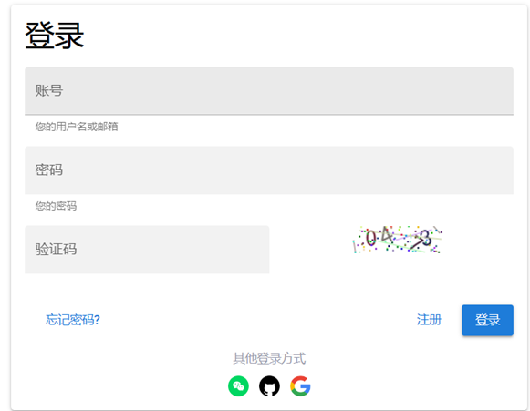
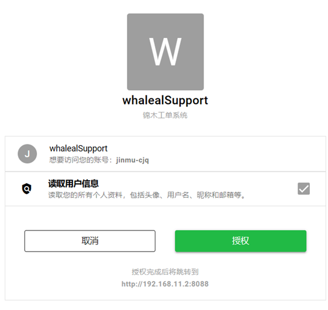
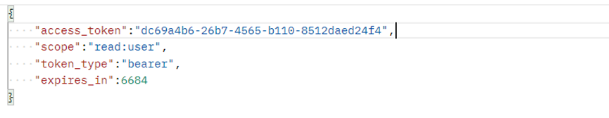
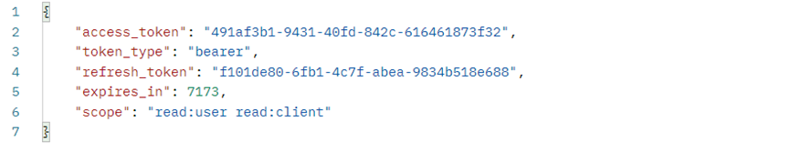

# Oauth2接入 Whaleal Account 介绍

## 一、前置工作-注册应用

__前往 **whaleal Account** 注册应用__ （[访问地址](https://account.whaleal.com)）



__注册参数说明__

| 参数     | 是否必须 | 说明                         |
|--------|------|----------------------------|
| 名称     | 是    | 应用的名称                      |
| 描述     | 是    | 应用的描述                      |
| 关联组织   | 是    | 选择用户创建的组织进行关联,只能选择顶级组织进行关联 |
| 是否对外开放 | 是    | 注册的应用是否对所关联组织的外部人员开放       |
| 应用回调地址 | 否    | 授权后重定向的回调链接地址              |

__保存应用信息__

应用注册完成后,请进入应用详情页面获取到clientId、clientSecret并自行保存

__应用详情__



__获取应用密钥__

获取应用密钥需要经过用户的邮箱接收验证码进行验证,验证成功后会在页面展示密钥,同时发送密钥到用户邮箱


## 二、前置工作-应用配置

__应用详情页面__



__配置应用回调地址__

如果在注册应用时没有填写回调地址或者回调地址需要修改,请在登陆后找到`应用->点击您创建的那个应用进入详情->回调地址`进行编辑

__配置授权作用域__

配置应用授权信息的范围


__配置权限__

应用拥有的权限,应用关联的组织的权限池包含此处的权限


__配置授权模式__

Oauth2的授权模式

根据需求去配置相应的授权模式


## 三. 授权码模式接入

__前端发起授权请求__

跳转到 __WhalealAccount__ 的认证页面,认证成功后会进行授权

```
url: /authorize
method: GET
```
__参数说明__

| 参数            | 是否必须 | 说明                                                                                                                                                                |
|---------------|------|-------------------------------------------------------------------------------------------------------------------------------------------------------------------|
| client_id     | 是    | 应用ID                                                                                                                                                              |
| response_type | 是    | 授权码模式固定值为code,响应内容中会携带授权码                                                                                                                                         |
| scope         | 是    | 授权作用域,规定应用授权信息的范围                                                                                                                                                 |
| redirect_uri  | 是    | 授权后重定向的回调链接地址                                                                                                                                                     |
| state         | 否    | oauth授权给了一个state的参数,这个参数,授权服务器不会做任何处理,第三方网站在发送state之后,授权服务器在回复code的同时会原封不动的把state发送给第三方网站,由于这个state是第三方网站可知的,但是攻击者是不可知的,所以可以用这个判定使用者的身份,只有验证通过后,再进行相应的处理。用于预防伪造攻击 |

__认证页面__



__授权页面__



__后端发起请求获取access_token__

成功认证授权后,能够获取到授权码,携带授权码去请求获取access_token（访问令牌）

__请求接口__

```
url: /v1/oauth/token
method: POST
```

__设置请求头__

请求此接口,请在请求头中携带:
```
Authorization:Basic+空格+Base64(clientId:clientSecret)
```

__参数说明__

| 参数           | 是否必须 | 说明                            |
|--------------|------|-------------------------------|
| grant_type   | 是    | 授权码模式下,值固定为authorization_code |
| code         | 是    | 上一步获取的授权码                     |
| redirect_uri | 是    | 授权后重定向的回调链接地址                 |

__postman调用响应结果__



__注:如果应用配置了refresh_token的授权模式响应结果中就会返回刷新令牌,不配置则不会携带__

## 四、密码模式接入

__请求授权接口__

```
url: /v1/oauth/token
Method: POST
```

__设置请求头__

请求此接口,请在请求头中携带:
```
Authorization:Basic+空格+Base64(clientId:clientSecret)
```

__请求参数__

| 参数           | 是否必须 | 说明                  |
|--------------|------|---------------------|
| grant_type   | 是    | 授权模式,密码模式下为password |
| redirect_uri | 是    | 授权后重定向的回调链接地址       |
| username     | 是    | 用户名                 |
| password     | 是    | 用户密码                |

__响应结果__




