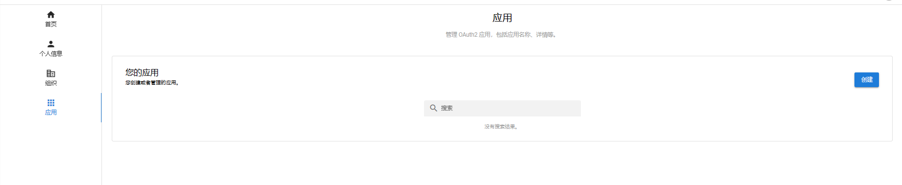
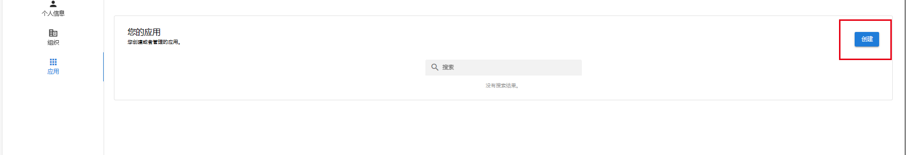
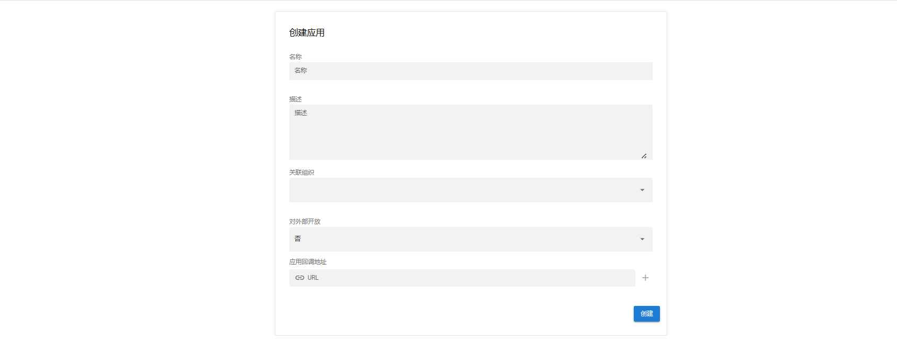
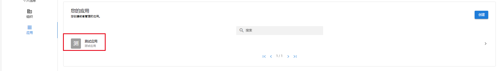
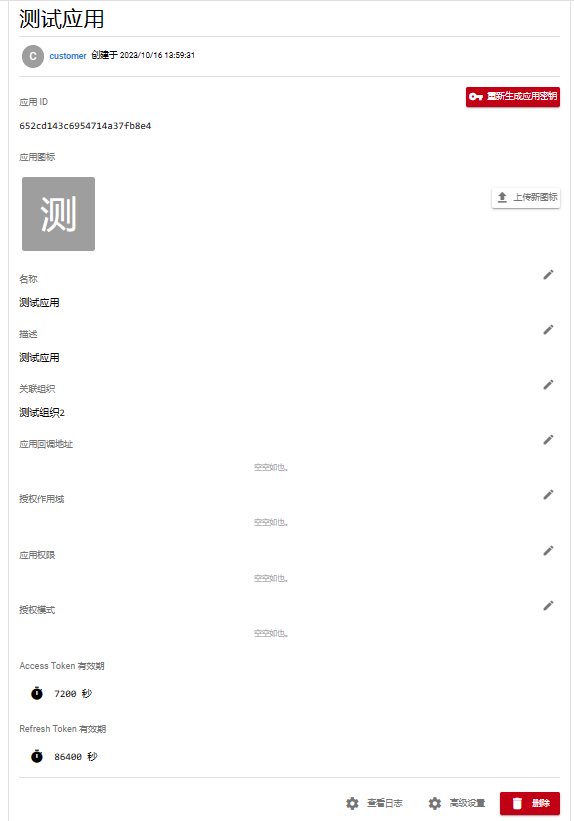
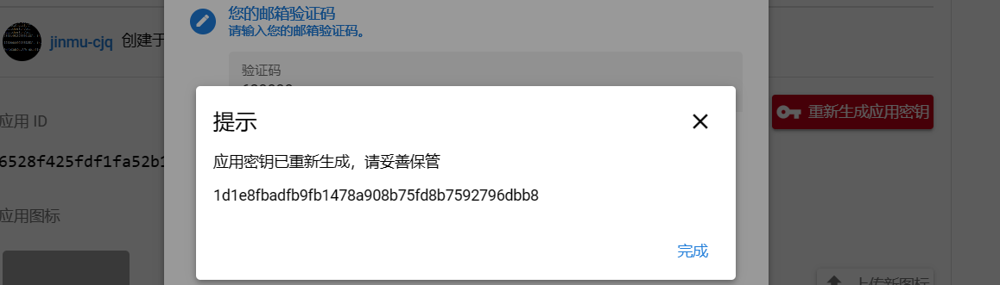
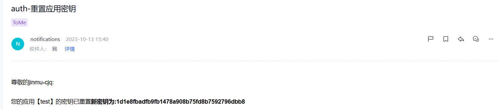
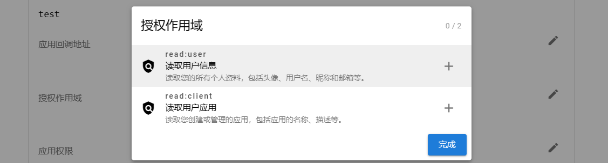
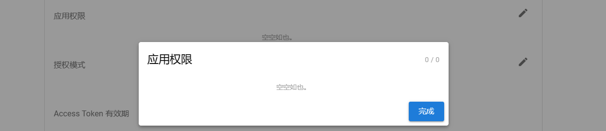
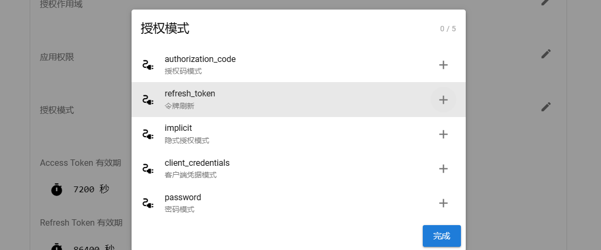

### 应用

__应用页__

用户可通过左侧应用菜单进入应用页

__创建应用__

点击右侧创建按钮

| 表格项    | 是否必须 | 说明                                      |
|--------|------|-----------------------------------------|
| 名称     | 是    | 应用的名称                                   |
| 描述     | 是    | 对应用的描述                                  |
| 关联组织   | 是    | 应用要关联的组织                                |
| 是否对外开放 | 是    | 默认为否即不对外开放,此参数影响应用在授权时是否允许应用关联组织之外的用户授权 |
| 应用回调地址 | 否    | 应用接入时需要用到的参数,创建时不填,创建完成后也可进入应用详情修改      |

__应用详情页__

应用创建完成后,点击应用进入应用详情

__获取应用密钥__

获取应用密钥需要经过用户的邮箱接收验证码进行验证,验证成功后会在页面展示密钥,同时发送密钥到用户邮箱

__配置应用回调地址__

如果在注册应用时没有填写回调地址或者回调地址需要修改,请在登陆后找到`应用->点击您创建的那个应用进入详情->回调地址`进行编辑

__配置授权作用域__

配置应用授权信息的范围

__配置权限__

应用拥有的权限,应用关联的组织的权限池包含此处的权限

__配置授权模式__

Oauth2的授权模式

根据需求去配置相应的授权模式

