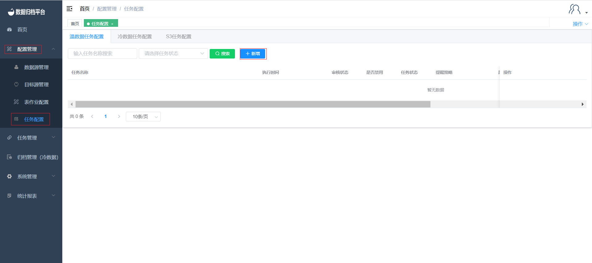
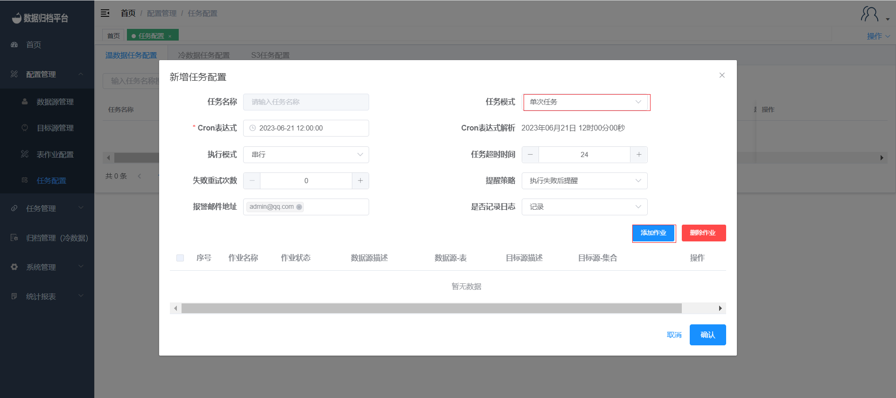
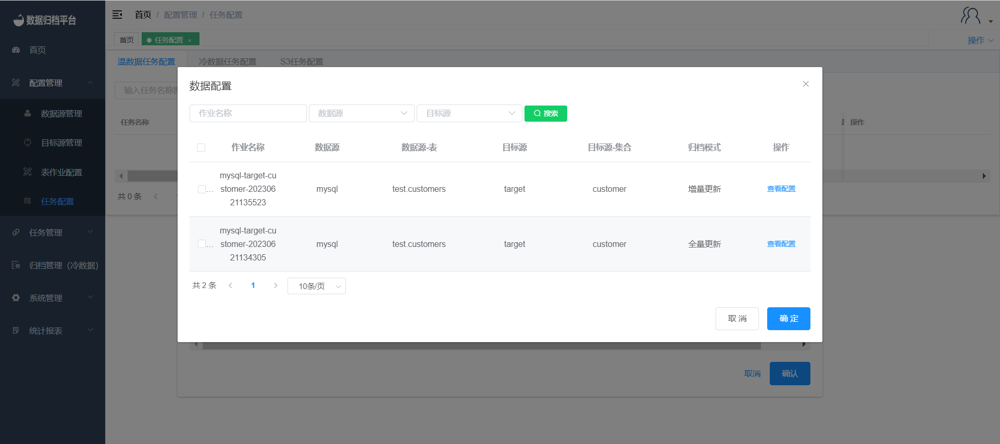

#### 			创建单次任务

​	点击任务配置菜单下的任务配置，此页面展示了所有任务点击蓝色新增按钮弹出第二张图片所示表单。任务模式选择单词任务，之后选择Cron表达式选择执行时间。若此任务表作业很多时可根据自身需求设置执行模式、任务超时时间、失败重试次数。提醒策略选择后添加报警邮箱地址，任务完成后将根据提醒策略发送邮件。点击添加作业弹出第三张图片所示数据配置，勾选作业后点击确定即可将此作业绑定至新建任务中，最后此任务需管理用户进行审核后才可以执行。

