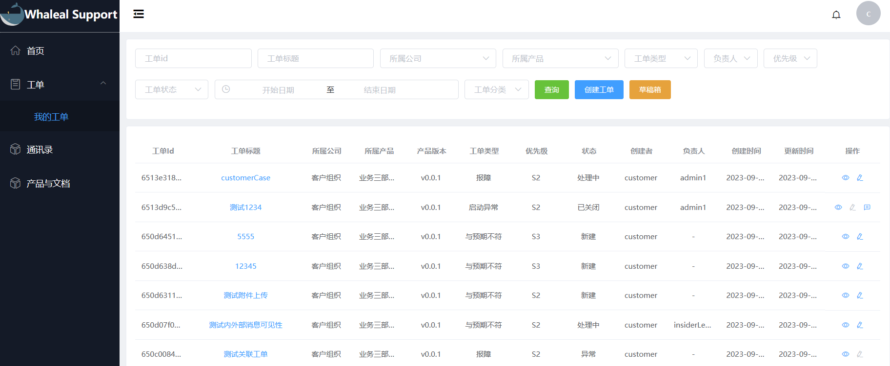
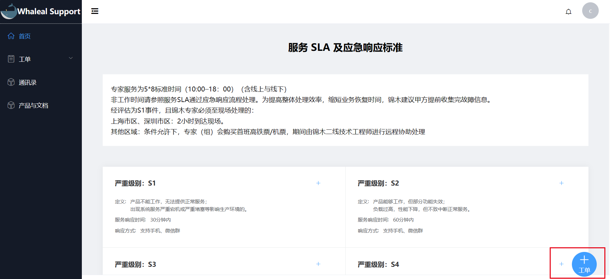
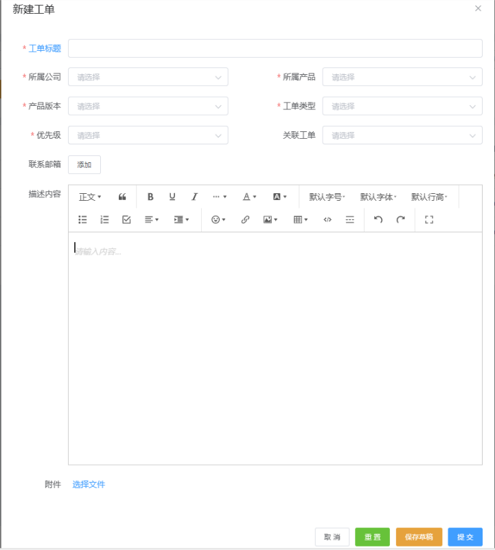
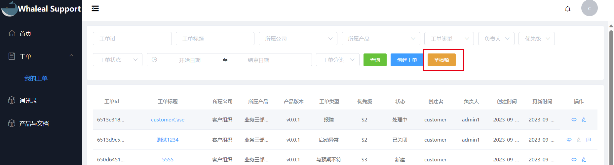
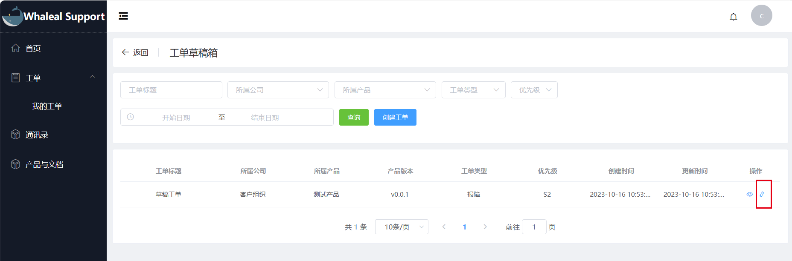

### 我的工单

__创建工单__

找到我的工单页面,点击创建工单按钮开始创建工单,填写完工单信息点击确定即可创建成功

或者点击右下方悬浮的工单按钮也可快速创建

__表格说明__

| 表格项  | 是否必须 | 说明                                                                                              |
|------|------|-------------------------------------------------------------------------------------------------|
| 工单标题 | 是    | 工单标题                                                                                            |
| 所属公司 | 是    | 提问者所属公司  注意:如果提示请先加入一个组织,请前往whalealAccount注册账号并创建或加入一个组织,同时需要将该组织登记为锦木的客户,非客户即使创建了组织也无法创建工单 |
| 所属产品 | 是    | 工单涉及的产品                                                                                         |
| 产品版本 | 是    | 涉及产品的版本                                                                                         |
| 工单类型 | 是    | 工单涉及产品的异常类型                                                                                     |
| 优先级  | 是    | 工单紧急的程度                                                                                         |
| 关联工单 | 否    | 关联已经处理或处理完毕的工单                                                                                  |
| 联系邮箱 | 否    | 客户的联系邮箱,默认为客户账号注册时填写的邮箱                                                                         |
| 描述内容 | 是    | 工单问题的具体描述                                                                                       |
| 选择文件 | 否    | 附件上传                                                                                            |

__保存为草稿__

点击保存为草稿按钮,该工单将保存在客户的草稿箱中

__草稿的正式发布__

点击草稿右侧的编辑按钮点击提交草稿即可发布为正式工单

