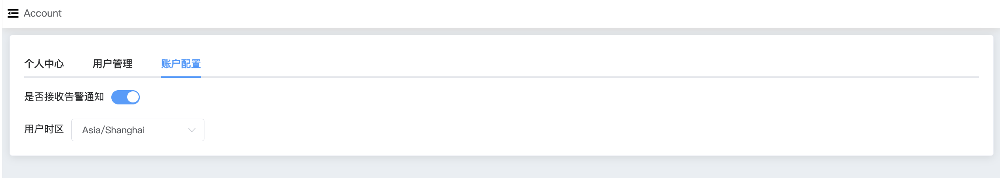

## Config

```
Config 提供以下配置项：
 - Alert
 - TimeZone
```

账号配置,WAP账号配置是否接收告警通知,用户时区

a. 进入页面左侧导航栏


b. 点击 Account 选项按钮，选择 账户配置 选项




### Alert

用户可以配置是否接收告警信息。


### TimeCone

用户可以配置时区，用户监控数据时间展示。

