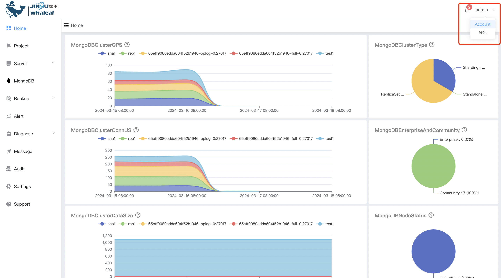
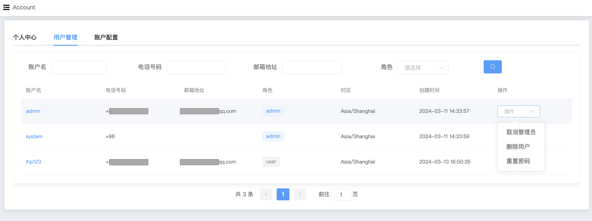
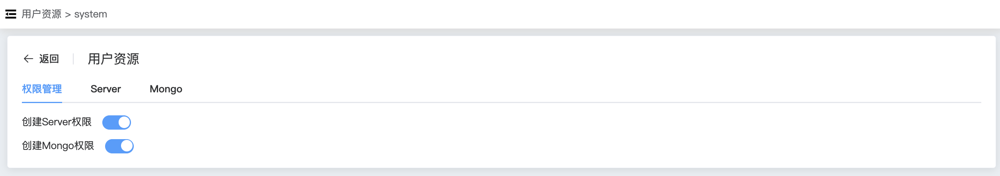

## Users

```
Users 提供以下操作：
 - Operation
 - Management
 - Server
 - MongoDB
```

用户管理,WAP用户管理可以配置账号权限,修改密码,删除用户等操作

a. 进入页面左侧导航栏



b. 点击 Account 选项按钮，选择 用户管理 选项


### Operation

WAP 可以为用户配置管理员权限，管理员可以执行删除用户的操作。




### Management

WAP 可以配置是否有权限创建Server、创建MongoDB。




### Server

WAP 提供了对服务器资源的访问限制。


### MongoDB

WAP 提供了对MongoDB资源的访问限制。

