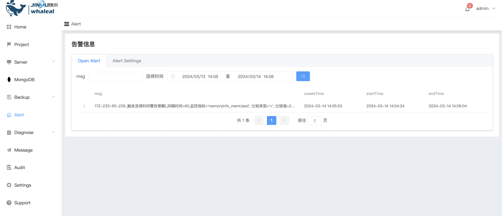
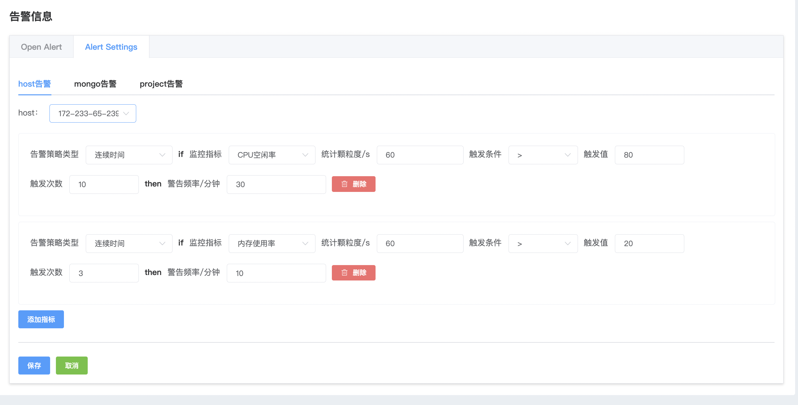
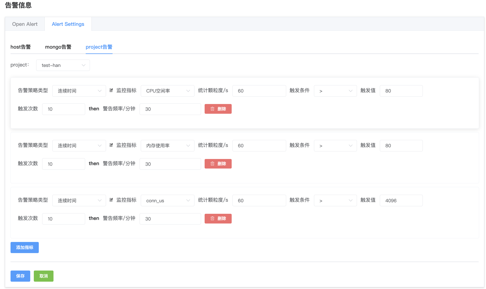

## Alert

**告警**

告警,主机和 MongoDB 监控告警确保系统稳定运行的关键措施。通过监控主机资源利用率、服务状态，以及监控 MongoDB 数据库的性能、状态、空间利用率等方面，及时发现异常情况并触发告警，帮助管理员及时采取措施，保障系统和数据库的正常运行。

告警信息

a. 进入页面左侧导航栏

b. 点击 alert 选项按钮,显示当前的告警信息

告警配置

a. 点击 Alert Settings 配置告警

b. 选择你要配置的告警类型

* host告警, 可以配置主机层面 资源情况的监控告警

* mongo 告警, 可以配置mongo 层面的性能监控告警

* Project告警,配置Project中包含的所有主机和mongo进行配置

c. 配置完成点击 保存 