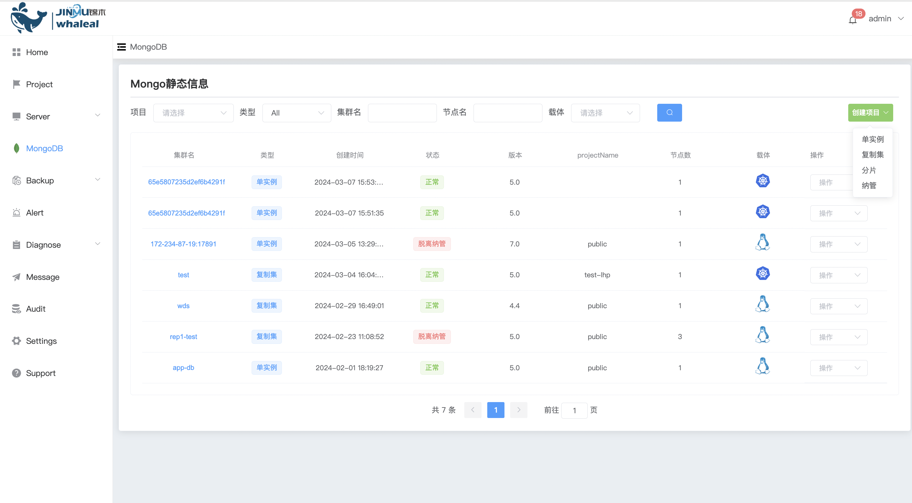
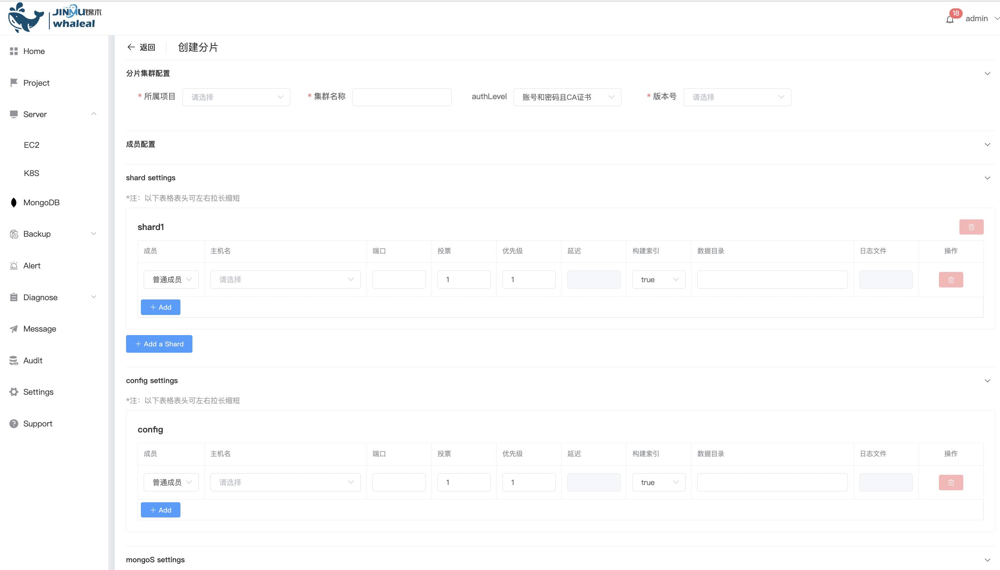
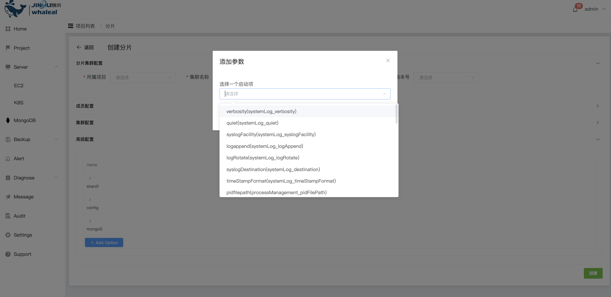

## Create Sharded Cluster

```
Create Sharded Cluster 分为以下两部分操作内容：
 - Prerequisites
 - Procedure
```

MongoDB Sharded Cluster是一种用于扩展MongoDB数据库性能和容量的解决方案。它通过将数据分散存储在多个服务器上来实现横向扩展，从而提高了读取和写入操作的性能，并允许存储更大量的数据。Sharded Cluster 部署方式提供高可用机制 与 水平拓展。推荐生产中使用。

使用 Whaleal Platform 可以创建 Sharded Cluster ，可以添加节点，升降级。

### Prerequisites

在部署 Sharded Cluster 前必须确保 Host 已被 WAP 管理。若没有，请先[添加EC2](../../Server/EC2.md)或[添加K8S](../../Server/K8S.md)。

在部署 Sharded Cluster 前必须确保 WAP 中有可使用的 MongoTar。若没有，请先[上传 MongoTar](../../Settings/UploadMongoDBTARfile.md)。

### Procedure

**1、进入导航目录**

a. 点击 MongoDB 选项按钮

b. 选择 MongoList 选项，页面展示所有用户可操作 MongoDB Cluster



**2、创建 ReplicaSet**

a. 点击右侧 创建项目 按钮

b. 选择 分片 选项


**3、配置 Sharded Cluster**




分片集群配置

| 配置项       | 值                                                           |
| ------------ | ------------------------------------------------------------ |
| 所属项目     | 选择所属的Project                                            |
| 集群名称     | 分片集群名                                                   |
| 是否开启认证 | 未开启任何认证: 不设置用户密码 <br/>账号和密码: 开启认证并设置用户密码 <br/>账号和密码且CA证书: 开启认证设置用户密码并使用CA证书 |
| 版本         | 选择创建 Standalone 版本所对应 MongoTar                      |

成员配置

Shard Settings

| 配置项    | 值                                                           |
| --------- | ------------------------------------------------------------ |
| 成员      | 成员类型：<br>成员节点：承载数据的节点，具有投票权，可以被选举为主节点<br/>隐藏节点：承载数据的节点，具有投票权，配置参数为 hidden<br/>隐藏延迟节点：承载数据的节点，具有投票权，配置参数为 slaveDelay and hidden |
| 主机名    | 选择部署 Sharded Cluster 节点 所在主机                       |
| 端口      | 节点所使用端口                                               |
| 投票      | 复制集选举期间的投票数                                       |
| 优先级    | 复制集选举期间的优先级，优先级为0，则节点不能被选举为主节点  |
| 延迟      | 节点落后于主节点的时间（单位：秒），仅用于成员为 隐藏延迟节点 |
| 构建索引  | true：MongoDB构建索引<br/>false：MongoDB不构建索引           |
| 数据目录  | Sharded Cluster 节点数据文件存储目录（绝对路径）             |
| 日志文件  | Sharded Cluster 节点日志输出文件（绝对路径）                 |
| add       | 添加成员节点                                                 |
| add Shard | 添加一个的shard集群                                          |

config Settings

| 配置项   | 值                                                           |
| -------- | ------------------------------------------------------------ |
| 成员     | 成员类型：<br>成员节点：承载数据的节点，具有投票权，可以被选举为主节点<br/>隐藏节点：承载数据的节点，具有投票权，配置参数为 hidden |
| 主机名   | 选择部署 Sharded Cluster 节点 所在主机                       |
| 端口     | 节点所使用端口                                               |
| 投票     | 复制集选举期间的投票数                                       |
| 优先级   | 复制集选举期间的优先级，优先级为0，则节点不能被选举为主节点  |
| 延迟     | 节点落后于主节点的时间（单位：秒），仅用于成员为 隐藏延迟节点 |
| 构建索引 | true：MongoDB构建索引<br/>false：MongoDB不构建索引           |
| 数据目录 | Sharded Cluster 节点数据文件存储目录（绝对路径）             |
| 日志文件 | Sharded Cluster 节点日志输出文件（绝对路径）                 |
| add      | 添加成员节点                                                 |

Mongos Settings

| 配置项   | 值                              |
| -------- | ------------------------------- |
| 主机名   | 选择部署 mongos 节点 所在主机   |
| 端口     | 节点所使用端口                  |
| 日志文件 | Mongos 日志输出文件（绝对路径） |
| add      | 添加mongos节点                  |

集群配置

| 配置项                                 | 值                                                           |
| -------------------------------------- | ------------------------------------------------------------ |
| Protocol Version                       | 复制集所用复制协议版本                                       |
| Chaining Allowed                       | true：允许从 secondary 节点复制数据<br>false：不允许从 secondary 节点复制数据 |
| Write Concern Majority Journal Default | 是否写入多数节点后返回                                       |
| Heartbeat Timeout(secs)                | 成员节点间心跳检测时间                                       |
| Election Timeout(ms)                   | 成员节点与主节点不可达时，检查时间                           |
| CatchUp Timeout(ms)                    | 新选举出的主节点与最近的写操作的追赶时间                     |
| CatchUp Takeover Delay(ms)             | 成员节点领先主节点后，等待主节点时间                         |

高级配置



a. 点击 Add Option 按钮

b. 选择添加启动配置项，点击 确定 按钮添加

c. 设置 配置选项 值


**4、创建**

点击 创建 按钮，创建 Sharded Cluster。