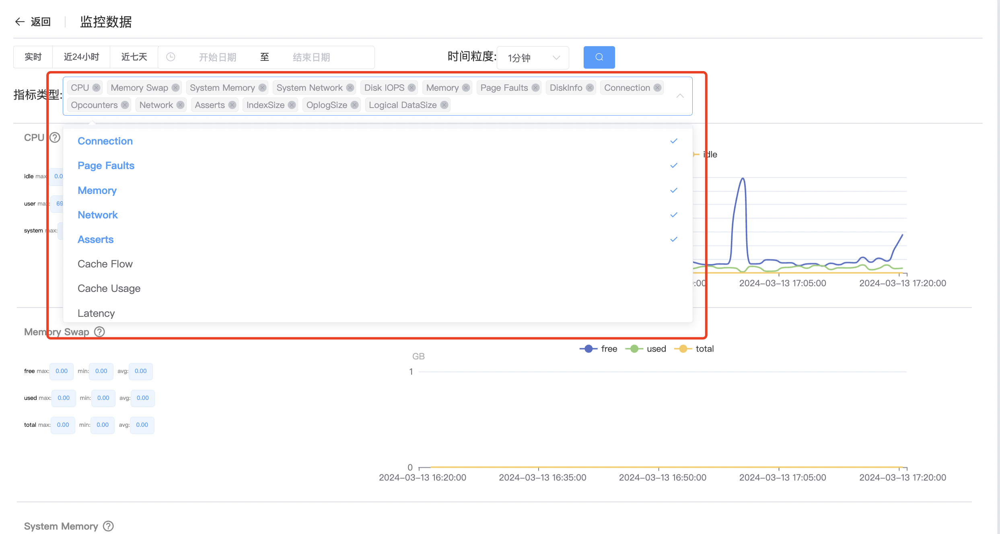

## Monitor MongoDB

**监控MongoDB**

监控 MongoDB 是确保数据库系统健康和性能的关键方面之一。通过监控 MongoDB 关键指标和资源利用情况，您可以及时发现潜在问题并采取适当的措施来解决它们，以确保系统的稳定性和可靠性。

使用监控之前要先查看群集是否[开启监控](../ManageCluster/clusteroperations/Turnonmonitoring.md)

a. 点击 MongoDB 选项按钮

b. 点击你要监控的群集名称

c. 点击查看监控

d. 查看监控

e. 选择监控指标

f. 选择监控时间范围

