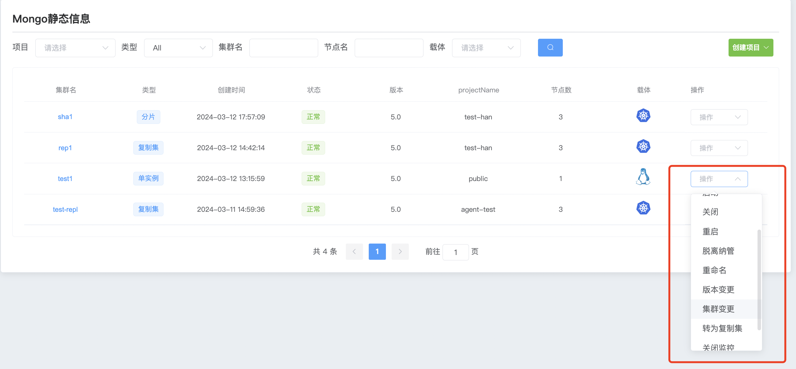
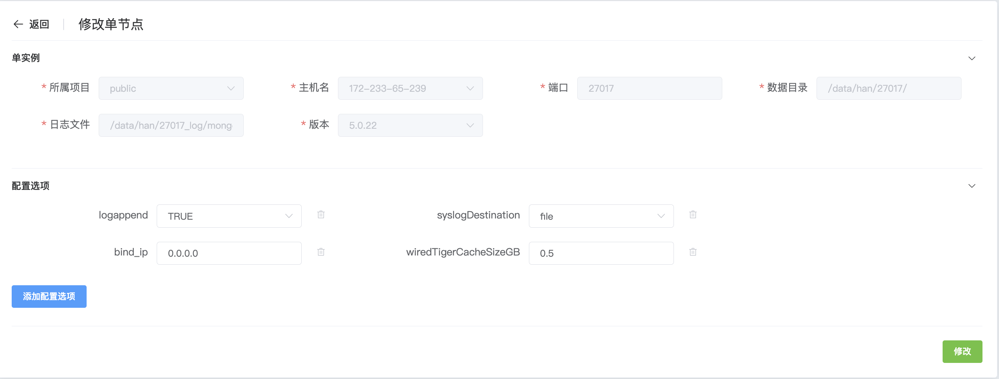
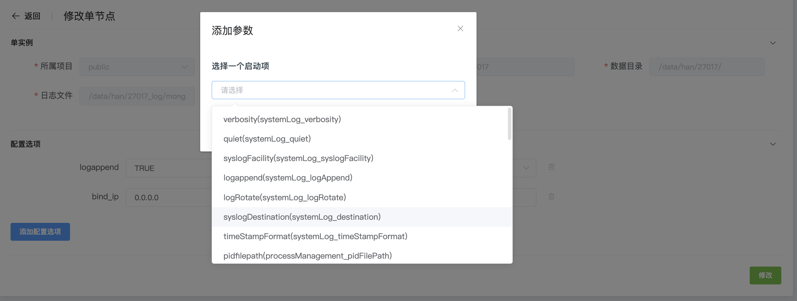
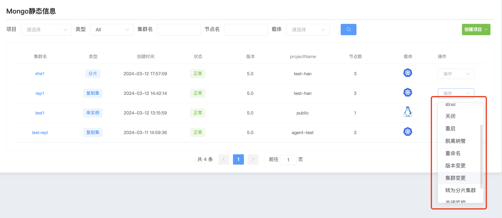
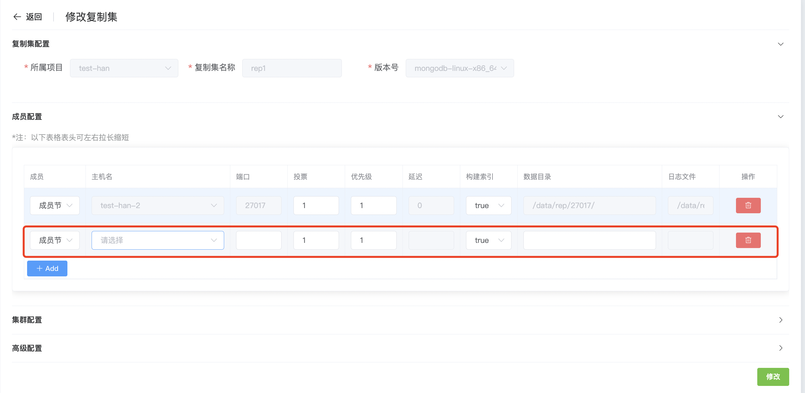
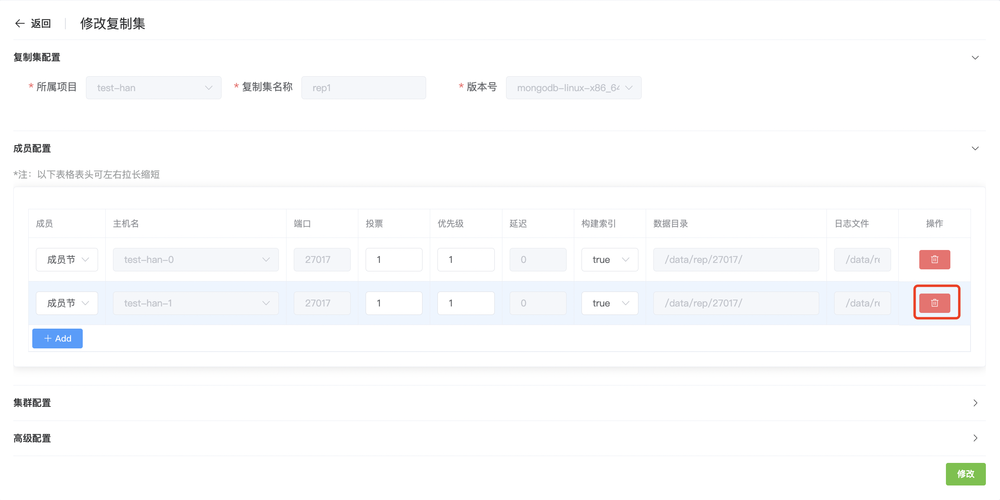
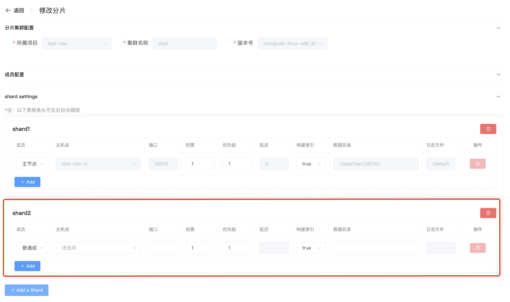
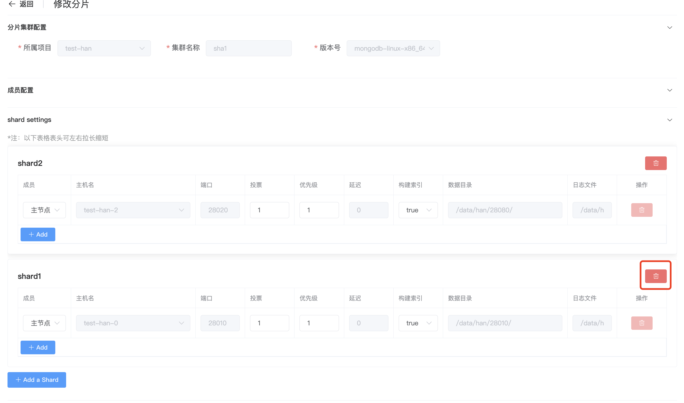

## Cluster changes

**群集变更**

在群集变更中,包括修改配置参数,复制集添加节点,分片集群添加shard 等变更操作

a. 点击 MongoDB 选项按钮

b. 选择群集点击 操作 群集变更

c. 修改配置选项内的参数

d. 添加配置选项

e. 配置完成后点击 修改

**复制集添加/删除成员**

a. 点击 MongoDB 选项按钮

b. 选择群集点击 操作 群集变更

* 添加复制集成员

  * 点击成员配置 +add 添加新的成员

    

  * 配置完成后点击 修改

* 删除复制集成员

  * 点击右边 删除 按钮

    

  * 配置完成后点击 修改

**分片集群添加/删除shard**

 a. 点击 MongoDB 选项按钮

b. 选择群集点击 操作 群集变更

* 添加分片shard

  * 点击成员配置 +add shard 添加新shard群集

    

  * 配置完成后点击下方 修改

* 删除分片shard

  * 点击右边 删除 按钮

    

  * 配置完成后点击下方 修改

