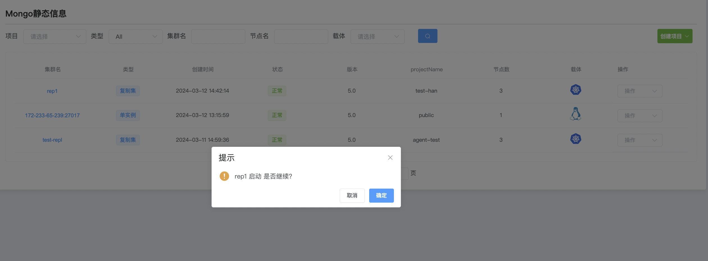

## Cluster startup shutdown

通过操作启动/关闭功能,对整个集群进行启动/关闭操作,针对的是整个集群内的所有节点

如果需要关闭/启动集群中的某个节点请参考[节点操作](../Nodeoperations.md)

**1、启动MongoDB群集**

a. 点击 MongoDB 选项按钮

b. 选择你要启动群集点击 操作 启动

c. 点击确认 ,启动集群内的所有mongodb服务

**2、关闭MongoDB群集**

a. 点击 MongoDB 选项按钮

b. 选择你要关闭群集点击 操作 关闭

c. 点击确认,关闭集群内的所有mongodb服务

**3、重启MongoDB群集**

a. 点击 MongoDB 选项按钮

b. 选择你要重启群集点击 操作 重启

c. 点击确认,重启集群内的所有mongodb服务

