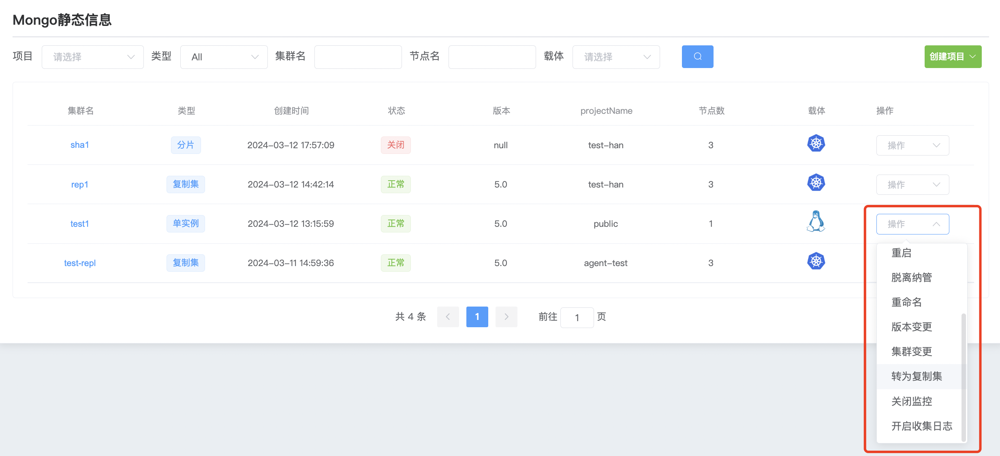
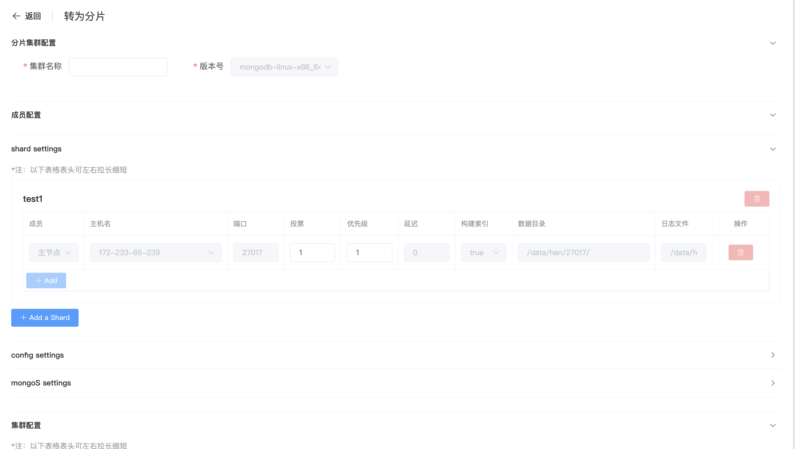

## cluster conversion

**群集转换**

WAP 平台支持简便的群集转换功能，用户可以轻松将单实例 MongoDB 转换为 MongoDB 复制集，或者将 MongoDB 复制集转换为分片集群。

**单实例转换为复制集**

a. 点击 MongoDB 选项按钮

b. 选择群集点击 操作 转为复制集

c. 输入复制集名称

d. 输入完成后点击 确认 开始转换

**复制集转换为分片**

a. 点击 MongoDB 选项按钮

b. 选择群集点击 操作 转为分片集群

c. 填写配置

复制集转换为分片,必须配置一个config和mongos集群

**Shard（分片）**

* Shard是MongoDB中存储数据的单个节点或副本集,分片集群中可以有一个或多个Shard

**Config**

* Config Servers存储了关于分片集群的元数据信息，包括分片键范围和数据的分片位置等信息。分片集群通常包含3个Config 以确保高可用性。

**Mongos（MongoDB路由器**)

* Mongos是客户端与分片集群交互的接入点。它接收来自客户端的操作请求，并将这些请求路由到正确的Shard上执行。

d. 配置完成后点击 保存 开始复制集转换为分片