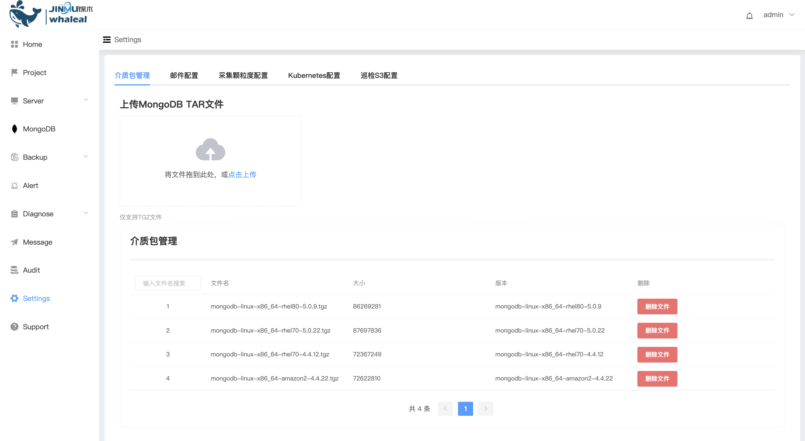

## UploadMongoTar

**介质包管理**

Whaleal Platform 创建集群，需使用 TGZ 文件。其他文件类型暂不支持。

**1、查看当前TGZ 文件**

a. 点击 Settings 选择 介质包管理

页面展示所有可用于创建集群 TGZ 文件

**2、上传文件**

a. 点击 点击上传

b. 选择待上传的 TGZ 文件

c. 点击 确定

d. 等待上传进度条完成，上传成功

**3、删除文件**

a.点击删除文件

b. 点击 确定

